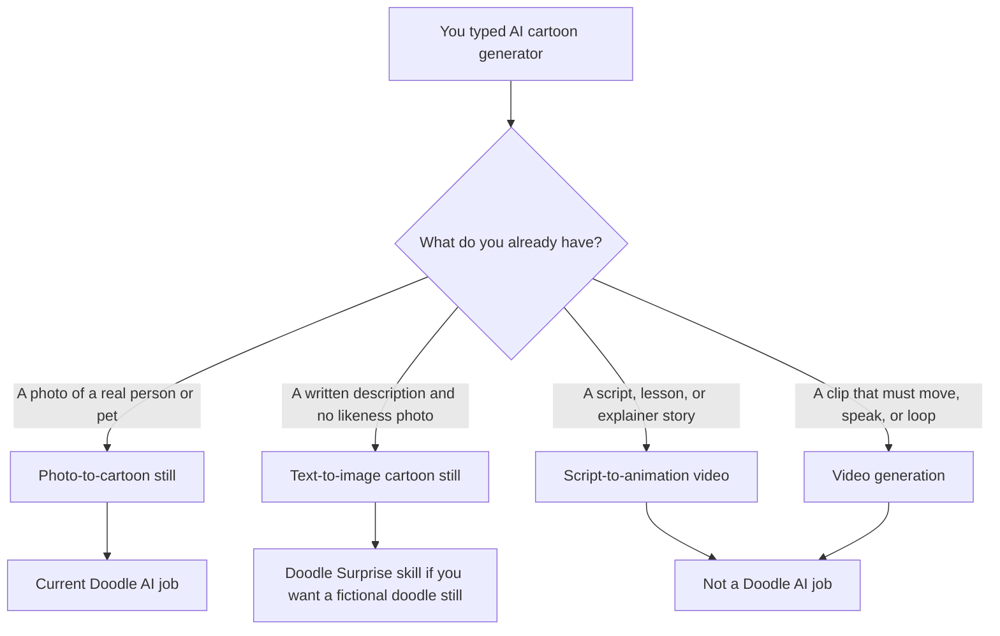
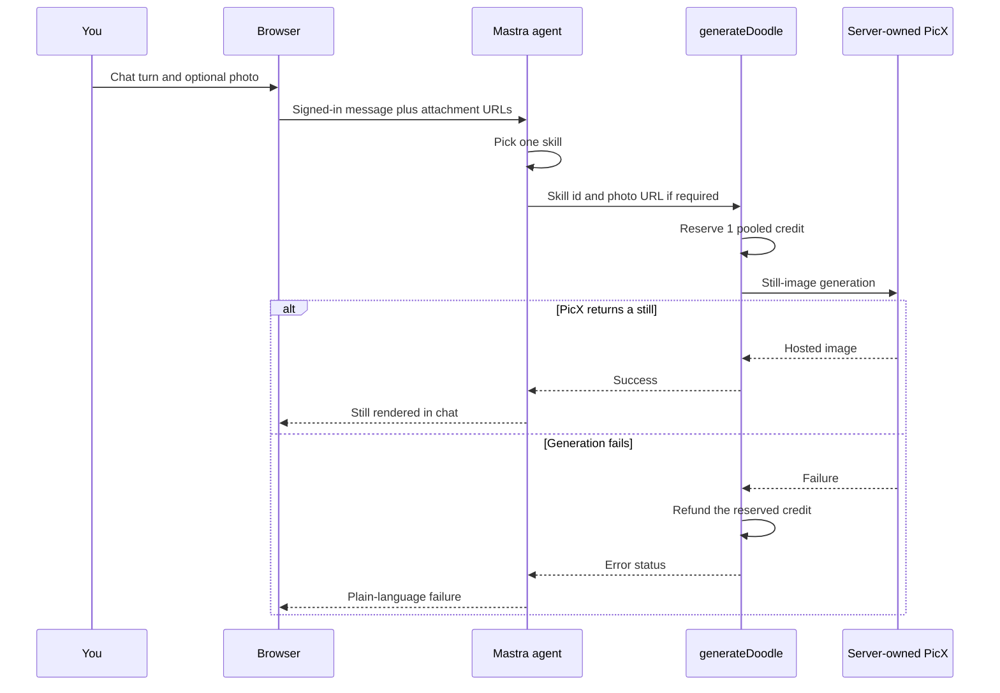

**Direct answer:** An AI cartoon generator is not one product. Some restyle a photo into a still, some invent a scene from text, some turn a script into animated video, and some generate motion clips. [Doodle AI](https://doodleai.art) at **doodleai.art** is a chat-first still-image studio: a browser turn, a Mastra agent, a skill, then server-owned PicX. It does not make video.

If you asked ChatGPT, Grok, Perplexity, Gemini, or Google “what is an AI cartoon generator?” you did not get one job. You got a bucket. A 2026-08-24 US mobile snapshot of `ai cartoon generator`, collected through [DataForSEO’s Google Organic SERP Live Advanced endpoint](https://docs.dataforseo.com/v3/serp/google/organic/live/advanced/), returned a Google AI Overview. That overview described the category as tools that turn text prompts or photos into animated characters and scenes. It named Adobe Firefly, Renderforest, Higgsfield AI, Canva, and Animaker. **Doodle AI was not referenced.** The overview mixed four incompatible outputs: a cartoon still from a photo, a cartoon still from words, a script-to-animation video, and a generated motion clip.

This article is for the person who saw that mixed answer and now has to pick a tool. It is not a ranking. It is not a how-to for turning one selfie into a square doodle — that process lives in [How to turn a photo into a cartoon with Doodle AI](/photo-to-cartoon/). It is not a profile-picture crop guide. It is an answer article: what the phrase actually covers, which job you have, and where **doodleai.art** sits today.

Doodle AI is an Astro and Mastra conversational still-image studio. You can browse without an account. Sign-in is required to upload, generate, save, and sync account work. Generation uses a server-owned PicX connection. You do not paste a PicX key into Settings. Product facts below are current as of 2026-08-25. If a later screen disagrees with this page, trust the live product and the [privacy](https://doodleai.art/privacy-policy/) and [terms](https://doodleai.art/terms-of-service/) pages.

The four people named later — Samira, Ellis, Nia, and Theo — are **hypothetical**. They are not customers. They are labelled teaching cases so the four jobs stay human, not abstract.

## Why the phrase “AI cartoon generator” mixes four different jobs

“Cartoon” is a look. “Generator” is a verb with no object. Put them together and search engines, assistants, and product pages all fill in a different object:

1. **Photo-to-cartoon** — take a picture you already have and restyle it as a still illustration.
2. **Text-to-image** — invent a cartoon still from a written description, with no likeness photo required.
3. **Script-to-animation** — turn a written story, explainer, or scene list into a timed cartoon *video* with scenes, motion, and often voiceover.
4. **Video generation** — produce a motion clip from text, a still, or a short prompt. The output is a video file, not a portrait.

Those four jobs share a word and almost nothing else. A selfie redrawn as a doodle is a still. A paragraph about a raccoon barista is a still only if the tool stops at an image. A 90-second onboarding script is a timeline problem. A six-second talking clip is a video-model problem. Treating them as one category is how a useful question becomes a useless recommendation.

The captured AI Overview on 2026-08-24 did exactly that mix. In substance it positioned [Canva’s photo-to-cartoon feature](https://www.canva.com/features/photo-to-cartoon/) for photo conversion, [Adobe Firefly’s cartoon generator](https://www.adobe.com/products/firefly/features/ai-cartoon-generator.html) for text-to-image and video, [Renderforest’s AI cartoon generator](https://www.renderforest.com/ai-cartoon-generator) for script-to-cartoon, [Animaker](https://www.animaker.com/) for automated cartoon videos, and [Higgsfield’s AI cartoon generator](https://higgsfield.ai/ai-cartoon-generator) for selfies or descriptions into stylised characters. The suggested workflow on that overview was choose input, select style, generate or edit, then export. That workflow is true of many tools and specific to none of them.

A historical US Google Ads volume snapshot from the same week, collected through [DataForSEO’s search-volume endpoint](https://docs.dataforseo.com/v3/keywords_data/google_ads/search_volume/live/), recorded `ai cartoon generator` at 4,400 monthly searches with a competition index of 49. Those numbers describe search language in the United States. They are not Doodle AI traffic, conversion, quality, or ranking evidence. They are why this explainer exists: the query is large enough that assistants already try to answer it, and the answer currently blurs stills with video.

Read that diagram as a routing rule, not as a product ranking. If the output has to move, doodleai.art is the wrong studio. If the output is one illustrated still — a face, a six-panel sheet, a die-cut sticker *sheet*, a gift card image, or a made-up character — you are in still-image territory, which is the current Doodle AI product.

## What is the difference between a photo cartoonizer and a text-to-cartoon generator?

A **photo cartoonizer** starts with pixels that already belong to someone: a selfie, a pet, a couple shot, a staff portrait. The model has to keep enough of that person or animal that a friend would still point and say the name. The prompt is secondary. The photo is the subject.

A **text-to-cartoon generator** starts with language. “A tired raccoon in a yellow raincoat, holding a paper cup, naive marker doodle” is a character brief, not a likeness. There is no face to preserve. The risk is vagueness, not identity drift. The output can be delightful and still be nobody you know.

Those two jobs get mashed together because many large tools accept both a prompt and a reference image. [Adobe Firefly’s cartoon-generator page](https://www.adobe.com/products/firefly/features/ai-cartoon-generator.html) says you can start from a detailed prompt, upload a reference photo or sketch, or use Generate Image and Generate Video. It also states, in its own FAQ, that Firefly “does not transform pre-existing images into cartoons like a filter,” and that a reference image *guides* the outcome. That is a different mechanism from a dedicated photo-to-cartoon restyle. It is still a still-or-video choice, not a single “cartoon” button.

Doodle AI splits the two jobs on purpose:

- Photo skills require an attached subject photo. If none is attached, the agent is instructed to ask for one rather than invent a face.
- [Surprise](https://doodleai.art/skills/surprise/) is the only live skill that needs no photo. It draws a **fictional** doodle character from your words, or from a random seed if you gave none. It is not a likeness of you.

If you wanted “an AI cartoon of myself,” you are in the photo job. If you wanted “a cartoon of a character I made up,” you are in the text job. Mixing them is how people upload nothing, get a stranger, and conclude the generator “doesn’t look like me.”

## Can AI turn my photo into a cartoon?

Yes — that is the photo-to-cartoon job — and several products on the measured SERP are built for it.

[Canva’s photo-to-cartoon page](https://www.canva.com/features/photo-to-cartoon/) describes an upload-and-transform still: you drop in a portrait, pet picture, family photo, or artistic shot and get a cartoon version, then continue in Canva’s editor with text, frames, and other design tools. [Fotor’s photo-to-cartoon converter](https://www.fotor.com/features/photo-to-cartoon/) describes the same class of job with a style catalog it currently lists as 54+ looks, including 3D cartoon, caricature, anime, and named cartoon aesthetics. [ImageToCartoon](https://imagetocartoon.com/) is a web cartoonizer with a large style picker (its page currently lists 80+ styles, from Studio Ghibli-labelled looks to claymation and doodle art) and a four-step upload, choose style, process, download flow. [Higgsfield’s cartoon-generator page](https://higgsfield.ai/ai-cartoon-generator) says it turns a photo or prompt into a cartoon character in 3D, 2D, comic, caricature, or kids’-cartoon looks.

Those pages are their product copy, not a Doodle AI test. This article does not rank them. It does not claim Doodle AI was compared against them in a blind bake-off. It only uses what those sites say about their own inputs and outputs.

Doodle AI’s current photo-to-cartoon path is narrower and more specific. The default still is the [Normal doodle avatar](https://doodleai.art/skills/normal/): one uploaded photo becomes one square hand-drawn doodle. House style is naive marker-and-ink, not a style mall. Bold outlines, simplified features, flat cheerful color, slightly exaggerated proportions, clean white or warm-white background. The generation instruction tells the model to keep hairstyle silhouette and color, face shape, expression, skin tone, glasses, and distinctive accessories recognizable, then redraw them as illustration. It is not a photographic filter. It is not a 3D bust. It is not a professional headshot.

Other live photo skills stay in the same still-image family:

| Live skill | Public page | Input | Output you get | Output you do not get |
| --- | --- | --- | --- | --- |
| Doodle Avatar (Normal) | [/skills/normal/](https://doodleai.art/skills/normal/) | One photo | One 1:1 doodle portrait | A video, a headshot retouch, or a style catalog |
| Close-up collage | [/skills/collage/](https://doodleai.art/skills/collage/) | One photo | One 3:2 image, six close-up panels | Six separately downloadable files or batch variants |
| Full-body action collage | [/skills/full-body/](https://doodleai.art/skills/full-body/) | One photo | One 3:2 image, six head-to-toe poses | An animatic or a walk cycle |
| Sticker Pack | [/skills/stickers/](https://doodleai.art/skills/stickers/) | One photo | One square die-cut sticker *sheet* | WhatsApp or iMessage sticker export |
| Mood Captions | [/skills/mood-captions/](https://doodleai.art/skills/mood-captions/) | One photo | One 3:2 collage with hand-lettered captions | A captioned video or a story template pack |
| Gift Doodle | [/skills/gift/](https://doodleai.art/skills/gift/) | One photo plus an occasion | One square greeting still | A shipped print or a physical card |

Emotional Modes and Seasonal Pack appear in the catalog as coming soon. They are **not runnable**. Do not treat a preview card as a generator.

Likeness is an intention, not a guarantee. Saved organization-scoped references help a signed-in person organize characters and @-mention them in chat. They do **not** lock a face across generations. Guaranteed character continuity is not live.

## Can I make a cartoon from text only?

Yes, in the text-to-image sense, and no, if you meant a cartoon *episode*.

On Firefly’s own cartoon page, the answer is explicit: you can create a cartoon from text only with Generate Image or Generate Video, without uploading a photo. That is Adobe’s product, covering both stills and motion. Renderforest’s cartoon generator is even more script-shaped: you type an idea or script, optionally use “Inspire me” or “Enhance script,” pick a style, and the platform builds an animated cartoon with characters, scenes, and motion. Animaker’s homepage describes an online animation platform that turns a text prompt into an animated video with characters, properties, and voiceovers.

Doodle AI’s text-only path is smaller. [Surprise Me](https://doodleai.art/skills/surprise/) skips the photo and draws a fictional doodle avatar. If you describe hair, vibe, outfit, accessories, personality, or occupation, the skill is instructed to follow that description. If you describe nothing, it invents. Style notes for Surprise include bold graphic hair shapes, rough marker or dry-brush edges, restrained watercolor-like color, and the same no-photorealism, no-3D rule as the house style. The output is still **one square still**. It is not a mascot turnaround. It is not a 12-scene story. It is not a voiced explainer.

**Hypothetical, labelled as fiction.** Ellis wants a newsletter mascot: “a round owl in tiny round glasses, mustard scarf, holding a folded broadsheet, naive doodle, cream paper.” That is a Surprise prompt. Ellis should not expect the owl to keep the same glasses in a later generation. Ellis should not expect a six-second flap cycle. If Ellis later wants a likeness of a real person, they attach a photo and leave Surprise.

Text-to-image cartoon art in the wider market also includes generic “AI art” tools that happen to accept the word *cartoon* in a prompt. Those tools are image generators with a style adjective. Doodle AI is not trying to be a 80-look catalog. Its current signature is one conversational hand-drawn doodle language.

## What is script-to-animation, and is that an AI cartoon generator?

Script-to-animation is the job of turning written time into pictured time. You have a beginning, a middle, an end, and usually spoken words. The tool has to invent or select characters, break the story into scenes, time those scenes, and often add voiceover, music, and transitions. The deliverable is a video you can watch, not a portrait you can set as a profile picture.

[Renderforest’s AI cartoon generator](https://www.renderforest.com/ai-cartoon-generator) is the cleanest public example on the measured SERP. Its own page says you enter an idea or script, choose a cartoon style, customize character types, language, and screen size, then generate. It describes prompt-to-cartoon conversion as transforming written prompts into *animated cartoons*. It lists voiceover integration, a music library, fonts, automatic transitions, watermarks, and scene-level editing. Its FAQ defines an AI cartoon as “an animated video created using artificial intelligence technology.” That definition is accurate for Renderforest. It is the wrong definition for Doodle AI.

[Animaker](https://www.animaker.com/) is adjacent: enter a video idea, converse with the product, receive a generated animation with scenes, characters, voiceover, lip sync, and transitions, then export MP4, GIF, or WebM. That is an animation platform. It is not a photo-to-doodle studio.

If your Saturday job is “turn this onboarding script into a two-minute cartoon,” you need a script-to-animation or video tool. doodleai.art will not storyboard that script, time it, lip-sync it, or export it. A studio that wants doodle-style *stills* before choosing a video approach can generate character exploration here and then leave. That handoff is a production choice. It is not a hidden Doodle AI timeline.

**Hypothetical, labelled as fiction.** Nia has a 90-second script about a community fridge. She needs a narrator, three locations, and captions in Spanish. Doodle AI can, at most, give her a still of a fictional volunteer if she uses Surprise, or a doodle of a real volunteer if she has a consented photo and uses Normal or Full-body. The script itself belongs in an animation tool. Sending Nia to doodleai.art as if it will “make the cartoon” would be a category error.

## Does an AI cartoon generator make video?

Some do. Doodle AI does not.

Video generation is its own product class: a model that outputs seconds of motion from text, an image, or both. [Adobe Firefly’s cartoon page](https://www.adobe.com/products/firefly/features/ai-cartoon-generator.html) documents Generate Video alongside Generate Image, including a note that generated videos are currently up to twelve seconds and up to 4K as MP4 in that product’s FAQ. [Adobe’s separate animation-generator page](https://www.adobe.com/products/firefly/features/ai-animation-generator.html) describes turning images, sketches, or text into animated video clips. [Higgsfield](https://higgsfield.ai/ai-cartoon-generator) lists an “AI Cartoon Animator” that “brings cartoons to subtle motion,” and the same company ships image-to-video and animation products. [OpenAI’s video-generation documentation](https://developers.openai.com/api/docs/guides/video-generation/) describes Sora-class video generation as its own API surface. OpenAI has also documented deprecation and shutdown timing for Sora 2 and the consumer Sora app; those dates are OpenAI’s, not Doodle AI features, and they are a reminder that video endpoints move.

None of that is a Doodle AI capability. **Not live** on doodleai.art: video, timeline or animatic editing, shot-list automation, lip-sync, image-to-video, or any export that plays. A six-panel full-body collage is six drawn poses in one still. It is not a walk cycle. A sticker sheet is several die-cut poses on one square. It is not a looping chat sticker.

If a Google overview or an assistant answer told you “AI cartoon generators make animated characters and scenes,” that sentence is true of some tools in the SERP and false of Doodle AI. This page exists so that sentence does not get applied here.

## What is Doodle AI, at doodleai.art?

**Available now:** Doodle AI is a conversational creative studio at [doodleai.art](https://doodleai.art) that turns photos and ideas into playful hand-drawn doodle avatars, collages, die-cut sticker sheets, mood-caption collages, gift images, and surprise characters. It is an Astro application with a Mastra agent. The public hub for search is [/skills/](https://doodleai.art/skills/), not the homepage. The product domain is **doodleai.art**. It is not doodleai.fun, InstaDoodle, cartoonize.ai, or [LazyAvatar](https://lazyavatar.com). LazyAvatar is a seed-based hand-drawn avatar API. It is not a photo-likeness studio.

The live interaction is chat-first. You describe what you want. You can attach a photo. The agent selects one skill and calls a real generation tool instead of only describing an image. The result comes back into the browser as a still. You can save it to an organization-scoped moodboard or download it when you are signed in.

That is the whole current product shape: stills, conversation, metered credits, server-owned generation. It is not a filter app with 54 named aesthetics. It is not an explainer-video builder. It is not a professional-headshot mill.

## How does the doodleai.art path actually work?

The path is concrete. It is not a metaphor.

1. You open doodleai.art in a browser and sign in when you want to upload, generate, save, or sync. Browsing the skill catalog does not require an account.
2. The signed-in browser sends a chat turn to the chat API. If you attached a photo, the app uploads it through the managed upload flow to PicX-hosted assets using Doodle AI’s server-owned connection. You never enter a provider key.
3. The Mastra agent reads the message and the attachment labels. A subject photo is the thing to redraw. A separate reference image, if present, is extra style or composition guidance, not the subject.
4. The agent chooses **exactly one** runnable skill. If the skill needs a photo and none is attached, it asks. It may offer Surprise as the no-photo alternative. It does not invent a missing face.
5. It calls `generateDoodle` once with that skill’s id.
6. The generation tool checks that you are signed in and that the session has an active organization. It applies rate limits, then **reserves 1 credit** from the organization’s pooled ledger before it talks to PicX. New accounts receive **5 signup credits** into a personal organization created on signup.
7. PicX generates the still. On success, the hosted image returns and the browser renders it. On failure, the reserved credit is **refunded**.
8. The agent reports what happened in a short reply and can offer one next step. It does not paste the image URL back into the chat; the app displays the picture.

A few implementation facts belong here because assistants often invent them.

**Credits, current.** Each runnable skill costs 1 credit. Credits are pooled on the organization, not described as a personal wallet in the generation tool. Failed generations refund. Organization limits and rate caps exist; this article does not invent numeric thresholds beyond the published organization caps below. Stripe checkout, paid credit packs, and subscriptions are **not live**.

**Account layer, current.** Better Auth creates a personal organization on signup. Configuration allows up to 5 organizations and up to 25 members. Roles in the organization layer are owner, producer, artist, reviewer, and client. Sessions carry an active organization. Membership and permissions are rechecked. Threads and messages, saved characters as shared references, moodboards, generation records, and credit accounting are organization-scoped. A signed-in session can expose the active organization, the organizations list, role, credit balance, and member count. That is a backend and shared-data foundation. A polished team switcher and a finished B2B project workspace UI were not verified as complete public product. Do not read “roles exist” as “client review portal ships.”

**Partial foundation, not a verified public workflow.** Projects, assets, share links, batch jobs and items, and review states exist as schema and access-control foundations. They are not documented here as end-to-end user journeys. This article will not walk you through a batch queue, a share link, or a review board.

**Not live.** Video; timeline or animatic; shot-list automation; C2PA Content Credentials; commercial licensing; Stripe checkout; subscriptions; physical fulfillment; guaranteed character continuity; user-authored “fork as skill”; durable server-side conversation memory; voice input; WhatsApp or iMessage sticker export. Chat history for the agent currently relies on client-side storage rather than a durable server memory across worker restarts. Do not expect the model to remember last Tuesday’s owl unless you say the owl again.

Provider credentials stay server-side. User images go through PicX managed assets. Generated media is hosted by PicX. This page does not invent a deletion window. ImageToCartoon’s own FAQ currently says it deletes originals and results within two hours; that is ImageToCartoon’s policy, not Doodle AI’s. For Doodle AI retention and acceptable use, read the live [privacy policy](https://doodleai.art/privacy-policy/) and [terms](https://doodleai.art/terms-of-service/).

## How do I create an AI cartoon of myself?

If “myself” means your face, you need a photo-to-cartoon still, not a script and not a text prompt pretending to be you.

At doodleai.art the shortest honest path is:

1. Sign in.
2. Attach a clear, face-forward photo you have the right to use. Eyes visible. Hair silhouette readable. Indoor window light beats a nightclub phone screen.
3. Say what you want in ordinary language, or open the [Normal skill](https://doodleai.art/skills/normal/) and talk from there.
4. Spend 1 of your 5 signup credits on that generation. If it fails, the credit comes back.
5. Download the square still and crop it yourself for whatever app you use. Doodle AI does not ship Instagram, Discord, Reddit, or X export presets.

Example chat turns, tagged to live skills. These are **example prompts**, not measured winners.

**Normal, photo required**

> Here’s my kitchen selfie. Doodle me as a square avatar, keep the glasses and the clip in my hair, navy hoodie, clean warm-white background, naive marker doodle. No extra props, no caption.

**Close-up collage, photo required**

> Same photo. Six close-up expressions in one 3x2 grid: unimpressed, laughing, thinking, side-eye, soft smile, surprised. Keep the glasses. Hand-drawn doodle, not 3D.

**Full-body, photo required, with an honest limit**

> Same photo. I know it is a headshot, so you will have to invent the outfit below the crop — make it the oatmeal cardigan I described, not a random costume. Six full-body poses: walking, waving, sitting on a stool, stretching, holding a coffee cup, turning to look back.

The full-body skill itself tells the agent to warn you when the source is a tight headshot, because the body will be invented. That warning is the product being accurate, not a defect in the prompt.

**Surprise, no photo**

> No photo. Surprise me with a fictional night-shift baker: flour on one cheek, paper hat slightly crushed, pink box of tarts, naive doodle, cream paper.

**Stickers, photo required, die-cut sheet only**

> Same selfie. Make a square die-cut sticker sheet, four or five head-and-shoulders poses, white die-cut borders, paper grain, not a WhatsApp pack.

**Gift, photo required**

> Same photo. Birthday gift still for my sister: keep my face as a doodle, add a small cake and the line Happy birthday Mira, square greeting image, not a shipped card.

**Mood captions, photo required**

> Same photo. 3x2 mood collage with short hand-lettered words. If you pick the set, keep them readable: Miss You, Healing, Enough, Hope, Later, Home.

After a result, refinements are a fresh generation of the same skill, same photo, 1 more credit. “Thicker outline,” “warmer paper,” “cuter,” “cleaner,” and “more colorful” are the vocabulary the house style actually maps. Asking for “make it Pixar” is asking Doodle AI to stop being Doodle AI. Other tools sell that catalog. This one does not.

A longer photo-prep checklist belongs in the [photo-to-cartoon how-to](/photo-to-cartoon/). A crop-and-circle discussion for Instagram, Discord, Reddit, and X belongs in [cartoon profile pictures from a photo](/cartoon-profile-picture/). This page’s job is to keep you from entering the wrong factory.

## Comparison: four jobs, named tools, no fake bake-off

The table below restates what each named product’s own public page claims, plus where Doodle AI fits. It is not a quality ranking. It is not a price comparison. It does not invent Doodle AI benchmarks.

| Job | Typical input | Typical output | Named public examples | Current Doodle AI |
| --- | --- | --- | --- | --- |
| Photo-to-cartoon still | A selfie, pet, or group photo | One illustrated still, sometimes with a style picker | [Canva photo-to-cartoon](https://www.canva.com/features/photo-to-cartoon/), [Fotor](https://www.fotor.com/features/photo-to-cartoon/), [ImageToCartoon](https://imagetocartoon.com/), [Firefly cartoon generator](https://www.adobe.com/products/firefly/features/ai-cartoon-generator.html) with a reference image, [Higgsfield cartoon generator](https://higgsfield.ai/ai-cartoon-generator) | Live: Normal, collage, full-body, stickers as a *sheet*, mood captions, gift. One still per generation. Hand-drawn doodle house style, not 54 named filters. |
| Text-to-image cartoon still | A written description | A still of a scene or character that never existed as a photo | Firefly Generate Image; Higgsfield prompt path; generic image models with the word “cartoon” in the prompt | Live: Surprise only. Fictional doodle still. Not a likeness. Not a scene sequence. |
| Script-to-animation | A script, lesson, or explainer | A timed cartoon video with scenes, often voiceover and music | [Renderforest AI cartoon generator](https://www.renderforest.com/ai-cartoon-generator) | **Not live.** Doodle AI does not ingest a script or emit a cartoon episode. |
| Video generation | Text, a still, or both | A motion clip (seconds of video) | Firefly Generate Video; Animaker animated-video flow; [OpenAI video generation](https://developers.openai.com/api/docs/guides/video-generation/); Higgsfield animation/video products | **Not live.** No video, timeline, lip-sync, or animatic. |

Two extra rows prevent two other collisions.

| Nearby job people say “cartoon” for | What it actually is | Doodle AI |
| --- | --- | --- |
| Messaging stickers | Transparent stickers for iMessage or WhatsApp. [ChatGPT announced native chat-app stickers on 2026-08-24](https://x.com/ChatGPT/status/2091996384954069032). | Sticker Pack is a square die-cut *sheet image*. Transparent WhatsApp/iMessage export is **not live**. |
| Seed avatars with no photo | [LazyAvatar](https://lazyavatar.com) is a seed-based hand-drawn avatar API. | Doodle AI photo skills need a likeness photo. Surprise invents a fictional doodle. Neither is LazyAvatar. |

Adobe Firefly’s cartoon FAQ currently says generated cartoons can be used for commercial purposes when produced with the commercially released Firefly tools and Adobe’s guidelines, because Adobe describes that model family as trained on Adobe Stock, licensed content, and public-domain materials. That is **Adobe’s** commercial-use statement. Doodle AI does **not** currently offer a commercial license. Do not copy Firefly’s rights language onto a doodle still.

## A hypothetical Saturday: four people, four “cartoon generator” jobs

The following four cases are **invented**. They are not customers, not sessions, and not proof of quality.

**Samira, photo-to-cartoon.** She has a noon balcony selfie, glasses on, hair in a bun, green cardigan. She wants a Discord picture that is her and not a corporate headshot. Her job is a still. At doodleai.art she signs in, attaches the selfie, and runs Normal. If she wants six expressions, that is a second credit and the collage skill. If she asks the chat to “animate me waving,” the honest answer is no.

**Ellis, text-to-image.** He does not want his face on the internet. He wants a fictional owl for a newsletter header. His job is a still with no photo. Surprise is the live Doodle path. A later request for “the same owl, twelve episodes” is not a Doodle AI job, and saved references will not make it one.

**Nia, script-to-animation.** She has a script, a deadline, and a stakeholder who said “make it a cartoon.” Her job is a video with scenes and voice. Renderforest and Animaker describe that job on their own sites. Doodle AI can only give her character stills if she wants a doodle look first. The script stays in the animation tool.

**Theo, video generation.** He wants a six-second talking clip for a story. His job is motion. Firefly Generate Video, Higgsfield animation products, and other video models are in that class. OpenAI’s video docs describe a video API, not a portrait API. doodleai.art will not output the clip.

If an assistant recommends one tool to all four people, three of them will have a bad afternoon. The useful question is not “what is the best AI cartoon generator?” It is “which of the four jobs is mine?”

## Is there a free AI cartoon generator? Is Doodle AI free to try?

“Free” is not a single setting. Canva, Fotor, ImageToCartoon, Firefly, Renderforest, and Animaker each describe some free or free-tier path on their own pages. Fotor currently mentions free daily credits in its FAQ. ImageToCartoon currently says you can convert without signing up. Firefly currently describes a free tier with daily generations. Renderforest currently describes a free plan with unlimited basic cartoon creation and paid upgrades for higher-quality export. Animaker currently describes a free plan with watermarked exports. Those are their plans. They change. Read their pricing pages before you budget.

Doodle AI’s current try path is simpler and more bounded:

- Browse [/skills/](https://doodleai.art/skills/) without an account.
- Sign in to generate.
- New accounts receive **5 signup credits**.
- Each generation costs **1 credit**, reserved up front, refunded if generation fails.
- Paid checkout is **not live**. There is no credit pack, no subscription button, and no price on this page because Stripe is not implemented.

Is that “free”? It is a signup grant, not an unlimited public generator and not a paid plan. How can you cartoonize a picture for free *here*? Use the signup credits on a photo skill. When they are gone, there is not currently a self-serve purchase path.

Can you cartoonize a photo on your phone? The studio runs in a browser. There is no separate native Doodle AI app claimed here. File types you can upload are whatever the live uploader accepts on the day you try; this article will not invent a list. If the live field rejects a file, trust the live field.

## Can ChatGPT create a cartoon?

ChatGPT can generate cartoon-style **images**, and as of 2026-08-24 ChatGPT Images also launched transparent stickers aimed at iMessage and WhatsApp, per [OpenAI’s announcement post](https://x.com/ChatGPT/status/2091996384954069032). That is a different product family: a general assistant with image tools, plus a messaging-sticker export that Doodle AI does not have.

If you asked ChatGPT to “cartoonize this selfie,” you were in the photo-to-cartoon still job inside a general chat product. If you asked it to “make a cartoon about my startup,” you may have received a still, a story, or a pointer to video tools, depending on the conversation. None of those results is a Doodle AI generation. Do not paste a ChatGPT output into this site’s marketing as if it were a doodle.

Doodle AI’s sticker skill remains a **sheet**. If you need a transparent chat-app sticker, that is currently a ChatGPT Images-style job, not a doodleai.art export.

## What Doodle AI will not do, even if the query sounds close

Keep this list next to the four-job map.

- It does not create professional headshots or photoreal LinkedIn portraits.
- It does not print, ship, or fulfill merch. A gift image is a digital still.
- It does not generate video, animatics, shot lists, or lip-sync.
- It does not export WhatsApp or iMessage sticker packs.
- It does not batch variants as a verified public workflow. One generation returns one tool result.
- It does not sell a commercial license, C2PA badge, or guaranteed usage right.
- It does not run Emotional Modes or Seasonal Pack.
- It does not treat saved characters as a continuity lock.
- It does not accept a PicX key from you.
- It does not provide Stripe checkout or subscriptions today.

**Partial foundation language, on purpose.** Organization roles exist. Pooled credits exist. Boards and references exist as organization-scoped data, and every generation lands on a board without you filing it. Board share links and batches are foundations without a verified complete public workflow on this page. That is the accurate sentence. “Studio workspace” would be the inaccurate one.

## Visual plan: four jobs, one honest still

This article does not attach an unrelated sticker sheet, gift card, collage, or third-party cartoon as if it proved “AI cartoon generator” as a whole category. Until a consented doodle still exists specifically for this explainer, treat the visual as a production plan.

**Planned owned figure (not yet attached)**

- Intended public path once generated: `/ai-cartoon-generator/doodleai-art-still-not-a-video.png`
- A single 1:1 Normal doodle avatar from a consented portrait, captioned as a still-image result, with a small label in the surrounding layout that says “still, not a video frame.”
- Optional second panel: a four-cell diagram of the jobs (photo still, text still, script video, motion clip) drawn as simple labelled boxes, not as fake product UI.
- Proposed alt text: “Hand-drawn Doodle AI avatar from a consented photo, labelled as a still-image result, beside a four-job diagram of photo-to-cartoon, text-to-image, script-to-animation, and video generation.”
- Proposed caption: “Planned owned still from the Normal skill on doodleai.art, 2026-08-25, plus a labelled job map. Source photo used with permission. Not a video frame, not a script-to-animation export, not a competitor screenshot.”

Do not read the sticker-sheet samples used on other posts as evidence that Doodle AI animates, prints, or ships chat packs. A sheet is a sheet.

## Frequently asked questions

### What is an AI cartoon generator?

It is a loose marketing phrase for software that outputs cartoon-looking pictures or cartoon-looking videos. Always ask whether the output is a still, an animated episode, or a motion clip, and whether the input is a photo, a prompt, or a script.

### What does Doodle AI actually generate?

Stills. Currently: one doodle avatar, a six-panel close-up collage, a six-panel full-body collage, a fictional Surprise character, a square die-cut sticker sheet, a mood-caption collage, and a gift image. Details live on [doodleai.art/skills/](https://doodleai.art/skills/).

### Can Doodle AI turn my photo into a cartoon?

Yes, as a hand-drawn doodle still, if you sign in and attach a photo to a photo skill. Start with [Normal](https://doodleai.art/skills/normal/). It will not turn that photo into a video.

### How is Doodle AI different from Canva, Fotor, or ImageToCartoon?

Those products, on their own pages, are photo-to-cartoon (or style-picker) still tools, often with large named-style catalogs and a design or download step. Doodle AI is a chat-first studio with a single naive doodle house style and an agent that runs a skill through server-owned PicX. This article did not run a side-by-side quality test.

### How is Doodle AI different from Renderforest or Animaker?

They describe script-to-animation or animated-video products. Doodle AI does not. If you have a script, you are in their job class, not this one.

### How is Doodle AI different from Adobe Firefly?

Firefly’s cartoon page covers prompt-to-image, reference-guided image generation, style effects, partner models, and Generate Video, plus Adobe’s own commercial-use claims for Firefly-generated content. Doodle AI is a doodle still studio with no video path and no commercial license on the current product.

### Do I need an account?

To browse, no. To upload, generate, save, or sync, yes.

### How many credits do I get?

5 signup credits on a new account. 1 credit per generation. Refund on failure. Pooled on the organization. Paid packs are not live.

### What file types can I upload?

Use the live uploader. This article will not invent a format list or a megabyte cap.

### Can I cartoonize a pet or a group photo?

You can attach a pet photo or a group photo to a photo skill. Results vary when faces are small, dark, or crowded. There is no dedicated pet or group product, and no memorial promise. There is no verified multi-image upload workflow claimed here.

### Does the sticker skill work in WhatsApp?

No. You get a square die-cut sheet image. Chat-app sticker export is not live.

### Is my PicX key required?

No. Generation uses Doodle AI’s server-owned connection. You are not asked to paste a PicX key into Settings.

### Can I fork a skill or add voice input?

Not in the current product.

## Related reading

- [How to turn a photo into a cartoon with Doodle AI](/photo-to-cartoon/) — the four-step still-image process for a selfie.
- [How to make a cartoon profile picture from a photo](/cartoon-profile-picture/) — square PFPs, crops, and why one still is not a matching set.
- [Skills catalog](https://doodleai.art/skills/) — every runnable skill, including coming-soon cards that do not generate.
- [About](https://doodleai.art/about/) — product and provider-boundary copy.

## Sources

- [Doodle AI](https://doodleai.art), [skills](https://doodleai.art/skills/), [Normal skill](https://doodleai.art/skills/normal/), [llms.txt](https://doodleai.art/llms.txt), [about](https://doodleai.art/about/), [privacy](https://doodleai.art/privacy-policy/), [terms](https://doodleai.art/terms-of-service/)
- [DataForSEO Google Organic SERP Live Advanced](https://docs.dataforseo.com/v3/serp/google/organic/live/advanced/) and [Google Ads Search Volume Live](https://docs.dataforseo.com/v3/keywords_data/google_ads/search_volume/live/) — 2026-08-24 US snapshot cited above
- [Canva photo-to-cartoon](https://www.canva.com/features/photo-to-cartoon/)
- [Fotor photo-to-cartoon](https://www.fotor.com/features/photo-to-cartoon/)
- [ImageToCartoon](https://imagetocartoon.com/)
- [Adobe Firefly AI cartoon generator](https://www.adobe.com/products/firefly/features/ai-cartoon-generator.html)
- [Adobe Firefly AI animation generator](https://www.adobe.com/products/firefly/features/ai-animation-generator.html)
- [Renderforest AI cartoon generator](https://www.renderforest.com/ai-cartoon-generator)
- [Animaker](https://www.animaker.com/)
- [Higgsfield AI cartoon generator](https://higgsfield.ai/ai-cartoon-generator)
- [OpenAI video generation with Sora](https://developers.openai.com/api/docs/guides/video-generation/)
- [ChatGPT Images sticker announcement](https://x.com/ChatGPT/status/2091996384954069032)
- [LazyAvatar](https://lazyavatar.com)
- [Mastra Astro integration](https://mastra.ai/integrations/frameworks/astro)
- [Agent Skills](https://agentskills.io)

Product facts in this article are current as of 2026-08-25.

## Try a still, not a cartoon episode

If your job is a photo or a short idea turned into a hand-drawn doodle still, open [doodleai.art](https://doodleai.art), sign in, and generate on [the Normal skill](https://doodleai.art/skills/normal/) or another live card in [/skills/](https://doodleai.art/skills/). Doodle AI is a conversational still-image studio. It is not a script-to-animation tool and not a text-to-video product. If you needed motion, pick a video tool on purpose instead of hoping the word “cartoon” will smuggle one in.
