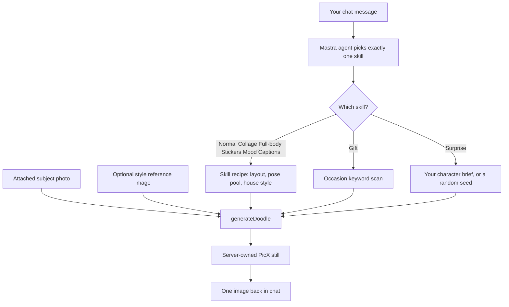
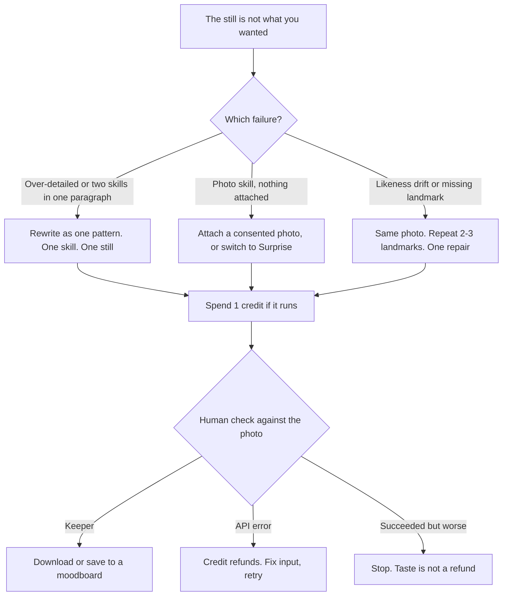

**Direct answer:** On [doodleai.art](https://doodleai.art), a useful prompt names one live skill, attaches the right input, and leaves house style to the skill. The photo carries likeness. Chat text mainly routes the Mastra agent. Gift scans occasion words. Surprise uses your character brief. Copy one pattern below, then generate on that skill.

This is a prompt and example library, not a filter mall and not a how-to for a first selfie. If you still need the four-step sitting for one square portrait, read [How to turn a photo into a cartoon with Doodle AI](/photo-to-cartoon/). If you are still deciding whether you even wanted a still, read [What does an AI cartoon generator actually do?](/ai-cartoon-generator/). This page is for the next job: you already know you want a hand-drawn doodle, and you want the chat line to do something real.

Doodle AI is an Astro and Mastra chat-first still-image studio. You can browse without an account. Sign-in is required to upload, generate, save, and sync account work. Generation uses a server-owned PicX connection. You do not paste a PicX key into Settings. New accounts receive **5 signup credits**. Every runnable skill reserves **1 credit**. Failed generations refund. Taste is not a refund. Product facts below are current as of 2026-08-25. If a later screen disagrees with this page, trust the live product, [llms.txt](https://doodleai.art/llms.txt), and the [privacy](https://doodleai.art/privacy-policy/) and [terms](https://doodleai.art/terms-of-service/) pages.

A historical US Google Ads volume snapshot from 2026-08-24, collected through [DataForSEO’s search-volume endpoint](https://docs.dataforseo.com/v3/keywords_data/google_ads/search_volume/live/), recorded `ai cartoon generator` at 4,400 monthly searches. That number describes search language. It is not Doodle AI traffic, conversion, or quality evidence. It is why the internet is full of “80 prompt” roundups. This library does not promise 80 styles. Doodle AI currently has **one house look** — naive marker-and-ink doodle — and **seven runnable skills**.

The named sittings later in this article (Imani, Devon) are **hypothetical**. They are not customers. No owned before/after files are attached yet. Every output description is labelled hypothetical.

## Visual plan for prompt-in, still-out cards

This article does not paste a competitor cartoon, a stock “AI brain,” or another skill’s sample and caption it as proof of these prompts. Until consented source photos and matching Doodle AI stills exist as owned files, treat the figures as a production plan.

**Planned owned figure 1 (not yet attached)**

- Intended public path: `/ai-cartoon-generator/prompts/doodleai-art-prompt-card-normal.png`
- Layout: the Pattern 1 prompt in plain text beside a 1:1 Normal doodle generated from a consented portrait.
- Proposed alt text: “Prompt card showing a landmark-first Doodle Avatar request next to a square hand-drawn doodle of a person with box braids and a mustard jacket, generated with the Normal skill on doodleai.art.”
- Proposed caption: “Owned Pattern 1 card from the Normal skill on doodleai.art. Source photo used with permission. Hypothetical until this file exists. Square doodle still, not a style-catalog thumbnail.”

**Planned owned figure 2 (not yet attached)**

- Intended public path: `/ai-cartoon-generator/prompts/doodleai-art-prompt-card-stickers-vs-collage.png`
- Layout: one square die-cut sticker *sheet* beside one 3:2 close-up collage, each labelled with the prompt that requested that skill.
- Proposed alt text: “Side-by-side of a Doodle AI die-cut sticker sheet and a six-panel close-up collage generated from the same consented photo, showing two different live skills rather than two styles.”
- Proposed caption: “Owned comparison of Stickers versus Collage on doodleai.art. Same source photo, two skills, two layouts. Not WhatsApp export. Not six separate files.”

Do not read a Surprise character as a likeness of Imani’s photo. Do not read a Gift card as a shipped print.

## What a Doodle AI prompt can influence, and what it cannot

On many cartoon sites, “the prompt” means a paragraph you hope the model will obey, plus a style thumbnail you tap. [ImageToCartoon](https://imagetocartoon.com/) currently advertises 80+ styles. [Fotor’s photo-to-cartoon page](https://www.fotor.com/features/photo-to-cartoon/) currently lists 54+ looks. Those are their catalogs. They are not Doodle AI. [Canva’s photo-to-cartoon feature](https://www.canva.com/features/photo-to-cartoon/) and [Adobe Firefly’s cartoon generator](https://www.adobe.com/products/firefly/features/ai-cartoon-generator.html) also sit on the same search surface. This article does not rank them and does not claim a bake-off.

On doodleai.art, a chat turn is split across several layers. Mixing those layers is how people write a 180-word “cinematic anime protagonist” brief, spend a credit, and get a naive doodle that ignored half the lore.

| Lever | Who currently controls it | What your chat text actually does |
| --- | --- | --- |
| Which live skill runs | Mastra agent, from your request | Name the outcome: one avatar, six close-ups, head-to-toe action, sticker *sheet*, mood grid, gift card, or a fictional character with no photo |
| Subject likeness | The attached photo, for every photo skill | Chat cannot invent a face the photo does not show. If no photo is attached, photo skills should ask for one |
| Optional style/composition reference | A second attached image, labelled as a reference, never as the subject | Useful as extra visual guidance. It is not a character-lock and not a second person in the same still |
| House style (bold outline, flat color, no photoreal, no watermark) | The skill’s baked generation recipe | You can agree with it (“no text,” “warm-white background”). You cannot replace it with a 80-look catalog |
| Layout and aspect ratio | The skill | Normal, Surprise, Stickers, and Gift are 1:1. Collage, Full-body, and Mood Captions are 3:2 six-panel pages |
| Pose and sticker sets | Skill pose pools, assembled per run | Asking “six expressions” routes to Collage. Typing an exact six-shot list does not become a storyboard feature |
| Mood-caption words | Randomized from a fixed pool | You request the Mood Captions skill. You do not hand-pick “Miss You” into panel three today |
| Gift card occasion and lettered line | Keyword scan of the Gift `description` | “birthday,” “thank,” “congrat,” “get well” / “feel better” / “sorry you,” “love” / “anniversary” / “valentine.” First match wins. Custom verses are not live |
| Surprise character | Your words, or a random seed if you gave none | This is the one likeness-free skill. Description is the brief |
| Visual theme (pastel, neon, sunset, mono) | A chat style setting sent with the turn, not a skill | A studio hint. Not four extra products. Not a style mall |
| Saved character `@name` | Organization-scoped shared reference | A reminder in the thread. **Guaranteed character continuity is not live** |
| Credits, refunds, rate limits | Server ledger | Prompts do not add credits. Stripe checkout is not live |

Two skills currently pass your wording through as a generation parameter:

1. **[Gift](https://doodleai.art/skills/gift/)** — the tool inspects the description for an occasion keyword and then letters a **fixed** card message for that occasion.
2. **[Surprise](https://doodleai.art/skills/surprise/)** — the tool uses your character description, or invents one if you said nothing.

For **[Normal](https://doodleai.art/skills/normal/)**, **[Collage](https://doodleai.art/skills/collage/)**, **[Full-body](https://doodleai.art/skills/full-body/)**, **[Stickers](https://doodleai.art/skills/stickers/)**, and **[Mood Captions](https://doodleai.art/skills/mood-captions/)**, the generation tool currently builds its own instruction from the skill recipe: house style, grid rules, die-cut spec, or caption pool. Your message still matters. It tells the agent which recipe to load, whether a photo is present, and whether a separate reference image should ride along. It is not a promise that every adjective will be spliced into the PicX instruction.

That is the contract this library is built on. Write for the contract, not for a generic “AI cartoon generator prompts” template you found under someone else’s 80 styles.

## How one chat turn is split

Read that as a routing diagram, not as a quality guarantee. The agent is instructed to choose **one** skill, ask for a photo when a photo skill has none, and call generation once. If the request is genuinely ambiguous, it should ask one short question instead of guessing. You do not get a batch of candidates. User-authored skills are **not live**. Server-side conversation memory is **not live**; the agent does not keep a private long-term memory of your face across Worker restarts. Signed-in threads, saved references, moodboards, and generation records are organization-scoped in the API. That is shared data behavior, not a prompt that “remembers you.”

After a still returns, a follow-up such as “thicker outline” or “warmer paper” is treated as a **fresh call of the same skill** with the same photo, and it costs another credit if it runs. The house-style notes map those phrases to line weight and paper tone for the agent. They are not a free undo, not a slider, and not a proof that the second face will match the first.

## Eight prompt patterns, mapped to live skills

Each pattern below is tagged with **exactly one** current skill, except Pattern 8, which is a follow-up on whichever photo skill you just ran. Copy the prompt. Attach the input the skill actually needs. Do not glue two skills into one paragraph.

| # | Pattern | Live skill | Required input | What you are actually asking for |
| --- | --- | --- | --- | --- |
| 1 | Landmark-first portrait | [Normal / Doodle Avatar](https://doodleai.art/skills/normal/) | One photo | One 1:1 doodle bust |
| 2 | Six close-ups, one page | [Collage](https://doodleai.art/skills/collage/) | One photo | One 3:2 image, six close-up panels |
| 3 | Action family, head to toe | [Full-body](https://doodleai.art/skills/full-body/) | One photo, ideally showing more than a tight headshot | One 3:2 image, six full-body poses |
| 4 | Fictional brief, no likeness | [Surprise](https://doodleai.art/skills/surprise/) | No photo | One 1:1 invented doodle character |
| 5 | Die-cut sheet, not a chat pack | [Stickers](https://doodleai.art/skills/stickers/) | One photo | One 1:1 sticker *sheet* image |
| 6 | Mood grid, words from the pool | [Mood Captions](https://doodleai.art/skills/mood-captions/) | One photo | One 3:2 page with six hand-lettered captions |
| 7 | Occasion keyword, fixed verse | [Gift](https://doodleai.art/skills/gift/) | One photo | One 1:1 greeting still |
| 8 | Same-skill repair | The skill you just used | The same photo | One new still, 1 more credit |

Emotional Modes and Seasonal Pack are catalog previews. They are **not runnable**. Do not write prompts for them.

### Pattern 1 — Landmark-first Normal avatar

**Skill:** [Doodle Avatar (Normal)](https://doodleai.art/skills/normal/)
**Photo:** required
**Output:** one 1:1 still

Use this when you want a single illustrated portrait of the person or pet in the photo. The skill is the default for “doodle me” and “turn this into a cartoon.” House style already asks the model to keep hairstyle silhouette and color, face shape, expression, skin tone, glasses, and distinctive accessories, then redraw them as illustration.

Your chat line has three jobs: name the single-portrait outcome so the agent does not load Collage, name two or three landmarks you will check later, and forbid text. The photo does the rest.

**Copy**

> Doodle avatar from this photo. Keep the box braids with the gold cuffs, the silver septum ring, and the mustard jacket. Closed-mouth smile. Bold outlines, clean warm-white background. No text.

**Do not paste**

> Make me an 8K cinematic anime protagonist in a neon alley, wind in the braids, holding a glowing sword, eight-head proportions, photoreal skin, signed in the corner, then animate a 12-frame fight, export as a WhatsApp sticker, and keep this exact face forever.

Normal will still try to draw **one square doodle**. It will not become video. It will not typeset a signature. It will not install a chat-app sticker. The extra lore competes with the landmarks and can send the agent looking for a different skill.

**Hypothetical output (not an owned still).** A mustard jacket, visible gold cuffs on the braids, a small silver ring, simplified features, warm-white ground, no caption. If the septum vanishes, that is a landmark miss, not a new personality to invent in the next paragraph.

### Pattern 2 — Ask for a close-up collage, not six files

**Skill:** [Close-up Collage](https://doodleai.art/skills/collage/)
**Photo:** required
**Output:** one 3:2 landscape image, exactly six panels

Use this when you want several expressions of the same illustrated person from one photo. The skill draws a strict 3-column by 2-row grid, varies pose and angle, and overlays sparse doodle marks. It is **one picture**. It is not six downloads, not a batch job, and not a storyboard.

Your chat line should request the grid. You do not currently author the six poses. The skill assembles a pose set from its own pool each run. “Six expressions, 3x2, same mustard jacket” is enough. A typed shot list is not a production feature.

**Copy**

> Close-up doodle collage from this photo, 3x2 grid, six different candid expressions of the same person. Keep the box braids, septum ring, and mustard jacket. Scrapbook overlays are fine. No captions, no extra people.

**Do not paste**

> Panel 1 left three-quarter laugh, panel 2 profile with a tear, panel 3 overhead wink, panel 4 hands on a coffee cup with the logo readable, panel 5 a second friend from another photo, panel 6 a quote in Helvetica, then zip each panel as its own PNG.

That paragraph asks for custom lettering, a second likeness, and six files. Collage does not take a second subject photo as a second person. Captions belong on Mood Captions, and even there the words come from a pool. Extra people belong in a different sitting, if at all.

**Hypothetical output (not an owned still).** One wide page, six close-up doodle busts, same braids and jacket, different angles, thin gutters, a few sparkles crossing a border. If one panel crops like a stranger, do not “fix it” by adding a biography. Recrop the source photo so the face is large, then run Collage again.

### Pattern 3 — Name an action family for Full-body, then inspect the feet

**Skill:** [Full-body Action Collage](https://doodleai.art/skills/full-body/)
**Photo:** required
**Output:** one 3:2 landscape image, six head-to-toe poses

Use this when the request is movement or the whole outfit: dancing, jumping, walking, karate, yoga, “show the jacket.” Every panel must show the complete figure. That is the only hard split from close-up Collage.

Naming an action family helps the agent pick Full-body instead of a face grid. It does not give you a custom six-shot fight scene. The generation recipe currently draws six actions from its own pool. The skill’s pose library talks about themed mixes — dance, sports, martial arts, everyday, yoga — as guidance, not as a user-authored shot list.

If the photo is a tight headshot, the skill is specified to say so honestly: the body below the crop will have to be invented. Offer Collage before spending the credit if you only needed faces.

**Copy**

> Full-body action collage from this photo, 3x2, head to toe in every panel. Keep the box braids, mustard jacket, and septum ring on the same character. Everyday movement is fine: walk, stretch, wave. Motion-line doodles are ok. No text.

**Do not paste**

> Six-shot storyboard, 16:9, camera moves, karate vs a second character, hold the kick for four frames, then export an animatic.

Video, timeline, and shot-list automation are **not live**. Full-body is still six doodle stills on one page.

**Hypothetical output (not an owned still).** Six complete figures, same jacket color story, feet visible, motion ticks near a jump. If a panel is cut off at the knees, the skill drifted toward a close-up. Say you need head-to-toe again, or switch to Collage on purpose.

### Pattern 4 — Surprise: a character brief, not a selfie in words

**Skill:** [Surprise Me](https://doodleai.art/skills/surprise/)
**Photo:** none. This is the only live skill that must not receive a subject photo
**Output:** one 1:1 fictional doodle

Use this when you have no photo, will not upload one, or want a made-up character. If you describe hair, vibe, outfit, accessories, or occupation, the skill is instructed to follow that brief. If you describe nothing, it invents. Style notes for Surprise include bold graphic hair, rough marker or dry-brush edges, and restrained watercolor-like color, still inside the same no-photorealism rule.

This is the one pattern where the paragraph *is* the subject. It is also the pattern people misuse when they wanted a cartoon of themselves and attached nothing.

**Copy**

> Surprise me. No photo. A sleepy fictional doodle character with mint-green shaved sides, an oversized rust scarf, round wire glasses, and a small tote. Naive marker, warm-white background, no text, nobody real.

**Do not paste**

> Surprise me as me, keep my real face from memory, use the selfie I uploaded last week, and make it my official mascot with a commercial license.

There is no server memory of last week’s selfie. Surprise will not become a likeness studio because you said “as me.” Commercial licensing is **not live**.

**Hypothetical output (not an owned still).** A square invented bust: mint crop, huge scarf, wire glasses, playful asymmetry, cream ground. It should not look like Imani. If it accidentally resembles a real person you know, do not publish it as that person.

A second Surprise prompt, still hypothetical, with almost no brief:

> Surprise me. Random doodle character. No photo.

That is valid. You are asking the skill to pick a seed. You will not get the scarf on purpose.

### Pattern 5 — Stickers: die-cut sheet language

**Skill:** [Sticker Pack](https://doodleai.art/skills/stickers/)
**Photo:** required
**Output:** one 1:1 sheet of separate die-cut busts

Use this when you want a *sheet image* of four or five head-and-shoulders stickers of the same illustrated character, each with a white die-cut border, light paper grain, and a short drop shadow on a warm-white page. The live product is that still. It is not a transparent PNG pack, not an iMessage tray, and not a shipped vinyl order.

ChatGPT Images launched native chat-app stickers on 2026-08-24; that is a different product. See the [ChatGPT announcement](https://x.com/ChatGPT/status/2091996384954069032). Doodle AI does not export WhatsApp or iMessage stickers.

Your prompt should say “die-cut sticker sheet” so the agent does not load Collage (a bordered grid) or Normal (one portrait). Pose variety is assembled from the skill’s sticker pool. You can mention a wave or a wink as a wish. You cannot currently lock a five-sticker script.

**Copy**

> Square die-cut sticker sheet from this photo. Four or five head-and-shoulders busts of the same person. Keep the box braids, gold cuffs, septum ring, and mustard jacket. Each cutout gets its own white die-cut border, paper grain, and a short shadow on a warm-white sheet. Space between stickers. No text, no scenery, not a 3x2 collage.

**Do not paste**

> Make a WhatsApp pack with transparent backgrounds, add it to iMessage, 30 stickers, print-ready die lines, ship them to my apartment.

Physical fulfillment is **not live**. Transparent chat-app export is **not live**.

**Hypothetical output (not an owned still).** A square page, four or five doodle busts floating as separate stickers, mustard jacket on each, no lettering. If the page reads as six boxed panels, you got collage behavior. Say “separate die-cut stickers, not a grid” on the next credit, or run Collage on purpose.

### Pattern 6 — Mood Captions: request the grid, do not lock the six words

**Skill:** [Mood Captions](https://doodleai.art/skills/mood-captions/)
**Photo:** required
**Output:** one 3:2 page, six panels, one hand-lettered caption each

Use this when you want a shareable mood or reaction page. The generation tool currently picks six entries at random from a short pool that includes words such as Miss You, Enough, Healing, Overthinking, Tired, Hope, Peace, Sorry, Goodbye, Wait, Maybe, Almost, Still, Again, Never, and Why?. You **cannot** hand-pick the six words for a given run today. If you ask for “make one say Miss You,” be honest with yourself: today’s path randomizes a set. Running again costs another credit and yields a fresh random six, not an editor.

Your prompt should request the skill and the same-person constraint. Treat any named words as a wish, not a typesetting contract.

**Copy**

> Mood-captions collage from this photo, 3x2, six doodle moods with short hand-lettered captions. Same person in every panel: box braids, septum ring, mustard jacket. I know the six words come from the pool. No extra logos.

**Do not paste**

> Put these exact six words in this order — Grind, Ship, Founder, Series A, Unicorn, Exit — in a clean sans font, and keep them identical next week for my brand kit.

That is a custom lettering and continuity job. It is not this skill. Caption quality can also wobble; inspect whether each word is readable and does not cover the face before you share the page.

**Hypothetical output (not an owned still).** A wide six-panel doodle of Imani’s landmarks, six pool words in uneven marker letters. If the letters collide with the septum ring, that still cost a credit. A second run is a new random set, not a typesetting pass.

### Pattern 7 — Gift: the occasion word is the lever

**Skill:** [Gift Doodle](https://doodleai.art/skills/gift/)
**Photo:** required
**Output:** one 1:1 greeting still with a **fixed** lettered line

Use this when the still has to be sent as a card-like image. The tool inspects your description for a small keyword list, then picks embellishments and a standard message. First match wins.

| If the wording includes | Occasion | Message that will actually letter |
| --- | --- | --- |
| birthday, bday | Birthday | Happy Birthday |
| thank | Thank You | Thank You |
| congrat | Congrats | Congrats! |
| get well, feel better, sorry you | Get Well | Get Well Soon |
| love, anniversary, valentine | Love | With Love |
| none of the above | Thinking of You | Thinking of You |

There is currently **no custom card verse**. “Happy 29th, Imani” will not replace “Happy Birthday.” Unmapped events (graduation, housewarming, new job without “congrat”) fall to Thinking of You unless you borrow a keyword on purpose.

**Copy**

> Birthday doodle gift from this photo. Keep the box braids, gold cuffs, and mustard jacket. Square greeting still. I know the lettered line will be Happy Birthday.

**Do not paste**

> Thank you for the birthday dinner, congratulations on the anniversary, sorry you had a long week — write all of that on the card.

Those keywords fight. Birthday is checked before thank. Congrat is checked before anniversary. “Sorry you” is a Get Well rule. Pick **one** occasion word. Leave the others out.

**Hypothetical output (not an owned still).** A square card-like doodle, balloons or confetti, “Happy Birthday” in marker letters, Imani’s landmarks if the photo held them. Digital file. Not a shipped print. Not a licensed merchandise design.

### Pattern 8 — Same-skill repair, one change at a time

**Skill:** whichever photo skill just ran
**Photo:** the same one
**Output:** one new still, 1 credit if it runs

Use this after a generation that is almost usable. The agent is instructed to keep the pinned skill unless you clearly want a different kind of output. Name the missing landmark. Use the mapped refinement words when they match what you saw: thicker outline, warmer paper, more chibi, cleaner (fewer overlay doodles), more colorful.

Do not spend the repair credit on a new biography, a new skill, and a new prop in the same sentence.

**Copy, after a Normal still that lost the septum ring**

> Same person from the photo. Put the silver septum ring back. Keep the box braids with gold cuffs and the mustard jacket. Thicker outline. No extra jewelry, no caption.

**Do not paste**

> Also make it Full-body karate, add my dog, switch to neon, and keep the last face identical.

That is three skills, a second likeness, a theme change, and a continuity guarantee. None of that is a repair.

**Hypothetical output (not an owned still).** A second square avatar. The ring may return. The grin may change. Treat that as expected drift, then stop if the face got worse. Taste is not a refund. An API failure would have refunded; a successful still you dislike would not.

## Failure case: over-detailing

Over-detailing is not “being specific.” Landmarks are specific. Over-detailing is stacking jobs the live skills do not accept: extra people, extra formats, extra verses, extra styles, extra motion.

Typical over-detailed prompt, still hypothetical:

> Cartoonize this selfie in Studio Ghibli, Pixar, South Park, and pencil sketch, 80 styles, plus a couple matching PFPs, a sticker pack for WhatsApp, a birthday verse that says “Happy 29th Imani,” a six-second talking clip, C2PA, and a commercial license, and save it as the official character so every future run matches.

What that paragraph actually does on doodleai.art:

- It does not unlock 80 styles. House style stays naive doodle.
- It confuses skill routing. The agent has to pick **one** skill. Birthday wants Gift. Sticker pack wants Stickers. Talking clip is not a skill.
- It asks for products that are **not live**: WhatsApp/iMessage export, video, C2PA, commercial licensing, guaranteed continuity, Stripe packs, physical fulfillment, user-authored skills.
- It burns attention that should have gone to the photo. If the face is small or dark, no paragraph will recover it.

A practical test before you hit send: can you point at **one** row in the pattern table? If you cannot, split the sitting. One credit, one skill, one still.

Over-detailing also shows up as costume fan fiction on a photo skill. “Add a crown, a dragon, a city, a logo, and a slogan” turns the bust into a poster the house style is trying not to draw. Normal and Stickers both ask for clean grounds. Collage overlays should stay sparse. If you wanted a fictional costume with no likeness, that is Surprise, and even Surprise asks for one point of visual interest, not five.

## Failure case: missing required photo

Six of the seven live skills **require** a photo. Surprise is the exception. The agent is instructed: if the chosen skill needs a photo and none is attached, ask for one and do not call the tool. Offer Surprise so you are not stuck.

If you wanted “an AI cartoon of myself” and attached nothing, you did not write a clever text-to-image prompt. You skipped the subject. The honest recoveries are:

1. Attach a photo you have permission to use, then run Normal, Collage, Full-body, Stickers, Mood Captions, or Gift.
2. Keep the sitting photo-free and run Surprise, knowing the result will not be you.

Do not try to smuggle a likeness through Surprise by describing your own face in painful detail. That is still a fictional character. Do not paste a PicX URL from another app and call it an upload. Uploads go through the signed-in doodleai.art path, using the server-owned connection.

**Hypothetical miss.** Devon types Pattern 1 and attaches nothing. The useful next line from the product is “attach a photo, or we can Surprise a fictional character instead.” Devon either uploads Imani’s consented selfie — only if Imani agreed — or switches to Pattern 4. Using someone else’s photo without permission is a disqualifying use case, not a prompt trick.

Group photos are a related miss. Normal is a single-portrait skill. A huddle of four faces in one frame is a weak subject. Recrop to one consented face, or accept that faces will compete. The product does not currently document a two-source-image couple merge as a live generation mode. Do not write a prompt that pretends it does.

## Failure case: identity drift

A good first doodle feels like a character you could reuse. The current product does not lock that character.

What exists today, for signed-in work in the active organization:

- You can keep the same photo attached and ask for another still.
- You can save a named character reference and `@`-mention it in chat.
- You can save keepers to an organization-scoped moodboard.
- You can paste the same two or three landmarks again.

What does **not** exist:

- Guaranteed identical faces across generations.
- A legal character bible.
- Batch variants from one click as a verified public workflow. Batch job schemas exist as foundation; they are not a user-facing “give me twelve matching PFPs” control.
- Projects, share links, and review portals as complete public workflows. Those are partial foundations. Do not put them in the prompt.

Identity drift is expected. Glasses vanish. A hoop becomes a stud. Box braids become a bun. A Surprise character you liked will not restamp itself because you said “same one.” Treat `@name` as a human reminder in an organization-scoped thread, not as a lock.

When drift happens, do not add more lore. Repeat the landmarks. Recrop the photo if the face was small. Stop after one repair if the second still is worse. Five signup credits disappear quickly if you chase a continuity the model does not offer.

Credits are pooled on the organization you signed into. A personal organization is created on signup. Configuration allows up to 5 organizations and up to 25 members, with owner, producer, artist, reviewer, and client roles in the Better Auth organization layer. Sessions carry an active organization. Membership and permissions are rechecked. That is a working backend and API foundation plus shared data behavior. It is not a polished team prompt studio. For this library you are one person spending sitting tickets.

## A clearly labelled hypothetical sitting

The following sitting is fictional. Imani and Devon are not real users. No time-to-done, no quality score, and no share rate was measured.

**Hypothetical person:** Imani, 27, wants better control over doodle stills after already knowing photo-to-cartoon exists.
**Hypothetical photo:** indoor window-light selfie, box braids with two gold cuffs, silver septum ring, mustard jacket, closed-mouth smile. Imani took it. Imani consents to processing it.
**Hypothetical budget:** 5 signup credits. Stripe is not live, so there is no “buy a prompt pack.”

| Credit | Pattern | Skill | Hypothetical intent | Hypothetical human check |
| --- | --- | --- | --- | --- |
| 1 | 1 | Normal | Landmark-first bust | Braids and jacket held; septum faint |
| 2 | 8 | Normal | Put the septum back, thicker outline | Ring readable; grin slightly changed |
| 3 | 5 | Stickers | Die-cut sheet of the same photo | Sheet reads as stickers, not a 3x2 grid |
| 4 | 7 | Gift | Birthday card for a friend, Imani’s face as the doodle, with permission | “Happy Birthday” lettered; not a custom verse |
| 5 | unspent | — | Do not spend this on “one more identical face” | Continuity is not for sale here |

**Hypothetical parallel sitting, still fictional.** Devon has no photo and will not upload one. Devon copies Pattern 4, runs Surprise, and gets a mint-crop scarf character that is nobody. Devon does not then ask Surprise to “make it look like Imani.” That would be a different, photo-based job.

If credit 1 had failed with a provider error, the credit would have refunded and Imani would still have 5. If credit 1 had succeeded and looked unlike Imani, that would still have cost 1. Those outcomes are different. The ledger already treats them differently. Prompts should too: retry after a refunded error; repair one landmark after a successful miss; stop after a successful miss that got worse.

## Copy-paste index

Use these as starting text. They are not measured “winning prompts.” They do not lock likeness. Attach the input the skill needs.

**Normal**

> Doodle avatar from this photo. Keep [landmark 1], [landmark 2], and [landmark 3]. Closed-mouth smile. Bold outlines, clean warm-white background. No text.

**Collage**

> Close-up doodle collage from this photo, 3x2, six expressions of the same person. Keep [landmarks]. No captions, no extra people.

**Full-body**

> Full-body action collage from this photo, 3x2, head to toe in every panel. Keep [landmarks] and the outfit color. No text.

**Surprise**

> Surprise me. No photo. A fictional doodle character: [hair], [one vibe], [one signature detail]. Warm-white background, no text, nobody real.

**Stickers**

> Square die-cut sticker sheet from this photo. Head-and-shoulders busts, white die-cut borders, paper grain, short shadows, warm-white sheet. Keep [landmarks]. No text, not a collage grid, not a chat pack.

**Mood Captions**

> Mood-captions collage from this photo, 3x2. Same person in every panel. Keep [landmarks]. I know the six words come from the pool.

**Gift**

> [One occasion word] doodle gift from this photo. Keep [landmarks]. Square greeting still. I know the lettered line is the standard message for that occasion.

**Repair**

> Same person from the photo. Put [missing landmark] back. Keep [two other landmarks]. Thicker outline. No extra props.

Replace the bracketed parts with things the photo actually shows. If the photo does not contain a hoop, do not ask the hoop to survive.

## What not to put in the prompt

Leave these out. They do not become features because you typed them.

- PicX keys, OpenRouter keys, or any provider credential. Generation is server-owned.
- WhatsApp, iMessage, or “transparent chat sticker pack.”
- Video, timeline, animatic, lip-sync, shot lists.
- Print-ready dimensions, shipped stickers, mugs, or fulfillment.
- Commercial license, C2PA badge, or copyright advice.
- “Keep this face identical forever,” “batch me 12,” “fork this as a skill,” “remember my last chat on the server,” “voice input.”
- Emotional Modes or Seasonal Pack, as if they generate today.
- Checkout, subscriptions, or credit-pack SKUs. Stripe is **not live**.
- doodleai.fun, InstaDoodle, cartoonize.ai, or [LazyAvatar](https://lazyavatar.com) as if they were this studio. LazyAvatar is a seed-based hand-drawn avatar API, not a photo-likeness studio. This product is **doodleai.art**. There is no official `@doodleais` account to cite.

Adobe’s 2025 creator survey, summarized in [Adobe’s published post](https://news.adobe.com/news/2025/10/adobe-max-2025-creators-survey), reported that 86% of more than 16,000 surveyed creators use creative generative AI. That is market context for why prompt libraries exist. It is not a Doodle AI metric and not a reason to pretend this studio is a 80-style prompt engine.

## Related reading

- [How to turn a photo into a cartoon with Doodle AI](/photo-to-cartoon/) — the first-sitting process for Normal
- [What does an AI cartoon generator actually do?](/ai-cartoon-generator/) — photo still vs text still vs animation vs video

The public hub for live skills is [doodleai.art/skills/](https://doodleai.art/skills/). [About](https://doodleai.art/about/) is the short product page.

## Sources

- [Doodle AI](https://doodleai.art)
- [Skills catalog](https://doodleai.art/skills/)
- [Doodle Avatar / Normal](https://doodleai.art/skills/normal/)
- [Close-up Collage](https://doodleai.art/skills/collage/)
- [Full-body Action Collage](https://doodleai.art/skills/full-body/)
- [Surprise Me](https://doodleai.art/skills/surprise/)
- [Sticker Pack](https://doodleai.art/skills/stickers/)
- [Mood Captions](https://doodleai.art/skills/mood-captions/)
- [Gift Doodle](https://doodleai.art/skills/gift/)
- [About doodleai.art](https://doodleai.art/about/)
- [Doodle AI llms.txt](https://doodleai.art/llms.txt)
- [Privacy policy](https://doodleai.art/privacy-policy/)
- [Terms of service](https://doodleai.art/terms-of-service/)
- [DataForSEO Google Ads Search Volume Live](https://docs.dataforseo.com/v3/keywords_data/google_ads/search_volume/live/) — 2026-08-24 US snapshot, search language only
- [ImageToCartoon](https://imagetocartoon.com/)
- [Fotor photo to cartoon](https://www.fotor.com/features/photo-to-cartoon/)
- [Canva photo to cartoon](https://www.canva.com/features/photo-to-cartoon/)
- [Adobe Firefly AI cartoon generator](https://www.adobe.com/products/firefly/features/ai-cartoon-generator.html)
- [LazyAvatar](https://lazyavatar.com)
- [ChatGPT Images sticker announcement](https://x.com/ChatGPT/status/2091996384954069032)
- [Mastra Astro integration](https://mastra.ai/integrations/frameworks/astro)
- [Agent Skills](https://agentskills.io)
- [Adobe 2025 creator survey](https://news.adobe.com/news/2025/10/adobe-max-2025-creators-survey) — market context only
- [C2PA 2.2 explainer](https://c2pa.org/specifications/specifications/2.2/explainer/Explainer.html) — provenance standard; not a current Doodle AI feature

Product facts in this article are current as of 2026-08-25.

## Copy one prompt, then run that skill

Pick **one** pattern. Open the matching public skill page. Sign in. Attach a photo you are allowed to use, unless you chose Surprise. Paste the short prompt. Generate. That sitting costs 1 credit if it runs and refunds if it fails. Do not expect 80 styles, a locked character, chat-app stickers, video, checkout, or a custom card verse. You are asking doodleai.art for one hand-drawn still from a live skill. That is the current job.
