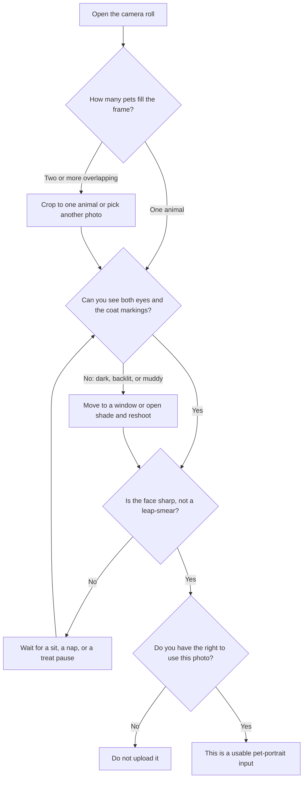
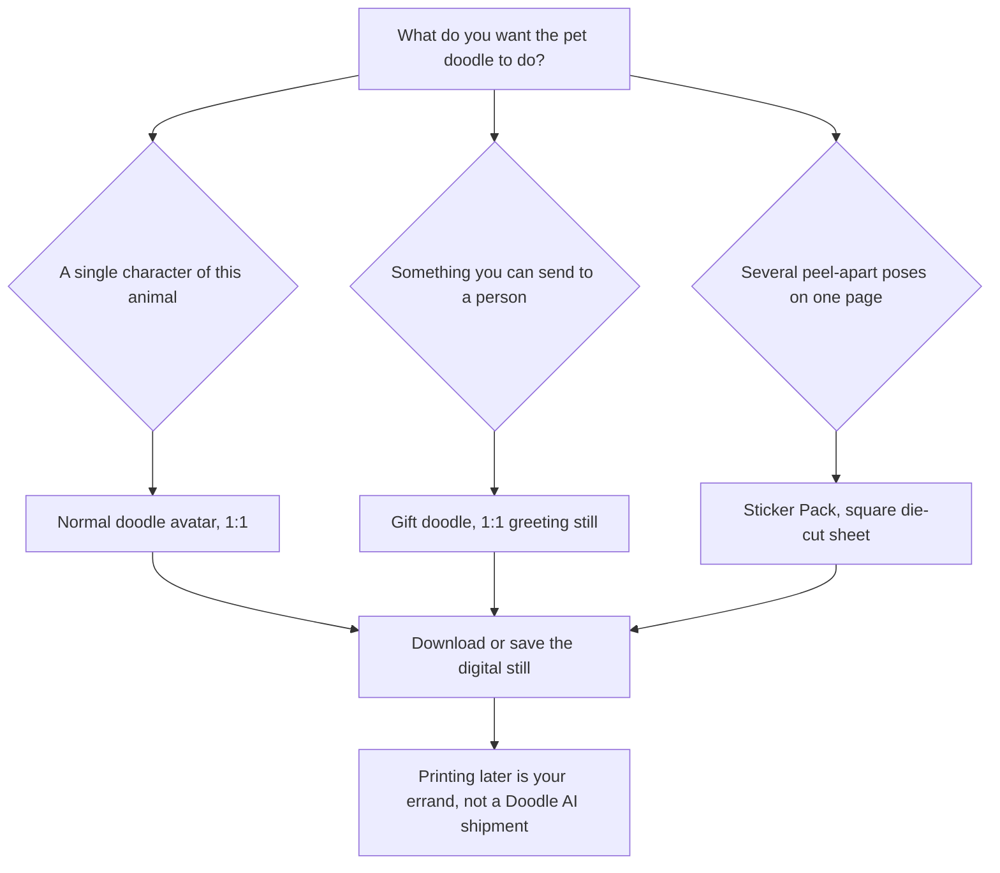

**Direct answer:** To make a cartoon pet portrait at [doodleai.art](https://doodleai.art), sign in, attach one clear photo of a single pet, and generate a still with [Normal](https://doodleai.art/skills/normal/), [Gift](https://doodleai.art/skills/gift/), or [Stickers](https://doodleai.art/skills/stickers/). You download a digital doodle, not a shipped print. Dark, blurry, or crowded multi-pet shots often fail, and memorial use is a sensitive choice, not a dedicated product.

You are probably not searching for “AI art.” You are staring at a camera-roll photo of a dog with a sock in its mouth, a cat in a sun patch, or a rabbit who only holds still for two seconds, and you want that animal to become a cute character you can keep. Search language for that job is closer to `pet cartoon` and “cartoon my dog” than to a generic cartoonizer. A historical US Google Ads volume snapshot from 2026-08-24, collected through [DataForSEO’s search-volume endpoint](https://docs.dataforseo.com/v3/keywords_data/google_ads/search_volume/live/), recorded `pet cartoon` at 880 monthly searches with a competition index of 11. Those numbers describe search language. They are not Doodle AI traffic, conversion, quality, or ranking evidence.

This article is a pet-parent how-to. It is not a professional pet-portrait commission. It is not a print-shop order form. It is not a grief-counseling product. It is a still-image guide for turning **one photo of one animal** into a playful hand-drawn doodle on **doodleai.art**, then deciding whether that doodle belongs as a character, a greeting image, or a die-cut sticker *sheet*.

Doodle AI is an Astro and Mastra chat-first still-image studio. You can browse without an account. Sign-in is required to upload, generate, save, and sync account work. Generation uses a server-owned PicX connection. You do not paste a PicX key into Settings. Product facts below are current as of 2026-08-25. If a later screen disagrees with this page, trust the live product and the [privacy](https://doodleai.art/privacy-policy/) and [terms](https://doodleai.art/terms-of-service/) pages.

The people and animals named later — Mina and Bramble, Cole and Noodle, Anika and Button — are **hypothetical**. They are not customers. They are labelled teaching cases. They are not proof of output quality.

## Visual plan: owned pet stills are not attached yet

This article does not paste an unrelated human avatar, sticker sheet, gift card, collage, or third-party cartoon as if it were a pet portrait. Until consented pet photos and matching Doodle AI results exist as owned files, treat the figures as a production plan rather than fake proof.

**Planned owned figure 1 — well-lit single-pet before/after (not yet attached)**

- Intended public path once generated: `/cartoon-pet-portrait/doodleai-art-pet-cartoon-before-after.png`
- Left panel: a consented, well-lit photo of one dog or cat, face filling most of the frame, eyes visible, collar or unique marking readable.
- Right panel: the 1:1 Normal doodle avatar generated from that same photo on doodleai.art.
- Proposed alt text: “Side-by-side of a consented well-lit pet photograph and the matching hand-drawn Doodle AI doodle from the Normal skill on doodleai.art.”
- Proposed caption: “Planned owned before/after from the Normal doodle avatar skill on doodleai.art. Source photo used with permission. Digital doodle still, not a shipped print, oil commission, or memorial product.”

**Planned owned figure 2 — what not to upload (not yet attached)**

- Intended public path once generated: `/cartoon-pet-portrait/doodleai-art-pet-photo-failures.png`
- Three labelled stills, photographed or generated with permission: a dark indoor shot, a motion-blurred leap, and a couch jumble of two overlapping animals.
- Proposed alt text: “Three labelled pet photographs showing common cartoon-portrait failures: a dark underexposed face, a blurry mid-leap, and two overlapping animals on a couch.”
- Proposed caption: “Planned ‘what not to upload’ strip for doodleai.art pet portraits. These are teaching stills, not Doodle AI results. Dark, blurry, and multi-pet frames are the usual failure modes.”

**Planned owned figure 3 — three digital options from one photo (not yet attached)**

- Intended public path once generated: `/cartoon-pet-portrait/doodleai-art-pet-normal-gift-stickers.png`
- One consented pet photo, then three separate generations: Normal avatar, Gift greeting still, Stickers die-cut sheet.
- Proposed alt text: “One consented pet photo shown with three Doodle AI stills: a square doodle avatar, a greeting-card gift image, and a square die-cut sticker sheet.”
- Proposed caption: “Planned comparison of three live doodleai.art skills from one pet photo. Each still is a separate 1-credit generation. The sticker result is a die-cut sheet image, not a WhatsApp or iMessage pack.”

Do not read human-avatar samples on other posts as pet proof. A selfie doodle is a different subject. A six-panel human action collage is a different pose library. A Surprise character with no photo is fictional and will not look like your animal.

## A cartoon pet portrait is a likeness problem, not a filter

A painted pet portrait, a print-on-demand canvas, and a phone cartoon filter all sit on the same search surface. They are different jobs.

A **commissioned portrait** starts with an illustrator, a brief, revisions, and usually a physical or high-resolution file you paid someone to author. A **print shop** starts with a file you already like and a shipping address. A **phone filter** restyles pixels in place and often keeps photographic fur texture. Doodle AI’s current job is narrower: one uploaded photo becomes one hand-drawn doodle still, in a naive marker-and-ink house style, through a chat turn on doodleai.art.

[Canva’s photo-to-cartoon page](https://www.canva.com/features/photo-to-cartoon/) explicitly lists pet pictures among the images you can convert, then continue editing in Canva. That is Canva’s product copy, not a Doodle AI test. This article does not rank Canva, [Fotor](https://www.fotor.com/features/photo-to-cartoon/), [ImageToCartoon](https://imagetocartoon.com/), or [Adobe Firefly’s cartoon generator](https://www.adobe.com/products/firefly/features/ai-cartoon-generator.html). It only uses what those sites say about their own inputs. Doodle AI’s current signature is a conversational doodle at **doodleai.art**, not a style mall of anime, oil, watercolor, or photoreal fur.

Two nearby names are easy to mix up and should stay separate:

- **doodleai.art** is this studio. It is not doodleai.fun, InstaDoodle, or cartoonize.ai.
- **[LazyAvatar](https://lazyavatar.com)** is a seed-based hand-drawn avatar API. It is not a photo-likeness studio. Uploading your dog is a different job from generating a seed character with no portrait.

The generation prompts for live photo skills were written around a human portrait: hairstyle, face shape, skin tone, glasses, outfit. A pet photo is still a valid upload. The model still sees pixels. What it is *instructed* to keep, though, is human-landmark language. For an animal, you should treat the analog landmarks as **ear shape, coat color, unique markings, eye color if visible, and a distinctive collar or accessory**. Do not assume the product was tuned as a pet-specific likeness engine. There is no dedicated `/pet-cartoon/` product page in the current public hub. The public catalog is [doodleai.art/skills/](https://doodleai.art/skills/).

| You asked for | Current Doodle AI result | Not in this sitting |
| --- | --- | --- |
| A cartoon of my dog or cat from a photo | One illustrated still from one photo, if the animal is readable | A guaranteed breed-accurate painting |
| A pet profile picture | A square doodle you can crop yourself | Platform export presets |
| A birthday image of the pet | A Gift still with a detected occasion message | A custom handwritten card or a mailed print |
| Several cute poses as stickers | One square die-cut sticker *sheet* | WhatsApp, iMessage, or ChatGPT-style transparent chat stickers |
| Two pets in one frame | One illustrated frame; animals may merge or compete | A guaranteed matching pair |
| A memorial that “captures their soul” | A doodle of whatever the photo shows | A grief product, a licensed memorial, or a promise the model cannot keep |
| A canvas in the mail | A digital still you may later print yourself | Print-ready dimensions, fulfillment, or shipping |

The historical snapshot also recorded `pet portrait ai` at 110 US monthly searches with a competition index of 90. That query often wants a painterly, photoreal, or commissioned look. Do not treat it as Doodle AI’s primary job. If you wanted oil-on-canvas realism, this studio is the wrong tool.

## What doodleai.art actually makes today

**Available now.** The runnable skills that matter for this article are:

| Live skill | Public page | Input | Output you get | Output you do not get |
| --- | --- | --- | --- | --- |
| Doodle Avatar (Normal) | [/skills/normal/](https://doodleai.art/skills/normal/) | One photo | One 1:1 doodle portrait | A video, a headshot retouch, or a shipped print |
| Gift Doodle | [/skills/gift/](https://doodleai.art/skills/gift/) | One photo plus occasion wording | One 1:1 greeting-card still with a standard message | Custom card copy, physical stationery, or a gift box |
| Sticker Pack | [/skills/stickers/](https://doodleai.art/skills/stickers/) | One photo | One square die-cut sticker *sheet* | Transparent PNG packs or chat-app export |

House style across those skills is the same doodle language: bold outlines, simplified features, flat cheerful color, slightly exaggerated proportions, marker-and-ink rather than fur rendering. Normal uses a clean white or warm-white background. Gift uses a warmer card background, occasion embellishments, and one hand-lettered message. Stickers places four or five head-and-shoulders busts on a plain sheet, each with a white die-cut border, subtle paper grain, and a short drop shadow.

**Partial foundation.** Signed-in work lives on a Better Auth organization layer: a personal organization on signup, up to 5 organizations, up to 25 members, roles of owner, producer, artist, reviewer, and client, an active organization on the session, and membership/permission rechecks. Threads, messages, saved characters as shared references, moodboards, generation records, and pooled credits are organization-scoped in the API. Projects, assets, share links, batch jobs, and review states exist as schema and access-control foundations. They are not verified complete public workflows. Do not plan a family “pet project board,” a share-link gallery, or a batch of twelve collar colors as if those surfaces already ship.

**Not live.** Video, timeline or animatic, shot-list automation, C2PA provenance, commercial licensing, Stripe checkout, subscriptions, physical fulfillment, guaranteed character continuity, user-authored fork-as-skill, server-side conversation memory, voice input, and WhatsApp or iMessage sticker export are not current capabilities. Emotional Modes and Seasonal Pack appear in the catalog as coming soon; they do not generate today.

ChatGPT Images launched transparent iMessage and WhatsApp stickers, announced on X at [this ChatGPT post](https://x.com/ChatGPT/status/2091996384954069032) on 2026-08-24. That is a different product and a different job. If you wanted a sticker that peels into a chat thread, doodleai.art is not that exporter.

## Choose a photo the doodle can actually see

Most disappointing pet cartoons start as photos the model cannot parse. A doodle can only keep landmarks that are visible. Dark fur against a dark couch, a leap frozen as smear, two animals sharing one blob of pixels — those frames ask the model to invent. Invention is how a brindle mutt becomes a generic brown dog.

Photographers who actually shoot dogs and cats repeat the same lighting advice. The [American Kennel Club’s guide to photographing dogs](https://www.akc.org/expert-advice/lifestyle/taking-photos-of-your-dog/) recommends shade or golden hour rather than harsh overhead sun, and getting down to the dog’s eye level. A second [AKC piece on photographing dogs](https://www.akc.org/expert-advice/dog-breeding/say-cheese-take-best-photos-dogs/) says indoor window light helps, warns against backlighting unless you want a silhouette, and notes that a phone’s portrait mode should focus on the dog, not the blanket. Cornell’s [CatWatch “Ask Elizabeth” photography column](https://www.catwatchnewsletter.com/behavior/socialization/ask-elizabeth-11-07/) tells cat people to prefer natural window light, turn the flash off when they can, and get down to the cat’s level, because a direct flash often produces eyeshine and washed-out color. Those are photography tips from named sources. They are not Doodle AI camera settings.

Use this as a living-room check, not a studio lighting course.

**Prefer**

- One animal filling most of the frame, face toward the camera.
- Eyes visible. Both of them, if the species has two that you can see.
- Even indoor window light, or open shade outdoors.
- Coat color and unique markings that read without a flashlight: a blaze, a sock, a nose spot, a notched ear.
- A collar, harness, or bow you actually want in the doodle. Solid colors survive stylization better than tiny patterns.
- A recent photo. An old puppy picture will be illustrated as that puppy.

**Skip or recrop**

- Nighttime living-room shots lit only by a TV.
- Mid-air fetches, zoomies, and any frame where the ears are a smear.
- Two or more pets overlapping on a bed or in a carrier.
- Heavy beauty filters, already-cartoonized screenshots, or photos with stickers already on them.
- Extreme wide shots from across a park, where the animal is a handful of pixels.
- Backlit silhouettes against a bright window, unless you want a dark blob.
- A professional photographer’s file you did not license to adapt.

Dark-coated animals need extra light on the face, not extra prompt adjectives. If you cannot see the eyes in the source photo, the doodle will not invent a trustworthy gaze.

That diagram is a photo checklist. It is not a claim that a good photo guarantees a good doodle. It only keeps you from spending a credit on a frame the model has to guess.

Species notes, stated as photography hygiene rather than product guarantees:

- **Dogs.** Ear silhouette and collar color do more work than “breed” as a word in the prompt. A floppy ear that is folded out of view will not reliably reappear.
- **Cats.** Flash eyeshine and dark facial markings hide the eyes. Window light and a still sit beat a toy-lunge.
- **Other pets.** Rabbits, guinea pigs, birds, and reptiles often have even smaller faces in casual photos. Get closer. A cage-bar close-up is usually worse than a short session on a towel near a window. Do not force an animal into a pose for a cartoon.

## Consent is about the photo, not the pet’s opinion

Pets do not sign release forms. Photographers do own copyright in original photographs. The [U.S. Copyright Office’s note for photographers](https://www.copyright.gov/engage/photographers) states that copyright protects original photographs from the moment they are fixed — when you take the picture — and that the copyright owner has the right to copy, adapt, distribute, and display the work. The Office has even used pet photos as the example: original pictures of your own cat or puppy can be protected as photographs. That is copyright in the *photo*, not a claim that the animal authored the picture, and not a Doodle AI license.

Doodle AI’s [terms](https://doodleai.art/terms-of-service/) say you keep whatever rights you have in what you submit, you are responsible for having permission to upload it, and you should not upload someone else’s photo without permission. The [privacy policy](https://doodleai.art/privacy-policy/) says attached photos are sent to PicX through Doodle AI’s server-owned connection, and that you should not upload anything you do not have the right to use. Those pages are the live rules. This article does not invent a deletion window, a commercial-use grant, or a memorial exception.

Treat consent as three separate questions:

1. **Did you take this photo, or do you otherwise have the right to adapt it?** A phone snapshot you made of your own dog is the usual yes. A professional pet photographer’s gallery proof is usually a no unless your contract allows derivative use. A viral Reddit cat is a no.
2. **Would the person who lives with this animal mind a cartoon of it existing on your account?** Household pets are shared emotional property even when the copyright sits with whoever held the phone. Ask before you turn a partner’s rescue into a joke sticker sheet.
3. **Are you about to upload a sensitive moment?** End-of-life photos, clinic tables, and grief albums deserve a pause that has nothing to do with model quality. A cheerful doodle of a hard day can feel wrong even when the likeness is close.

Shelter, rescue, and breeder photos are a frequent trap. The organization or the original photographer typically owns those files. Do not treat an adoption listing as a free reference library.

This article is not legal advice. If you need a rights answer for a paid portrait sitting, ask the photographer or a lawyer. Doodle AI does not currently sell commercial licenses, and C2PA provenance is not live.

## Three live digital options, and how to pick among them

Once the photo is usable, pick the still that matches the job. All three skills below require a photo. Each generation costs **1 credit**. New accounts receive **5 signup credits**. Credits are reserved before generation and refunded when generation fails. Credits are pooled on the organization.

### Normal, when you want one pet character

Use [Normal](https://doodleai.art/skills/normal/) when the job is “make my pet into a doodle.” You get one square illustrated portrait on a clean background. This is the default if you say “cartoon my dog” with no occasion and no sticker request.

Say the landmarks out loud in the chat. Breed words are weaker than visible facts. “Keep the brindle coat, white chest, and red collar” gives the sitting something to hold. “Make him look like a noble German shepherd” asks the model to argue with the photo.

Normal is not a professional headshot product, for people or for pets. It is not a 3D bust. It is not a guaranteed breed sheet.

### Gift, when the doodle has to be sent to someone

Use [Gift](https://doodleai.art/skills/gift/) when the still is for another person: a pet birthday, an adoption anniversary, a thank-you to a sitter, a gentle “thinking of you.” Gift wraps the portrait in a greeting-card composition. Occasion detection is keyword-based from your wording. It is not freeform card design.

| If your prompt mentions | Occasion the skill currently detects | Card message that will actually render |
| --- | --- | --- |
| “birthday” or “bday” | Birthday | Happy Birthday |
| “thank” | Thank You | Thank You |
| “congrat” | Congrats | Congrats! |
| “get well”, “feel better”, or “sorry you” | Get Well | Get Well Soon |
| “love”, “anniversary”, or “valentine” | Love | With Love |
| none of the above | Thinking of You (default) | Thinking of You |

Only one occasion is detected per run, from the first keyword match. There is currently no way to set fully custom card text. If you ask for “Happy Gotcha Day, Bramble,” the live Gift path will still letter the standard message for whichever keyword it found — or “Thinking of You” if it found none. Say that out loud to yourself before you spend the credit.

Gift is a digital greeting still. It is not a mailed card, a wrapped box, or a print. Stripe checkout is not live, so there is no in-app gift purchase.

### Stickers, when you want a sheet of poses, not a chat pack

Use [Stickers](https://doodleai.art/skills/stickers/) when you want several head-and-shoulders poses of the same illustrated pet on one square sheet. Each sticker is specified as a standalone die-cut object: white border hugging the silhouette, subtle paper grain, short drop shadow, plain warm-white sheet. Default count is four or five. Poses in the skill’s library are human-gesture flavored — wave, wink, peace sign, thumbs up — so a pet sheet may still come back with those gestures translated awkwardly onto paws. That is a real limit, not a cute surprise to sell.

The output is **one image of a sticker sheet**. It is not a transparent WhatsApp pack, not an iMessage pack, and not a print-on-demand vinyl order. If you later take that PNG to a local sticker printer, that printer’s job starts after Doodle AI’s job ends.

## How to run the sitting

1. **Browse first if you want.** The [skills catalog](https://doodleai.art/skills/) is public. You do not need an account to read what Normal, Gift, and Stickers are. You do need to sign in to upload and generate.
2. **Sign in.** Creation uses Google sign-in. A personal organization is created on signup. The session carries an active organization. You receive 5 signup credits into that organization pool.
3. **Attach one image file.** Uploads accept image files and reject empty files. Images must be 20 MB or smaller. Sign-in is required; the upload uses the server-owned PicX connection. Do not paste a provider key anywhere.
4. **Ask for the skill by name.** “Doodle my dog with Normal,” “Gift doodle, birthday, this cat,” or “Sticker sheet of this rabbit” is clearer than “make it cute.” If no photo is attached, photo skills are instructed to ask for one rather than invent an animal.
5. **Spend the credit on purpose.** The ledger reserves 1 credit, calls PicX, and refunds that credit if generation fails. A result you dislike is not a failure refund. Another attempt is another credit.
6. **Look at the still the way you will actually use it.** For a pet account avatar, shrink it. For a gift, read the lettered message. For stickers, check whether the sheet still reads as separate die-cuts rather than one collage.
7. **Save if you want it in-account.** Signed-in users can save characters as organization-scoped references, @-mention them in later chat, and save results to moodboards. Those surfaces help you find the work again. They do **not** guarantee the next generation will look like the same animal. Guaranteed character continuity is not live.

Server-side conversation memory is not live. If you close the thread and come back later, do not expect the agent to remember Bramble’s collar. Re-attach the photo and restate the landmarks.

## Three clearly labelled hypothetical sittings

These are teaching stories. They are not case studies, not screenshots, and not measured quality.

**Hypothetical 1 — Mina and Bramble, a dog birthday avatar.** Mina has a Saturday morning photo of Bramble, a brindle mixed-breed, sitting on a kitchen mat. Window light from the left, both eyes open, red collar with a round tag, white chest blaze visible. She signs in at doodleai.art, attaches that photo, and asks the [Normal](https://doodleai.art/skills/normal/) skill: “Doodle my dog. Keep the brindle coat, white chest blaze, and red collar. Square naive marker-and-ink avatar, clean warm-white background.” She spends 1 of her 5 signup credits. If the still keeps the blaze and collar, she has a digital character. If the still turns Bramble into a generic tan dog, she can recrop tighter to the face and spend a second credit. She does not have a mailed poster.

**Hypothetical 2 — Cole and Noodle, a cat thank-you card.** Cole wants to thank a neighbor who fed Noodle, an orange tabby, for a week. The best photo is Noodle loafed on a windowsill, green collar bell visible, afternoon light on the face, no flash. Cole runs [Gift](https://doodleai.art/skills/gift/) with “thank you doodle of this cat, keep the orange tabby stripes and green collar bell.” The live occasion match is Thank You, so the card message will be “Thank You,” not Cole’s private joke about the wet food. Cole downloads the still and texts the file. That is a digital gift. It is not a stationery order.

**Hypothetical 3 — Anika and Button, a rabbit sticker sheet.** Anika has a cream lop rabbit. Most photos are through cage bars. She spends an evening putting Button on a towel near a window and takes a still, head and ears filling the frame. She runs [Stickers](https://doodleai.art/skills/stickers/) with “die-cut sticker sheet of this rabbit, keep the lop ears and cream fur, head-and-shoulders busts.” She should expect a square sheet of four or five illustrated busts, not a messaging pack. If a sticker grows human hands doing a peace sign, that is the human pose library showing through. It is not a defect she can file as a print-shop reprint.

None of these three is a Doodle AI customer. If a later owned before/after exists, it will be captioned as such. Until then, do not treat these names as proof.

## Dark, blurry, and multi-pet photos: expected failures

Failures are not rare edge cases. They are the default when the source photo hides the animal.

**Dark photos.** Black cats on charcoal sofas, black dogs at night, any face under a single warm lamp. The coat becomes a silhouette. The doodle then invents a medium-brown generic pet, or keeps a dark blob with cartoon eyes floating on it. Recovery is photographic, not rhetorical: window, open shade, or a well-lit nap. Prompting “make the black fur accurate” does not add photons.

**Blurry photos.** Pets move. A fetch, a pounce, a head shake at 1/30 of a second is a smear. Simplified doodle outlines need a silhouette. A smear has none. Recovery is a still sit, a sleepy loaf, or a treat held at camera height. Do not pick the “funniest” blur and hope the model finds the joke.

**Multi-pet photos.** Two dogs in one lap, a cat draped over a dog, a bonded pair in a carrier. Normal, Gift, and Stickers each consume **one** source photo and draw **one** illustrated subject as the primary character. Extra animals compete for the same face slot. You may get a merged creature, a vanished friend, or a composition that no longer matches either pet. Recovery is a crop to one animal, then a separate generation if you want the second. That is two credits, two stills, not a matching set. There is no verified multi-image upload workflow claimed here, and batch jobs are only a partial foundation.

**Unusual poses.** Upside-down play, extreme foreshortening, a face buried in a blanket, a bird on the far side of a cage. The house style wants a readable bust or portrait. If you cannot circle the head with a finger on the phone screen, pick another frame.

A result you simply do not like — “that is not my cat’s attitude” — is not a failed generation. The credit stays spent. You can try again with a clearer photo or a tighter landmark list. You cannot currently buy more credits in the app; Stripe checkout is not live. When the five signup credits are gone, the ledger is empty until a paid path exists.

## Celebration and memorial language, without a memorial product

Pet parents generate cartoons for birthdays, gotcha days, holidays, and sometimes for remembrance. Those jobs are not equal, and the product is not equally suited to them.

Celebration is the closer fit. Gift already detects birthday, thank-you, congratulations, get-well, and love language, and it draws cheerful balloons, ribbons, hearts, or flowers around a doodle. A playful marker-and-ink still of a living animal, sent to a person who loves that animal, is the use case the skill is built for. Even then, the lettered message is the standard line in the table above, not a custom epitaph.

Memorial use is different. Grief after a pet dies is real. The [ASPCA’s pet-loss page](https://www.aspca.org/pet-care/pet-loss) says it is as natural to grieve a pet as any loved one, and it points people toward actual support, including a pet-loss hotline. That is the right kind of resource for the hard part. Doodle AI is not that resource. It is not mental-health advice. Its house style is cute, flat, and slightly exaggerated. A cheerful doodle of a last photo can feel tender to one person and unbearable to another. Neither reaction is a product defect. Neither reaction is a promise that the still “honors” anyone.

If you still want a doodle from a photo of an animal who has died:

- Use a well-lit, typical photo from life, not the hardest medical image.
- Prefer Normal if you want a quiet character without party props. Gift’s default “Thinking of You” still comes with warm hearts and sparkles.
- Do not ask the model to restore youth, remove illness, or “look alive.” It will guess.
- Do not treat saved references as a way to keep generating the same face forever. Continuity is not guaranteed.
- Stop if the still feels wrong. Another credit will not settle grief.

This is a sensitive use case with quality limits, not a dedicated memorial product. There is no memorial pack, no licensed remembrance certificate, and no physical urn insert.

## A digital keepsake, not a shipped print

Search “pet portrait” and you will find oil painters, Etsy shops, and print-on-demand canvases. Search “photo to sticker” and you will find vinyl printers. Doodle AI currently sells none of that workflow. Physical fulfillment is not live. Print-ready dimensions are not verified. There is no checkout for a framed doodle.

What you can do today is download a digital still and keep it: set it as a pet-account avatar, attach it to a text, drop it into a shared album, or, later and entirely on your own, take the file to a printer you already use. If you do print it, that print’s size, paper, color, and shipping are the printer’s job. Do not read “1K” or “square” in a generation setting as a poster spec.

| Object | Who makes it today | What Doodle AI currently returns |
| --- | --- | --- |
| Hand-drawn doodle of your pet | doodleai.art, if the photo is usable | A digital still from Normal, Gift, or Stickers |
| Greeting you can send tonight | You, with a Gift still | A square card image with a standard message |
| Die-cut sticker *sheet* image | doodleai.art Stickers skill | One square sheet, not a cut vinyl pack |
| WhatsApp / iMessage sticker | Other products; ChatGPT Images announced chat-app stickers on 2026-08-24 | Not live on doodleai.art |
| Shipped canvas, mug, or vinyl pack | Print shops and merchandise vendors | Not live |
| Commercial license to sell the likeness | A contract you would need in writing | Not live |

Keep the emotional framing honest: a doodle you can send today is a keepsake. A box on a doorstep is a logistics product Doodle AI does not operate.

## Credits, saving, and family sharing without a studio UI

Current credit facts: **5 signup credits**, **1 credit per runnable generation**, reservation before the PicX call, refund if that generation fails. Credits are pooled per organization. Organization limits and rate caps exist. `GET /api/v1/me` returns the active organization, organizations, role, balance, and member count. That is backend and API behavior.

If two people in a household both want to doodle the same dog, they are not looking at a polished family workspace. A complete team switcher and B2B project UI were not verified as finished product surfaces. Roles exist in the organization layer. Shared threads, references, moodboards, and the credit pool are organization-scoped in the API. Treat a “family pet board” as a possible use of that foundation, not as a documented public workflow.

Saving a pet as a character reference is useful filing. @-mentioning that reference in a later chat is useful filing. Neither step locks identity. The next sticker sheet can drift. Say the landmarks again. Re-attach the photo.

## What this article will not pretend you received

- Professional pet headshots or photoreal fur painting.
- A matching pair from one couch photo of two animals.
- Batch variants, A/B collar colors, or a twelve-pose pack from one click.
- Video of the pet, a walk cycle, or an animatic.
- Transparent chat stickers.
- Stripe, subscriptions, or a price for extra credits.
- Commercial licensing, C2PA credentials, or guaranteed uniqueness.
- User-authored skills, voice input, or a remembered biography of your pet.
- A print in the mail.

If you needed any of those, stop here and pick a different kind of vendor. The current doodleai.art job is one still, from one photo, in a playful doodle.

## Prompt and workflow examples you can actually type

These prompts are starting text for the live skills. They are not a measured prompt library. They do not lock likeness.

**Normal, dog (hypothetical Bramble sitting):**

> Doodle my dog from this photo with the Normal skill. Keep the brindle coat, white chest blaze, floppy left ear, and red collar tag. One square naive marker-and-ink avatar, bold outlines, flat color, clean warm-white background. No photoreal fur, no text, no extra pets.

**Gift, cat (hypothetical Noodle thank-you):**

> Gift doodle of this cat as a thank-you. Keep the orange tabby stripes, white muzzle, and green collar bell. Greeting-card composition is fine. I know the lettered message will be the standard Thank You line.

**Stickers, rabbit (hypothetical Button sheet):**

> Sticker Pack from this photo. Cream lop rabbit, both ears down, dark eyes visible. Square die-cut sticker sheet, head-and-shoulders busts, white die-cut borders, no cage bars, no chat-app export, no extra animals.

**Workflow when the first still is wrong, still hypothetical:**

1. Do not immediately change the skill. Check the photo.
2. If the face was small, recrop and rerun the same skill.
3. If the face was fine but the job was wrong — you needed a card, not a plain avatar — switch skills on purpose.
4. If you wanted two pets, split into two sittings.
5. Stop after a keeper. Five signup credits disappear quickly if you chase a continuity the product does not guarantee.

Collage, full-body, mood-captions, and surprise are usually the wrong next click for this job. Close-up collage and full-body collage use human pose sets (peace signs, shopping bags, karate kicks). Mood-captions letter human status words. Surprise invents a fictional character and needs no photo, so it will not be your pet. Adjacent how-tos for those skills belong on their own pages.

## Questions pet parents actually ask

### Can Doodle AI cartoon my dog or cat?

You can attach a pet photo to a photo skill at doodleai.art. Results vary with light, sharpness, and whether one animal fills the frame. There is no dedicated pet engine and no likeness guarantee.

### What about a bird, rabbit, or guinea pig?

Same path: one clear photo, then Normal, Gift, or Stickers. Smaller faces fail more often. Get closer, with consent from whoever owns the photo and care for the animal.

### Can I put two pets in one cartoon?

You can attach a two-pet photo. The live skills still aim at one illustrated subject. Expect competition, merging, or a dropped animal. Separate photos are the honest workaround, and they cost separate credits. Matching-pair continuity is not live.

### Will this look like a real commissioned pet portrait?

No. You get a naive doodle still, not oil, pastel, or photoreal fur. If you wanted a painter, hire a painter.

### Can I print it?

You can download a digital file and print it yourself later. Doodle AI does not ship prints, verify poster dimensions, or sell frames.

### Can I use this as WhatsApp stickers?

No. Stickers returns a square die-cut *sheet* image. Chat-app sticker export is not live.

### Is this a memorial service?

No. You may generate a doodle from a photo you have the right to use, including a photo of an animal who has died, but the product is a cheerful still-image studio. For grief support, use resources such as the [ASPCA pet-loss page](https://www.aspca.org/pet-care/pet-loss). Doodle AI is not that.

### How much does it cost?

New accounts receive 5 signup credits. Each generation costs 1 credit and refunds on failure. Paid packs and subscriptions are not live.

### Do I need a PicX key?

No. Generation uses Doodle AI’s server-owned connection.

### If I save the pet as a character, will every future doodle match?

No. Saved references help you organize work. They do not guarantee identical characters.

## Related reading

- [How to turn a photo into a cartoon with Doodle AI](/photo-to-cartoon/) — the still-image process for a person photo on Normal.
- [How to make a cartoon profile picture from a photo](/cartoon-profile-picture/) — square PFPs and crop notes, if the pet doodle is going on an account.
- [Skills catalog](https://doodleai.art/skills/) — every runnable skill, including coming-soon cards that do not generate.
- [About](https://doodleai.art/about/) — product and provider-boundary copy.

## Sources

- [Doodle AI](https://doodleai.art)
- [Skills catalog](https://doodleai.art/skills/)
- [Doodle Avatar / Normal](https://doodleai.art/skills/normal/)
- [Gift Doodle](https://doodleai.art/skills/gift/)
- [Sticker Pack](https://doodleai.art/skills/stickers/)
- [About doodleai.art](https://doodleai.art/about/)
- [Doodle AI llms.txt](https://doodleai.art/llms.txt)
- [Privacy policy](https://doodleai.art/privacy-policy/)
- [Terms of service](https://doodleai.art/terms-of-service/)
- [DataForSEO Google Ads search volume live](https://docs.dataforseo.com/v3/keywords_data/google_ads/search_volume/live/) — 2026-08-24 US snapshot cited only as historical search language, not as Doodle AI performance
- [Canva photo to cartoon](https://www.canva.com/features/photo-to-cartoon/)
- [Fotor photo to cartoon](https://www.fotor.com/features/photo-to-cartoon/)
- [ImageToCartoon](https://imagetocartoon.com/)
- [Adobe Firefly AI cartoon generator](https://www.adobe.com/products/firefly/features/ai-cartoon-generator.html)
- [LazyAvatar](https://lazyavatar.com)
- [American Kennel Club — tips for photographing dogs](https://www.akc.org/expert-advice/lifestyle/taking-photos-of-your-dog/)
- [American Kennel Club — say cheese, photographing dogs](https://www.akc.org/expert-advice/dog-breeding/say-cheese-take-best-photos-dogs/)
- [Cornell CatWatch — Ask Elizabeth photography tips](https://www.catwatchnewsletter.com/behavior/socialization/ask-elizabeth-11-07/)
- [U.S. Copyright Office — what photographers should know about copyright](https://www.copyright.gov/engage/photographers)
- [ASPCA — pet loss](https://www.aspca.org/pet-care/pet-loss)
- [ChatGPT sticker announcement on X](https://x.com/ChatGPT/status/2091996384954069032) — messaging stickers are a different product; not a Doodle AI export
- [C2PA 2.2 explainer](https://c2pa.org/specifications/specifications/2.2/explainer/Explainer.html) — provenance standard; not a current Doodle AI feature
- [Google privacy policy](https://policies.google.com/privacy) — Google sign-in

## Make one digital pet doodle, then stop

If you have a photo you are allowed to use — one animal, eyes visible, face sharp — open [Normal](https://doodleai.art/skills/normal/), [Gift](https://doodleai.art/skills/gift/), or [Stickers](https://doodleai.art/skills/stickers/) at **doodleai.art**, sign in, attach the picture, and generate one still. Browse the rest of the [skills](https://doodleai.art/skills/) only after that still is a keeper. Read [about](https://doodleai.art/about/) if you want the product in one page. Do not expect a mailed print, a chat-app sticker pack, a matching pair, a commercial license, or a memorial service. You are asking for a playful cartoon of a real pet photo. That is the current job.
