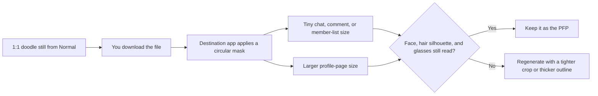
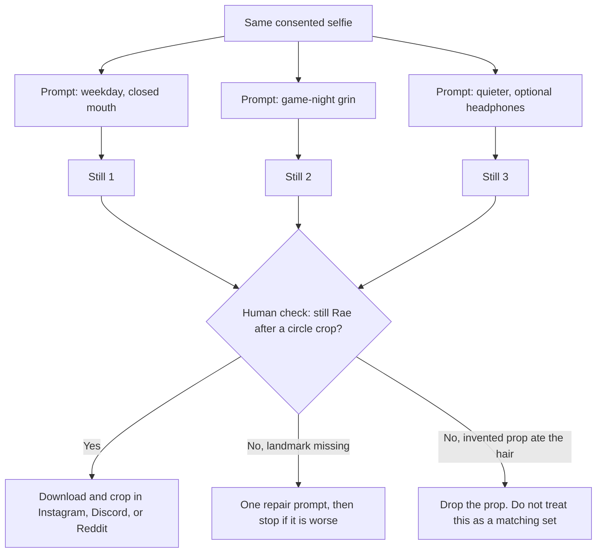

**Direct answer:** To make a cartoon profile picture from a photo at [doodleai.art](https://doodleai.art), sign in, attach a clear selfie, and generate a square doodle avatar with the [Normal skill](https://doodleai.art/skills/normal/). Download the still and crop it yourself for Instagram, Discord, Reddit, or similar apps. Doodle AI does not ship platform export presets, matching-set continuity, or professional headshots.

A profile picture is a social object, not a gallery print. It sits next to a username in a comment thread, a Discord message, a Reddit reply, or an Instagram story sticker. People see it at the size of a bottle cap, often inside a circle, often while they are scrolling past something else. That is a different job from “turn this photo into a cartoon,” even when the same selfie is the starting point.

This article is a use-case explainer for that job. The intended reader is someone who wants a distinctive cartoon PFP without opening Photoshop: a social-first person, roughly in the 16–34 range described in Doodle AI’s customer research, who already has a selfie and already knows which app they will post it to. It is not a professional-headshot tutorial. It is not a print-shop walkthrough. It is not a Discord Nitro GIF guide. It is not a claim that one generation will give you a matching identity pack for every platform.

Doodle AI is a chat-first still-image studio at **doodleai.art**, built with Astro and Mastra. Generation uses a server-owned PicX connection. You can browse without an account. Sign-in is required to upload, generate, save, and sync account work. Product facts below are current as of 2026-08-25. If a later screen disagrees with this page, trust the live product and the [privacy](https://doodleai.art/privacy-policy/) and [terms](https://doodleai.art/terms-of-service/) pages.

A historical US Google Ads volume snapshot from 2026-08-24, collected through [DataForSEO’s search-volume endpoint](https://docs.dataforseo.com/v3/keywords_data/google_ads/search_volume/live/), recorded `cartoon pfp` at 2,900 monthly searches, `profile picture cartoon` at 1,900 with a competition index of 1, and `ai profile picture` at 1,000. Those numbers describe search language. They are not Doodle AI traffic, conversion, or quality evidence.

The person named Rae later in this article is **hypothetical**. Rae is not a customer. The three-mood set is a labelled fiction for teaching crop, consent, and drift. It is not a measured experiment.

## Visual plan for a missing three-mood PFP grid

This article does not attach an unrelated sticker sheet, gift card, collage, or third-party cartoon as if it were a profile picture. Until a consented source photo and three matching Doodle AI avatars exist as owned files, treat the visual as a production plan rather than fake proof.

**Planned owned figure (not yet attached)**

- Intended public path once generated: `/cartoon-profile-picture/doodleai-art-three-mood-pfp-grid.png`
- Three square doodle avatars from one consented selfie, generated separately with the Normal skill on doodleai.art, laid out in a row.
- Optional overlay: a circular crop guide on the center tile, labelled in the caption as a *publishing crop*, not as an in-product export preset.
- Proposed alt text: “Three square hand-drawn Doodle AI avatars from one consented selfie, shown as a weekday, game-night, and headphones mood, with a circular crop overlay on the center tile as a publishing guide.”
- Proposed caption: “Planned owned three-mood PFP grid from the Normal doodle avatar skill on doodleai.art. Source photo used with permission. Each tile is a separate generation. The circle is a crop guide for Instagram, Discord, or similar apps, not a Doodle AI export preset.”

Do not read the sticker-sheet samples on other blog posts as PFP proof. A die-cut sheet is a different skill. A six-panel collage is a different aspect ratio. A fictional Surprise character is not a likeness of your face.

## A cartoon PFP is a tiny public object

Search language mixes several jobs. `cartoon pfp` and `profile picture cartoon` usually mean a square illustrated face you can set on an account. `ai profile picture` sometimes means a photoreal corporate headshot. `ai cartoon generator` sometimes means a video clip. Doodle AI’s current product for this article is the first of those: one 1:1 hand-drawn doodle avatar from a photo, which you then crop and upload yourself.

That last clause matters. The [Normal doodle avatar skill](https://doodleai.art/skills/normal/) returns a square still with a clean white or warm-white background. House style is a naive marker-and-ink doodle: bold outlines, simplified features, flat cheerful color, slightly exaggerated proportions. The skill is instructed to keep hairstyle, face shape, expression, skin tone, glasses, and distinctive accessories recognizable. It is not a photographic filter. It is not a 3D bust. It is not an animated Discord avatar.

The destination apps then do their own work. Most profile pictures are uploaded as squares and displayed as circles. Corners disappear. Fine interior detail disappears at chat size. Text in the image becomes unreadable, which is one reason Normal is specified to avoid captions, watermarks, and signatures.

[Instagram’s help article on adding a profile picture](https://www.facebook.com/help/instagram/557544397610546) states that your Instagram profile picture can be associated with you and is public to everyone, on or off Instagram, even if they do not have an Instagram account. That is a publishing fact, not a Doodle AI setting. A cartoon does not make a face private. If the doodle still reads as you, treating it as a “disguise” is a mistake.

[X’s help article on customizing a profile](https://help.x.com/en/managing-your-account/how-to-customize-your-profile) recommends 400×400 pixels for a profile photo, with JPG, GIF, or PNG as accepted formats, and notes that X does not support animated GIFs for profile or header images. [X’s upload troubleshooting page](https://help.x.com/en/managing-your-account/common-issues-when-uploading-profile-photo) repeats the 400×400 recommendation and a 2 MB file-size cap. Those are X’s numbers. Doodle AI does not emit an “X preset.”

[Buffer’s 2026 social image-size guide](https://buffer.com/resources/social-media-image-sizes/) collects third-party publishing recommendations, including Instagram profile photos at 320×320 pixels displayed as a circle, X at 400×400, Threads at 320×320, TikTok at 200×200, and a general note to aim for at least 400×400 across devices. Buffer is a scheduling product’s size chart, not Doodle AI documentation. Use it as a crop reminder. Do not wait for doodleai.art to grow a platform-by-platform exporter.

[Discord’s developer image-formatting reference](https://docs.discord.com/developers/reference) documents user avatars on the Discord CDN and states that requested image size can be any power of two between 16 and 4096. That range is why a PFP has to survive being tiny. Discord can ask for a 16-pixel avatar. A busy background, a thin outline, or a hair clip parked in a corner will not survive that.

[Reddit’s help article on updating an avatar](https://support.reddithelp.com/hc/en-us/articles/360043036152-How-do-I-update-my-avatar-image) describes two paths: create a custom Reddit avatar, or upload an image. Reddit does not publish a pixel spec in that article. This page will not invent one. If you upload a Doodle AI still to Reddit, you are using Reddit’s uploader, not a Doodle AI Reddit pack.

| Destination | What the named source actually says | What you do with a Doodle AI still | Not a Doodle AI product |
| --- | --- | --- | --- |
| Instagram | Profile picture can be public to everyone, even without an Instagram account | Download the square, let Instagram circle-crop, check the live profile | An Instagram export preset |
| Discord | CDN avatars can be requested at power-of-two sizes from 16 to 4096 | Keep the face large, outline thick, corners empty of important marks | An animated Nitro avatar |
| X | Recommended profile photo 400×400, 2 MB max, no animated GIF PFP | Upload the square; X will mask most personal accounts as a circle | An X-sized file from doodleai.art |
| Reddit | You can upload an image or use Reddit’s avatar builder | Upload the still, or do not; Reddit’s builder is a different cartoon | A snoovatar integration |
| Threads / TikTok (Buffer chart) | Threads 320×320; TikTok 200×200 recommended in Buffer’s 2026 guide | Same square still, cropped in the destination app | A multi-platform pack from one click |

Read that table as publishing guidance. The current Normal skill is 1:1. That already matches the square most of these apps want you to start from. The rest of the sizing work happens after download.

The circle in that diagram is the app’s mask, not a Doodle AI control. If the hair clip, hoop earring, or glasses sit near a corner of the square, the mask will eat them.

## Pick a selfie that still reads after the circle

Likeness in a PFP is not “every pore survived.” It is “a friend would still point at the tiny circle and say that is you.” The landmarks the house style tries to keep are the same ones that survive a circular crop: hair silhouette and color, face shape, expression, skin tone, glasses, and a distinctive accessory that sits *inside* the face-and-hair mass, not out on the edge of the frame.

**Prefer**

- One person, face toward the camera, filling most of the square you will actually upload.
- Even indoor light. A window to the side beats a bathroom bulb directly over the part.
- Eyes visible. Glasses on, frames readable, no mirrored lenses that erase the eyes.
- Hair that makes a silhouette: curls, bun, fade, bangs, locs, a sharp part.
- Clothing color you want in the doodle. A forest-green crewneck will carry farther than a busy patterned shirt.
- A recent photo. An old haircut will be illustrated as that old haircut.

**Skip or recrop before you spend a credit**

- Group photos. Normal is a single-portrait skill. A huddle becomes a mash of faces.
- Full-body concert shots where the head is a few dozen pixels. The doodle cannot invent a face it cannot see.
- Heavy beauty filters that already flattened the face into a plastic mask.
- Sunglasses, hats pulled over the hairline, or a microphone covering the mouth, unless that object *is* the identity you want.
- Screenshots of screenshots, memes with stickers already on them, or a photo that already has a caption.
- Someone else’s face that you do not have permission to process or to publish as *your* account image.

File limits that are implemented today: uploads must be image files, and they must be 20 MB or smaller. Empty files and non-image files are rejected. There is no verified public list of “best selfie apps,” and this article does not invent one.

If you do not want to upload a likeness at all, do not use Normal. Use [Surprise](https://doodleai.art/skills/surprise/), which invents a fictional doodle character and does not preserve your face. That is an honest fork. It is also a different PFP: a character, not a cartoon of you.

## Consent is two decisions, not one

Generating a cartoon and publishing a profile picture are separate acts. The first sends a photo through Doodle AI’s server-owned PicX connection. The second puts a likeness on a platform that other people can see, screenshot, and reuse.

Doodle AI’s [terms](https://doodleai.art/terms-of-service/) require that you have the right to use the photo you upload. You keep whatever rights you already have in that photo. Doodle AI does not claim ownership of your content. You are responsible for reviewing results before publishing or using them. AI-generated results may be inaccurate, unexpected, or similar to other results. There is no commercial license attached to a successful generation. There is no C2PA Content Credential on current outputs. [C2PA’s 2.2 explainer](https://c2pa.org/specifications/specifications/2.2/explainer/Explainer.html) describes a provenance standard this product does not currently attach.

The [privacy policy](https://doodleai.art/privacy-policy/) states, in short:

- Browsing is open. Sign-in is required to create, save, and sync.
- Creation currently uses Google sign-in.
- When you attach a photo, that photo, references, prompt, and generation settings are sent to PicX through Doodle AI’s server-owned connection. PicX hosts the resulting media.
- Chat messages go to the language-model service via OpenRouter.
- Cloudflare hosts the site, API, D1 database, and session storage.
- DataFast provides analytics. The policy says Doodle AI does not run advertising pixels, does not sell data, and does not build an advertising profile.
- This article does **not** invent a numbered retention window. If the policy does not state one, neither does this guide.

Practical habits for a PFP sitting:

1. Upload a photo of yourself that you took, or that you have permission to process.
2. Do not upload a friend’s face as a joke and set it as your Discord picture.
3. Do not upload a child’s photo. The privacy policy says Doodle AI is not directed at children.
4. Remember Instagram’s public-profile-picture rule before you treat a cartoon as privacy.
5. On Reddit, decide whether you want a recognizable cartoon of your real face on a pseudonymous account. That is a social choice, not a product toggle.
6. A downloaded doodle can still be recognized as you. Sharing is a second decision.

You do not paste a PicX key into Settings. Live copy that tells you to supply a provider credential is outdated. Credentials stay on the server.

## Sign in, then ask for a square doodle, not a headshot

You can read [doodleai.art/skills/normal/](https://doodleai.art/skills/normal/) without an account. You cannot upload or generate until you sign in. On signup, Doodle AI creates a **personal organization** and grants **5 signup credits**. Credits are pooled on the organization. Every runnable skill costs **1 credit**. The ledger reserves that credit before PicX is called and refunds it when generation fails. If you are rate-limited, nothing is reserved. Stripe checkout, paid credit packs, and subscriptions are **not live**. Five attempts is the current starter grant.

The Better Auth organization layer supports up to 5 organizations and up to 25 members, with owner, producer, artist, reviewer, and client roles. Sessions carry an active organization. Membership and permissions are rechecked. Threads, messages, saved characters, moodboards, generation records, and credits are organization-scoped. That is a working backend and API foundation plus shared data behavior. It is not a polished team switcher, and it is not required for a personal PFP. For this sitting you are one person in your personal organization.

Projects, assets, share links, batch jobs, and review states exist as schema or partial access-control foundations. They are **not** verified complete public workflows. Do not wait for a share-link review or a “make 12 PFPs” queue. Generate one still. Look at it. Decide.

Doodle AI is not a row of style thumbnails. You attach a photo and talk. For a first PFP, keep the request small enough that the photo can still do the work, and add one instruction that only a profile picture needs: the face should survive a circular crop.

**A first PFP prompt you can paste**

> Turn this photo into a doodle avatar for a profile picture. Keep my dark curls, gold hoop, and forest-green crewneck. Closed-mouth smile. Center my face. Leave the corners empty. Bold outline. Clean warm-white background. No text, no watermark.

That prompt names the outcome (one avatar), names landmarks the skill already tries to keep, and adds PFP-specific composition: center the face, empty corners, bold outline. It does not ask for a cinematic alley, a LinkedIn retouch, or six outfits.

**A prompt that fights a PFP**

> Make me an anime protagonist in a neon city, wind in my hair, holding a glowing sword, cinematic depth of field, eight-head proportions, photoreal skin, my @username in the corner, then export Discord, Instagram, and Reddit sizes.

Normal will still try to draw one square doodle. It will not become a video. It will not typeset a username. It will not emit three platform files. Extra lore competes with the landmarks that make a tiny circle recognizable.

| Prompt move | Why it helps a PFP | When it backfires |
| --- | --- | --- |
| “Center my face. Leave the corners empty.” | Circular masks eat corners | Asking for a wide scenic background hides the head |
| “Bold outline” or “thicker outline” | Thin lines vanish at chat size | “Make it more professional” sounds like a headshot, which this is not |
| Name two or three landmarks: curls, hoop, crewneck color | Gives the doodle something to keep | A ten-item jewelry list crowds the bust |
| Name the expression you already have | The photo already contains it | “Every emotion” belongs on Collage, not on a single PFP |
| After a first still: “same person, warmer paper, keep the hoop” | Mapped refinement language | “Make it identical to last time” is a continuity guarantee the product does not have |

Saved characters are organization-scoped shared references. Signed-in users can save them and @-mention them in chat. That helps you reuse a name and a note. **Guaranteed character continuity is not live.** Saved references help human organization. They do not freeze a face. If the second generation drifts, say so in the next prompt and point at the landmarks again.

## Prompt variations are moods, not a matching pack

People search for cartoon PFPs because they want a look, not because they want a file-format lecture. Mood is the useful lever. Clothing color, expression, and outline weight change how a tiny circle feels. The trap is treating three moods as one identity system. They are three generations. Each one costs 1 credit. Each one can drift.

Use the house-style refinement words the skill actually maps: thicker outline, warmer paper, cuter / more chibi, cleaner, more colorful. Pair those with landmarks from the photo. Do not invent a style catalog of “80 PFP aesthetics.” Doodle AI’s current signature is a conversational hand-drawn doodle, not an anime, clay, comic, or photoreal-sketch menu.

**Weekday, still one person**

> Same photo, doodle avatar for a profile picture. Closed-mouth smile. Keep the gold hoop and forest-green crewneck. Center the face. Thicker outline. Warm-white background. No text.

**Game night, still one person**

> Same photo, doodle avatar. Bigger grin, still recognizable. Slightly more chibi. Keep the curls and hoop. Same forest-green crewneck. Center the face. No extra props, no headset unless it is in the photo. No text.

**Night-off, still one person**

> Same photo, doodle avatar. Quieter look, eyes a little softer. Over-ear headphones only if you can keep my curls and hoop readable. Thicker outline. Cleaner background. Center the face. No caption.

If the source photo has no headphones, the third prompt is asking the model to invent an object. Invented objects are optional costume. They are also a common way to lose the hair silhouette. If the headphones eat the curls, drop them. A PFP that looks like you without the prop is more useful than a PFP that looks like a generic gamer.

Do not ask Normal for six expressions in one still. That is [Collage](https://doodleai.art/skills/collage/), a 3:2 six-panel page, which is a poor native PFP. You can crop one panel by hand later. That crop is yours. Do not ask [Mood captions](https://doodleai.art/skills/mood-captions/) for a profile picture; that skill letters words on a 3:2 grid, and text is the first thing a circular mask ruins. Do not ask [Stickers](https://doodleai.art/skills/stickers/) for a Discord sticker pack. The live sticker skill makes a square die-cut *sheet image*. Transparent WhatsApp or iMessage sticker export is **not live**. ChatGPT Images launched native chat-app stickers on 2026-08-24; that is a different product. Doodle AI does not do that job.

Nearby tools on the same search surface include [Canva’s photo-to-cartoon feature](https://www.canva.com/features/photo-to-cartoon/), [Fotor’s photo-to-cartoon tool](https://www.fotor.com/features/photo-to-cartoon/), [ImageToCartoon](https://imagetocartoon.com/), and [Adobe Firefly’s cartoon generator](https://www.adobe.com/products/firefly/features/ai-cartoon-generator.html). This article does not rank them. [LazyAvatar](https://lazyavatar.com) is a seed-based hand-drawn avatar API. It is not a photo-likeness studio. Uploading a selfie to doodleai.art is a different job from generating a seed character with no portrait. doodleai.art is also not doodleai.fun, InstaDoodle, or cartoonize.ai.

## A clearly labelled hypothetical three-mood PFP set

The following sitting is fictional. Rae is not a real user. No time, quality score, or share rate was measured. The set exists so the rest of the article can talk about circle crops and drift without pretending we have a customer case study.

**Hypothetical person:** Rae, 21. Uses Instagram for friends, Discord for a game-and-study server, Reddit for a hobby subreddit. Wants a cartoon PFP that is not a raw selfie and not a plastic AI headshot.

**Hypothetical photo:** bathroom-mirror selfie, overhead light, dark curls, one gold hoop in the left ear, forest-green crewneck, closed-mouth almost-smile. Rae took it. Rae consents to processing it. Rae also consents, in this fiction, to publishing a cartoon of that face on Instagram, knowing Instagram’s help text says a profile picture can be public even to people without an account.

**Hypothetical budget:** 5 signup credits. Stripe is not available, so there is no “buy three more moods.”

**Hypothetical three-mood plan**

| Credit | Mood name (Rae’s words) | Prompt intent | PFP test |
| --- | --- | --- | --- |
| 1 | Weekday | Closed-mouth, green crewneck, hoop, centered face, bold outline | Instagram circle still shows the hoop |
| 2 | Game night | Bigger grin, slightly more chibi, same clothes and hair | Discord chat size still shows the curls |
| 3 | Night-off | Softer eyes, headphones only if curls survive | Reddit upload still reads as Rae, not a generic gamer |
| 4 | Repair buffer | Put the hoop back, or drop the headphones | Stop if the face got worse |
| 5 | Unspent unless a second photo is needed | Do not spend this on stickers “just to see” | Paid packs are not live |

**Hypothetical results, still fictional.** Credit 1 keeps the curls and crewneck; the hoop is half-clipped by how far it sits toward the square’s edge. Rae does not need a new personality. Rae needs the hoop moved inward. Credit 4 is the repair: “Same person from the photo. Keep the gold hoop fully inside the face area so a circular crop will show it. Thicker outline. No extra jewelry.” Credit 2’s grin works at Instagram size and turns muddy at Discord chat size because the outline is still thin; Rae asks for thicker outline rather than “make it pop.” Credit 3 invents headphones and loses the left-side curls. Rae rejects it. That rejection is the point of a human sitting. The product returned a still. Rae decided it was a bad PFP.

Three keepers would be three files, not one “PFP pack.” Rae might use weekday on Instagram, game night on Discord, and skip Reddit, or use the same weekday file everywhere. That choice is Rae’s. Doodle AI generated stills. Doodle AI did not set the profile pictures, did not guarantee the three faces match, and did not create platform-specific exports.

If credit 1 had failed with an API error, the credit would have refunded and Rae would still have 5. If credit 1 had succeeded but looked unlike Rae, that would still have cost 1 credit. Taste is not a refund reason. Those two outcomes are different, and the ledger treats them differently.

## One image is not a continuity lock

This is the sentence people skip, then regret on the second generation. A good first PFP feels like a character you could reuse. The current product does not lock that character.

What exists today:

- You can keep the same photo attached and ask for another mood.
- You can save a named character reference in the active organization and mention it with @.
- You can save keepers to an organization-scoped moodboard.
- You can paste the landmarks again: curls, hoop, forest-green crewneck.

What does **not** exist:

- Guaranteed identical faces across generations.
- Batch variants from one prompt.
- User-authored “fork as skill.”
- Server-side conversation memory that remembers your face next week without the photo.
- A brand kit, a reference-lock object, or a commercial likeness license.

If you need the same circle on Instagram and Discord, **reuse the file**. Download weekday once. Upload it twice. That is how you get a matching PFP today. Generating “the same one, but for Discord” is a new still. It may look like a sibling. It may not.

Creators already use generative tools for identity work; that is industry habit, not a Doodle AI metric. [Adobe’s 2025 creators survey, covering more than 16,000 creators, reports that 86% use creative generative AI](https://news.adobe.com/news/2025/10/adobe-max-2025-creators-survey). Those figures describe an environment where an illustrated PFP is a normal request. They do not measure doodleai.art. They do not prove your still will match last Tuesday’s still.

If you later want a recognizable recurring character for a newsletter or a stream, that is a different article and a partly supported job. Saved references help. Continuity is not guaranteed. Commercial licensing is not live. This page stays on the social PFP.

## What this use case is not

Say these out loud before you upload, because search language will try to talk you into a different product.

It is **not a professional headshot**. Doodle AI’s anti-ICP for this job includes photoreal corporate portraits. If you need a LinkedIn photo, use a photographer or a tool that actually sells that look. Normal is instructed to avoid photorealism, 3D, and heavy realistic shading.

It is **not a print**. There is no physical fulfillment. There is no verified print-ready dimension set. You may download a digital still and print it yourself later. That printing step is yours.

It is **not video**. There is no timeline, animatic, shot list, or image-to-video adapter.

It is **not a WhatsApp or iMessage sticker pack**, and it is not a Discord custom-sticker upload pipeline. The live sticker skill makes a square die-cut sticker *sheet*.

It is **not an animated PFP**. X’s help text says X does not support animated GIFs for profile images. Discord animated avatars are a Discord Nitro concern, not a Doodle AI output. Normal returns a still.

It is **not a commercial license**, and it is not C2PA provenance.

It is **not guaranteed identity**, even if you saved a character.

It is **not a public gallery post**. [About](https://doodleai.art/about/) states there is no feed or public gallery. Account-scoped chats, moodboards, saved characters, and generated results are visible to you through the app.

| You asked for | Current Doodle AI result | Not in this sitting |
| --- | --- | --- |
| A cartoon of me as a PFP | One 1:1 doodle avatar you crop yourself | Platform export presets, official sizes, or auto-upload to Instagram |
| Matching PFPs on three apps | Reuse the same downloaded file | A guaranteed three-mood identity system |
| A Discord look | A square still you upload in Discord | Nitro GIFs, per-server avatars as a Doodle AI feature |
| A Reddit look | A still you may upload as a custom image | A snoovatar builder inside doodleai.art |
| Privacy via cartooning | A likeness that can still be recognized | A public-Instagram exception, a deletion-day promise, or C2PA |
| Many variants at once | One result per generation, 1 credit each | Batch jobs as a verified public workflow |

The generation request currently uses PicX with a 1:1 aspect ratio and a 1K size setting. That is a provider size parameter, not a promise of a specific pixel count you can print, and not an Instagram or Discord export.

## After you have a keeper: crop, then look at it small

After a successful Normal generation, the image is hosted by PicX and shown in the chat. You can download it. You can save it to a moodboard. You can keep going in the same thread. Signed-in chats, characters, and moodboards can sync across devices. Voice input is not live.

Then leave Doodle AI. Open the destination app’s own editor.

**A crop checklist that is not a product preset**

1. Start from the square. Do not stretch it.
2. Put the eyes in the upper half of the circle. Most apps pin a tiny avatar next to text; eyes are the readable landmark.
3. Keep glasses fully inside the circle. Cut-off frames look like a generation error even when they are a crop error.
4. Keep one accessory — hoop, hair clip, scarf knot — inside the circle if that is how people recognize you.
5. Leave padding. Buffer’s size guide, and most platform masks, punish edge-hugging detail.
6. Zoom the preview down. Pinch until the circle is closer to a chat avatar than to a poster. If the doodle becomes a brown blob with a smile, the outline is too thin or the crop is too wide.
7. Check dark mode and light mode if the app has both. A warm-white background is usually fine. A busy invented background is not.

**Hypothetical crop.** Rae likes weekday, downloads it, and uses Instagram’s circle preview. The hoop sits inside the mask after the repair prompt. Rae uploads the same file to Discord. Rae does not generate a “Discord version.” That is how matching works with the current product.

If you want to show the result to a friend before you set it live, download the file and send it through the channel you already use. That is a human share. It is not a Doodle AI messaging integration. Share-link schema exists; a verified public review route was not confirmed.

## Adjacent skills, only after the PFP is good enough

This article’s job is one square cartoon you can actually set as a profile image. Other live skills are adjacent, not bundled. Each costs 1 credit.

| If you actually want | Use | Why it is not the PFP itself |
| --- | --- | --- |
| One illustrated bust of the person in the photo | [Normal / Doodle Avatar](https://doodleai.art/skills/normal/) | This is the PFP skill: 1:1, photo required |
| Six close-up expressions | [Collage](https://doodleai.art/skills/collage/) | 3:2 page; crop a panel by hand if you must |
| Head-to-toe action | [Full-body](https://doodleai.art/skills/full-body/) | Full-body reads poorly in a circle |
| No photo | [Surprise](https://doodleai.art/skills/surprise/) | Fictional character, no likeness |
| A die-cut sticker *sheet* | [Stickers](https://doodleai.art/skills/stickers/) | Sheet image, not a chat-app pack and not a PFP |
| Mood words on a grid | [Mood captions](https://doodleai.art/skills/mood-captions/) | Captions come from a pool; text dies in a circle |
| A greeting-style still | [Gift](https://doodleai.art/skills/gift/) | Digital card, not a profile image |

Emotional Modes and Seasonal Pack are catalog previews. They are **not runnable**. Do not plan a seasonal PFP around them.

For the broader photo-to-cartoon process, including photo prep and the generation path in more detail, see [How to turn a photo into a cartoon with Doodle AI](https://doodleai.art/photo-to-cartoon/). That guide is a process piece. This one is the PFP use case.

## Questions people actually ask about AI profile pictures

These questions showed up around `ai profile picture` in a 2026-08-24 US mobile SERP snapshot described in Doodle AI’s SEO research. The answers below are about doodleai.art, not about every app in those results.

**How do I get an AI profile picture here?** Sign in at doodleai.art, attach a selfie you have the right to use, and ask for a doodle avatar. Generate with Normal. Download the square still. Crop it in Instagram, Discord, Reddit, or whichever app you actually use.

**Can I use AI for my profile picture?** Yes, as a still you upload yourself. Platforms have their own rules. Instagram’s help text says a profile picture can be public to everyone. X does not support animated GIF profile photos. You are responsible for the likeness you publish.

**What is the best AI to create a profile picture?** This page does not rank tools. Doodle AI’s current offer is a playful hand-drawn square doodle from a photo, not a photoreal headshot and not a style catalog. If you want a corporate portrait, this is the wrong studio.

**Is there a free AI profile picture generator?** Browsing doodleai.art is open. Generation uses credits. New accounts receive 5 signup credits. Each generation costs 1 credit. Failed generations refund. Paid checkout is not live, so “unlimited free PFPs” is not the offer.

**Will it look exactly like me?** It is instructed to keep recognizable landmarks. It does not guarantee identical characters across generations. Judge the still at the size you will actually display.

**Can I make a matching set for Instagram, Discord, and Reddit?** Reuse the same downloaded file. Separate generations are not a locked set. Saved references do not change that.

**Can I cartoonize a photo on my phone?** The current product is a browser app. You can sign in from a phone browser, attach a photo from the camera roll, and generate. This article does not claim a native iOS or Android app.

**What happens to my photo?** It is uploaded through Doodle AI’s server-owned PicX connection, used to generate the still, and hosted according to that processing path. Read the [privacy policy](https://doodleai.art/privacy-policy/). Do not upload anything you do not want sent to those processors.

## Sources

- [Doodle AI](https://doodleai.art)
- [Doodle Avatar / Normal skill](https://doodleai.art/skills/normal/)
- [Skills catalog](https://doodleai.art/skills/)
- [About doodleai.art](https://doodleai.art/about/)
- [Doodle AI llms.txt](https://doodleai.art/llms.txt)
- [Privacy policy](https://doodleai.art/privacy-policy/)
- [Terms of service](https://doodleai.art/terms-of-service/)
- [DataForSEO Google Ads search volume live](https://docs.dataforseo.com/v3/keywords_data/google_ads/search_volume/live/) — 2026-08-24 US snapshot cited only as historical search language, not as Doodle AI performance
- [Instagram Help: add or change a profile picture](https://www.facebook.com/help/instagram/557544397610546)
- [X Help: customize your profile](https://help.x.com/en/managing-your-account/how-to-customize-your-profile)
- [X Help: uploading profile photos and recommended sizes](https://help.x.com/en/managing-your-account/common-issues-when-uploading-profile-photo)
- [Discord developer API reference, image formatting](https://docs.discord.com/developers/reference)
- [Reddit Help: update your avatar image](https://support.reddithelp.com/hc/en-us/articles/360043036152-How-do-I-update-my-avatar-image)
- [Buffer: social media image sizes in 2026](https://buffer.com/resources/social-media-image-sizes/) — third-party publishing chart, not a Doodle AI export spec
- [Canva photo to cartoon](https://www.canva.com/features/photo-to-cartoon/)
- [Fotor photo to cartoon](https://www.fotor.com/features/photo-to-cartoon/)
- [ImageToCartoon](https://imagetocartoon.com/)
- [Adobe Firefly AI cartoon generator](https://www.adobe.com/products/firefly/features/ai-cartoon-generator.html)
- [LazyAvatar](https://lazyavatar.com)
- [Adobe 2025 creators survey](https://news.adobe.com/news/2025/10/adobe-max-2025-creators-survey) — industry context, not a Doodle AI metric
- [C2PA 2.2 explainer](https://c2pa.org/specifications/specifications/2.2/explainer/Explainer.html) — provenance standard; not a current Doodle AI feature
- [ChatGPT sticker announcement on X](https://x.com/ChatGPT/status/2091996384954069032) — messaging-sticker launch in a different product; not a Doodle AI feature

## Make one square, then crop it where you actually post

If you have a selfie you are allowed to use, open the [Normal doodle avatar skill](https://doodleai.art/skills/normal/), sign in, attach the picture, and generate one square doodle. Download the keeper and crop it in Instagram, Discord, Reddit, or the app you already live in. Browse the rest of the [skills](https://doodleai.art/skills/) later if you want a collage or a sticker sheet. Read [about](https://doodleai.art/about/) if you want the product in one page. Do not expect platform presets, a matching three-mood lock, video, checkout, prints, chat-app sticker export, or a commercial license from this sitting. You are asking for a playful cartoon PFP from a real photo. That is the current job.
