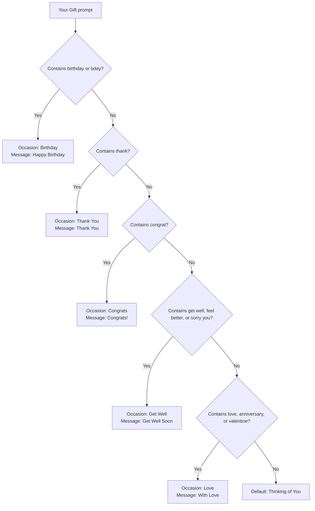
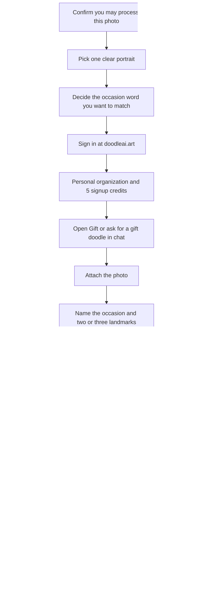

**Direct answer:** To make a personalized digital doodle gift at [doodleai.art](https://doodleai.art), sign in, attach a photo you may use, and run [Gift](https://doodleai.art/skills/gift/) with the occasion named in your wording. You get one square greeting still with a standard card message. Download the PNG and send it yourself — Doodle AI does not ship cards or prints.

This article is for a buyer with a deadline. You already have a birthday, thank-you, anniversary, congratulations, or celebration on the calendar. You are not trying to become an illustrator. You are not ordering a mug. You need a personal visual you can actually send today.

Doodle AI is an Astro and Mastra chat-first still-image studio. You can browse without an account. Sign-in is required to upload, generate, save, and sync account work. Generation uses a server-owned PicX connection; you do not paste a PicX key into Settings. New accounts receive **5 signup credits**. Each Gift generation reserves **1 credit** and refunds that credit if generation fails. Product facts below are current as of 2026-08-25. If a later screen disagrees with this page, trust the live product and the [privacy](https://doodleai.art/privacy-policy/) and [terms](https://doodleai.art/terms-of-service/) pages.

The people named later — Lena and Mira, Owen, Priya and Dev, Sam — are **hypothetical**. They are not customers, not measured sessions, and not proof of output quality.

A historical US Google Ads volume snapshot from 2026-08-24, collected through [DataForSEO’s search-volume endpoint](https://docs.dataforseo.com/v3/keywords_data/google_ads/search_volume/live/), recorded `personalized photo gift` at 720 monthly searches with a competition index of 100. That query is commercially noisy: it usually points at printed merch. `ai gift from photo` returned no Google Ads volume in the same pull. Treat it as product language, not demand proof. Those numbers describe search language. They are not Doodle AI traffic, conversion, ranking, or quality evidence.

## Visual plan: owned gift stills are not attached yet

This article does not paste an unrelated avatar, sticker sheet, collage, or third-party greeting card as if it were a Gift-skill result. Until a consented source photo and a matching doodleai.art Gift still exist as owned files, treat the figures as a production plan rather than fake proof.

**Planned owned figure 1 — digital birthday doodle (not yet attached)**

- Intended public path once generated: `/doodle-gift/doodleai-art-digital-birthday-gift.png`
- A 1:1 Gift still from a consented portrait, with hand-drawn balloons or a candle and the standard lettered line “Happy Birthday.”
- Proposed alt text: “Square hand-drawn Doodle AI gift still of a consented portrait, with birthday embellishments and the hand-lettered message Happy Birthday, generated by the Gift skill on doodleai.art.”
- Proposed caption: “Planned owned Gift-skill result on doodleai.art. Digital birthday doodle, not a shipped print. Source photo used with permission. Standard card message, not custom verse.”

**Planned owned figure 2 — buyer checklist (not yet attached)**

- Intended public path once generated: `/doodle-gift/doodleai-art-gift-checklist.png`
- Five labelled steps: photo permission, occasion word, prompt, generate, download.
- Proposed alt text: “Five-step checklist graphic for making a digital doodle gift on doodleai.art: confirm photo permission, name the occasion, write the prompt, generate, then download the PNG.”
- Proposed caption: “Planned checklist for a deadline sitting. Each generation still costs 1 credit. Download is the verified share path; Doodle AI does not mail the card.”

Do not read a Normal avatar, a die-cut sticker sheet, or a Surprise character as a gift example. Those are other skills.

## A digital gift is a sendable still, not a box

Search “personalized photo gift” and you will find canvases, mugs, blankets, and photo books. That is a fulfillment business. Doodle AI currently sells none of that workflow. Physical fulfillment is **not live**. Stripe checkout is **not live**. Commercial licensing is **not live**. Print-ready dimensions are not verified.

What the [Gift skill](https://doodleai.art/skills/gift/) actually returns is one square hand-drawn greeting image from one uploaded photo. The composition is a warm card layout, not the plain warm-white bust used by the Normal avatar skill. Occasion-matched props sit around the portrait. A short standard message is hand-lettered near the bottom. The generation request currently uses PicX with a 1:1 aspect ratio and a 1K size setting. That is a provider size parameter, not a poster spec and not a folded 5×7 card template.

| Job you may have meant | Who does that today | What doodleai.art currently returns |
| --- | --- | --- |
| A personal visual you can send tonight | You, after a Gift sitting | One 1:1 digital greeting still |
| A cartoon of the person, no card chrome | [Normal](https://doodleai.art/skills/normal/) | A square doodle avatar, not a greeting |
| A mailed greeting card | Stationers and print shops | Not live |
| A shipped print, mug, or blanket | Merchandise vendors | Not live |
| Vinyl stickers in an envelope | Print-on-demand sticker shops | Not live; Stickers is a *sheet image* |
| WhatsApp or iMessage stickers | Other products | Not live |
| A commercial license to sell the likeness | A written contract | Not live |
| A paid gift checkout inside the app | Stripe, when it exists | Not live |

If the recipient expects a package on a doorstep, stop here and use a printer or a store. If the recipient will open a text, an email, or a group chat, a digital Gift still can be the whole present.

## Permission comes before the prompt

Gift buyers often want to doodle someone else. That is the point of a present, and it is also the risk. [Terms of service](https://doodleai.art/terms-of-service/) say you keep whatever rights you already have in the photo you upload, you are responsible for having permission to upload, process, and share that content, and you must not upload someone else’s photo, artwork, trademark, or personal information without permission. This article is not legal advice. It is a practical stop: if you cannot honestly say you have permission, do not run Gift.

A gift sitting sends the photo through Doodle AI’s server-owned PicX connection. Chat is routed through OpenRouter. Hosting is on Cloudflare. Those processors are named on the [privacy policy](https://doodleai.art/privacy-policy/). There is no public gallery. There is also no verified private “gift vault” that only the recipient can open. Treat the photo as something you are asking a generation provider to see.

**Usually a reasonable starting point, still your call**

- A photo you took of yourself to send as a thank-you.
- A photo the recipient took of themselves and already sent you, with a clear “yes, doodle this.”
- A photo you took together, where the other person knows you are making a digital card from it.

**Usually a bad starting point**

- A screenshot from their public social post, used because it was convenient.
- A candid from across a room that they have never seen.
- A workplace headshot pulled from a company directory.
- A photo of a child you do not have authority to process.
- A medical, grief, or crisis image.

**Hypothetical permission check.** Lena wants a birthday still of her sister Mira. Mira sent Lena a kitchen selfie last month and said “use this if you make me something.” That is a usable yes for this teaching case. Owen wants to thank a mentor and only has a cropped keynote screenshot from a conference livestream. That is a weak yes. Ask for a photo, or pick a picture the mentor already shared with him for this purpose. Priya wants an anniversary still from a couple photo Dev posted years ago. Dev is the recipient, but an old public post is not the same as “process this likeness tonight.” Ask.

Do not upload private or sensitive material unless you understand it may be sent to PicX or another provider to fulfill the request. That sentence is already in the terms. A deadline does not create an exception.

## Plan the occasion before you spend the credit

Gift is not freeform card design. The generation tool inspects your description for a small set of keywords, then picks one occasion, one set of embellishments, and one fixed card message. The match is case-insensitive. Only one occasion is detected per run, from the **first** keyword rule that hits. If nothing matches, the skill falls back to a warm “Thinking of You” default.

| If your wording includes | Occasion the skill currently detects | Embellishments that will be asked for | Card message that will actually letter |
| --- | --- | --- | --- |
| “birthday” or “bday” | Birthday | Balloons, a confetti burst, a lit candle | Happy Birthday |
| “thank” | Thank You | Small flowers, looping ribbon swirls | Thank You |
| “congrat” | Congrats | Stars, ribbon streamers, a party popper | Congrats! |
| “get well”, “feel better”, or “sorry you” | Get Well | Soft pastel flowers, a small heart | Get Well Soon |
| “love”, “anniversary”, or “valentine” | Love | Small hearts, soft swirl accents | With Love |
| none of the above | Thinking of You (default) | Warm hearts, dotted trails, gentle sparkles | Thinking of You |

There is currently **no way to set fully custom card text**. If you ask for “Happy 30th, Mira” or “Thank you for feeding Noodle,” the live path still letters the standard line for whichever occasion it detected. Say that out loud before you spend the credit. If the exact verse matters more than the portrait, letter the verse yourself after you download the still.

The first-match rule is the part most deadline buyers miss.

**Prompts that land on the occasion you meant**

> Birthday doodle gift from this photo. Keep the glasses and yellow sweater. Square greeting still.

That contains “birthday,” so the card message will be “Happy Birthday.”

> Thank-you doodle from this photo. Keep the grey bun and green scarf.

That contains “thank,” so the card message will be “Thank You.”

> Congratulations doodle from this photo. Keep the shaved fade and denim jacket.

That contains “congrat,” so the card message will be “Congrats!”

**Prompts that quietly pick the wrong card**

> Thank you for the birthday dinner. Doodle this photo as a gift.

“birthday” is checked before “thank.” The live path will treat this as Birthday, not Thank You. If you meant a thank-you card, do not put “birthday” in the prompt.

> Congratulations on your anniversary. Doodle this photo.

“congrat” is checked before “anniversary.” The live path will treat this as Congrats, not Love. If you wanted hearts and “With Love,” say anniversary or love and omit congrat.

> Sorry you had a rough week. Anniversary doodle from this photo.

“sorry you” is a Get Well keyword. It is checked before love/anniversary. The live path can letter “Get Well Soon” on an anniversary sitting. Do not use “sorry you” unless you actually want a get-well card.

Unmapped occasions fall to Thinking of You unless you borrow a keyword on purpose. “Graduation,” “housewarming,” “new apartment,” “wedding,” “promotion,” and “baby” are not separate Gift occasions. If the honest card is congratulations, put “congrat” in the wording. If the honest card is a warm default, leave the extra event words out and accept “Thinking of You.”

Gift is a cheerful doodle. It is not a condolence product, not a memorial service, and not a workplace HR card. “Get Well Soon” with pastel flowers is the closest mapped tone for illness. Do not force the skill into grief copy it does not have.

## Run the sitting like a deadline, not like a studio

You can browse [doodleai.art/skills/gift/](https://doodleai.art/skills/gift/) without an account. The skill page states that a photo is required and the output is 1:1. You cannot upload or generate until you sign in. Creation currently uses Google sign-in. On signup, Doodle AI creates a **personal organization** and grants **5 signup credits** into that organization’s pool. Configuration allows up to 5 organizations and up to 25 members, with owner, producer, artist, reviewer, and client roles in the Better Auth organization layer. Sessions carry an active organization. Membership and permissions are rechecked. That is a working backend and API foundation plus shared data behavior. It is not a polished team gift studio. For this sitting you are one person making one still.

| Action | Signed out | Signed in |
| --- | --- | --- |
| Read `/skills/gift/` and this guide | Yes | Yes |
| Upload a photo | No | Yes, image files 20 MB or smaller, through the server-owned PicX connection |
| Generate a Gift still | No | Yes, 1 credit reserved |
| Save to a moodboard | No | Yes; generated images are also auto-saved to the moodboard |
| Download the PNG | After a result exists in chat | Yes, via the Download button |
| Paste a PicX API key | Never | Never |

Uploads accept image files and reject empty files. Non-image files are rejected. Images must be 20 MB or smaller. There is no verified list of “best cameras,” and this guide does not invent one.

Pick a photo the doodle can actually see: one person filling most of the frame, face toward the camera, even indoor light, eyes visible, hair as a readable silhouette, clothing color you want kept. Recrop group huddles. Skip motion blur, nightclub darkness, heavy beauty filters, and screenshots of screenshots. Gift is instructed to preserve recognizable hairstyle, face shape, expression, skin tone, and accessories, then translate them into naive marker-and-ink cartoon artwork. If those landmarks are hidden, the card still spends the credit.

A first prompt you can paste, after you attach the photo:

> Gift doodle from this photo for a birthday. Keep the round glasses, left-side hair clip, and yellow sweater. Square greeting still. No extra text beyond the card message.

That prompt names the skill outcome, names the occasion keyword, names landmarks, and does not ask the model to typeset a private joke. It also does not ask Doodle AI to print, foil-stamp, or ship anything.

If no photo is attached, Gift is specified to ask for one rather than invent a face. Surprise is the skill that invents a fictional character with no likeness. A made-up person is a weak birthday present for a real recipient.

## Credits on a night when the party is tomorrow

New accounts receive **5 signup credits**. Gift costs **1 credit**. The ledger **reserves** that credit before PicX is called. If generation fails — no usable hosted image URL — the credit is **refunded**. If you are rate-limited, the request is a no-op against the ledger. If the organization balance is too low, generation does not start. Credits are pooled per organization. Organization limits and rate caps exist. This article does not invent extra numeric thresholds beyond the published caps of 5 organizations and 25 members.

Stripe checkout, paid credit packs, and subscriptions are **not live**. You cannot currently buy more attempts in the app. Five sittings is the starter grant. Spend them as if the store is closed after they are gone, because for now it is.

A generation you dislike is not a refund. Taste is not a ledger error. Remix, if you use it, re-sends the preceding user message and starts another assistant turn. Treat Remix as another generation, not as a free undo.

**Hypothetical 5-credit plan for a gift due tomorrow**

| Credit | Job | Stop rule |
| --- | --- | --- |
| 1 | First Gift still with the intended occasion word and two landmarks | Keep if the face, clothes, and lettered message are sendable |
| 2 | One landmark repair, or a cleaner card if the first was cluttered | Stop if the face got worse |
| 3 | One photo recrop if the first frame hid the eyes | Do not spend this on a different skill |
| 4 | Buffer | Leave it unless the still is unusable |
| 5 | Last buffer | Do not “just try stickers” at 11 p.m. |

If credit 1 fails with an API error, it refunds and you still have 5. If credit 1 succeeds and the card says “Happy Birthday” when you wanted “Thank You,” that still cost 1 credit. Rewrite the prompt without the colliding keyword and spend credit 2 on purpose.

Do not spend Gift credits on adjacent curiosity while the recipient is waiting. Collage, full-body, stickers, mood captions, surprise, and Normal each also cost 1 credit. They are live. They are not bundled into Gift. Emotional Modes and Seasonal Pack are catalog previews. They are **not runnable**.

## Inspect the card the way the recipient will see it

Before you download, look at the still as a gift, not as a generation log.

1. **Likeness.** Would the recipient recognize themselves in three seconds? Glasses, hair, a mole, a jacket color. If the face is generic-cute, the present failed even if the balloons are charming.
2. **Message.** Read the lettered line. It should be the standard message for the occasion you meant. Extra text, a garbled name, or a second slogan is a miss. Gift is instructed to include only that one message, with no watermark and no logo. If extra lettering appeared, say “no extra text beyond the card message” and spend another credit, or stop.
3. **Tone.** Birthday balloons on a quiet thank-you are a first-match problem, not a personality. Get-well pastels on an anniversary are the same problem.
4. **Crop.** The output is square. If you will send it in a chat bubble, look at it small. If a circular crop will cut the candle or the message, send the full square.
5. **Permission, again.** If you would not want this photo processed, do not send the doodle either.

Saved characters are organization-scoped shared references. You can save a named reference and @-mention it later. That helps you find notes. **Guaranteed character continuity is not live.** A second Gift still from the same photo can drift. Judge each card on its own.

Server-side conversation memory is not live. If you close the thread and come back in the morning, re-attach the photo and restate the occasion word. Do not expect the agent to remember Mira’s yellow sweater.

## Download and share only the ways that actually exist

After a successful Gift generation, the image is hosted by PicX and shown in the chat. Verified actions on that result:

- **Download.** The chat result includes a Download button. The app requests the image and saves it with the filename `doodleai-doodle.png`. If that fetch cannot complete, the fallback opens the image URL in a new tab so you can save it from the browser. That is the current download path. This article does not invent a PDF, a transparent PNG pack, a print ICC profile, or a 300 dpi poster file.
- **It lands on a board by itself.** There is no Save control to remember. Every generated image is added to your Inbox board automatically, and you can move it onto a named board afterwards. Boards are organization-scoped in the API. They are a place for you to find the still again, not a gift-delivery product.
- **Remix.** If there is a preceding user message, Remix re-sends that message. Budget it as another attempt.
- **Keep talking.** You can ask for a different occasion or a simpler avatar in the same thread. Each new generation still costs 1 credit if it runs.

What you should not expect:

- A “send this as a gift” button, a recipient inbox, or an in-app greeting.
- A branded public share page as a finished product surface. Share-link schema exists as a **partial foundation**. It is not a verified complete public gift-share workflow. Do not wait for a review link to finish a birthday.
- Projects, asset libraries, batch jobs, or client review boards as live how-tos. Those records exist as schema or partial integration. Dedicated end-to-end public workflows were not verified for this article.
- Platform exporters for iMessage, WhatsApp, Instagram, or Mail. Download the file and attach it where you already talk to the person.
- Voice input, user-authored skills, or a checkout that pays for shipping.

The human share path is ordinary on purpose: download `doodleai-doodle.png`, then text it, email it, AirDrop it, or drop it into the group chat you already have. That send is yours. Doodle AI produced the still.

[About](https://doodleai.art/about/) already names download as the last step of a sitting: keep it, refine it, save it to your moodboard, or download it. Use those verbs. Do not add “we print it and mail it.”

## Four clearly labelled hypothetical sittings

These are teaching stories. They are not case studies and not screenshots.

**Hypothetical 1 — Lena, a birthday due tomorrow.** Lena has Mira’s kitchen selfie, window light, round glasses, hair clip, yellow sweater. Mira already said the photo could be used. Lena signs in, attaches the photo, and runs Gift: “Birthday doodle gift from this photo. Keep the round glasses, hair clip, and yellow sweater.” Occasion match: Birthday. Card message: “Happy Birthday.” Lena reads the line, downloads `doodleai-doodle.png`, and texts the file at 8 a.m. She does not have a shipped card. She does not have custom verse with Mira’s name typeset in the image. If she wants the name, she writes “Happy 30th, Mira” in the text bubble above the still.

**Hypothetical 2 — Owen, a thank-you tonight.** Owen’s mentor sent a well-lit portrait from a hallway, grey bun, green scarf, closed-mouth smile. Owen runs Gift: “Thank-you doodle from this photo. Keep the grey bun and green scarf.” Occasion match: Thank You. He does not write “thank you for the birthday advice,” because that would collide with Birthday. He downloads the PNG and emails it with a real sentence in the body of the email. The card letters “Thank You.” The specific help stays in Owen’s writing, where it belongs.

**Hypothetical 3 — Priya, an anniversary on Saturday.** Priya and Dev have a porch photo they took together. Both faces are in frame. Gift still treats the upload as one portrait sitting, not a matching pair generator. Priya crops to Dev, because Dev is the recipient, and asks: “Anniversary doodle from this photo. Keep the beard and rust jacket. With love card.” Occasion match: Love, from “anniversary” and “love.” Card message: “With Love.” She does not add “congratulations,” which would have won first and lettered “Congrats!” She does not expect a two-person continuity lock. She downloads the square and sends it to Dev, not to a print queue.

**Hypothetical 4 — Sam, a roommate’s new apartment.** “New apartment” is not a Gift keyword. Sam wants a celebration, so the prompt is “Congratulations doodle from this photo. Keep the short curls and striped shirt.” Occasion match: Congrats. Card message: “Congrats!” If Sam had written only “housewarming gift from this photo,” the live path would have fallen through to “Thinking of You.” Either card can be kind. Only one of them is a congratulations card. Sam spends 1 credit, inspects the lettering, and drops the PNG in the roommate chat. No keys, no cake, no mailed poster.

None of these four is a Doodle AI customer. If a later owned Gift still exists, it will be captioned as such.

## When Gift is the wrong skill

Stay on Gift when the still has to feel like a card you would send. Leave Gift when the job is something else.

| If you actually want | Use | Why Gift is the wrong spend |
| --- | --- | --- |
| One illustrated bust, no greeting chrome | [Normal](https://doodleai.art/skills/normal/) | Gift will add a card background, props, and a lettered line |
| Six close-up expressions | [Collage](https://doodleai.art/skills/collage/) | A greeting still is one portrait, not a contact sheet |
| Head-to-toe action | [Full-body](https://doodleai.art/skills/full-body/) | A tight headshot will not become an honest full-body card |
| A fictional character and no photo | [Surprise](https://doodleai.art/skills/surprise/) | Gift requires a photo and tries to keep a likeness |
| A die-cut sticker *sheet* | [Stickers](https://doodleai.art/skills/stickers/) | Gift is not a sheet, not vinyl, and not a chat pack |
| Mood words on a grid | [Mood captions](https://doodleai.art/skills/mood-captions/) | Gift letters one standard message, not a six-word collage |
| A profile picture | Normal, then crop yourself | A candle and “Happy Birthday” are weak PFP chrome |
| A shipped object | A printer or a store | Physical fulfillment is not live |

Two nearby products are easy to mix up and should stay separate:

- **doodleai.art** is this studio. It is not doodleai.fun, InstaDoodle, or cartoonize.ai.
- **[LazyAvatar](https://lazyavatar.com)** is a seed-based hand-drawn avatar API. It does not turn a recipient photo into a likeness, and it is not a gift card.

[Canva’s photo-to-cartoon feature](https://www.canva.com/features/photo-to-cartoon/), [Fotor’s photo-to-cartoon tool](https://www.fotor.com/features/photo-to-cartoon/), and [Adobe Firefly’s cartoon generator](https://www.adobe.com/products/firefly/features/ai-cartoon-generator.html) sit on a broader cartoonize surface. This article does not rank them. None of them is a Doodle AI Gift sitting, and a cartoon filter is not automatically a present.

## What this sitting will not pretend you received

Say these limits before you upload, because gift language will try to talk you into a different product.

It is **not a mailed card**. There is no envelope, stamp, or recipient address in the app.

It is **not a print**. There is no fulfillment. You may later take the downloaded file to a printer you already use. Size, paper, color, and shipping are that printer’s job.

It is **not stickers you can peel**. The live sticker skill makes a square die-cut *sheet image*. Transparent WhatsApp or iMessage export is not live. ChatGPT Images announced native chat-app stickers on 2026-08-24; that is a different product and a different job.

It is **not checkout**. Stripe is not live. There is no in-app way to pay for extra credits, a gift wrap upgrade, or shipping.

It is **not a commercial license**. [Terms](https://doodleai.art/terms-of-service/) say AI-generated results may be inaccurate, unexpected, or similar to other results, and you are responsible for reviewing them before publishing or using them commercially. There is no C2PA Content Credential on current outputs. [C2PA’s explainer](https://c2pa.org/specifications/specifications/2.2/explainer/Explainer.html) describes a provenance standard Doodle AI does not currently attach.

It is **not guaranteed identity**. Two Gift stills from the same photo can drift. Saved references do not freeze a face.

It is **not custom lettering**. The card message is the standard line for the detected occasion.

It is **not video**, not a timeline, not an animatic, and not a voice note. Gift returns a still.

It is **not a public gallery post**. Account-scoped chats, moodboards, saved characters, and generated results are visible to you through the app.

## Questions gift buyers actually ask

**Can I make a birthday doodle from a photo today?** Yes, as a digital still. Sign in, attach a photo you may use, and run Gift with the word “birthday” or “bday” in the prompt. Download the PNG and send it.

**Will the card say the person’s name?** Not as a supported feature. The birthday line is “Happy Birthday.” Put the name in your message.

**Can I write a longer thank-you on the card?** Not in the current Gift path. The thank-you line is “Thank You.” Write the rest in the text, email, or card you send alongside the image.

**Is this a free gift maker?** Browsing is open. Generation uses credits. New accounts receive 5 signup credits. Each Gift run costs 1 credit. Failed generations refund. Paid checkout is not live, so “unlimited free gifts” is not the offer.

**What if I run out of credits before the still is good?** You cannot currently buy more in the product. Stop while you still have a sendable result, or wait until a paid path exists. Do not treat Remix as a loophole.

**Can I use a couple photo?** You can attach one image. Gift is a single-portrait greeting still. Faces compete. Crop to the recipient if the gift is for one person. This article does not invent a verified two-image couple workflow.

**Can I gift a pet doodle?** Yes, as the same digital Gift still, if the photo is one animal with a readable face. Occasion keywords still control the lettered line. A longer pet-specific process lives in a separate article. This page stays on the human gift-buyer job.

**Will Doodle AI mail it if I pay extra?** No. Physical fulfillment is not live. Stripe checkout is not live.

**Is the download print-ready?** Not as a verified claim. You get a square digital still saved as `doodleai-doodle.png`. Print dimensions are not specified here.

**What happens to the photo?** It is uploaded through the server-owned PicX connection and used to generate the still. Read the [privacy policy](https://doodleai.art/privacy-policy/). Do not upload a likeness you do not have permission to process.

## Related reading

- [How to Turn a Photo into a Cartoon with Doodle AI](/photo-to-cartoon/) — when you want a likeness still without card chrome
- [How to Make a Cartoon Pet Portrait from a Photo](/cartoon-pet-portrait/) — when the gift is an animal, not a greeting-card sitting

## Sources

- [Doodle AI](https://doodleai.art)
- [Gift Doodle skill](https://doodleai.art/skills/gift/)
- [Skills catalog](https://doodleai.art/skills/)
- [About doodleai.art](https://doodleai.art/about/)
- [Doodle AI llms.txt](https://doodleai.art/llms.txt)
- [Privacy policy](https://doodleai.art/privacy-policy/)
- [Terms of service](https://doodleai.art/terms-of-service/)
- [DataForSEO Google Ads search volume live](https://docs.dataforseo.com/v3/keywords_data/google_ads/search_volume/live/) — 2026-08-24 US snapshot cited only as historical search language for `personalized photo gift`; `ai gift from photo` returned no volume
- [Canva photo to cartoon](https://www.canva.com/features/photo-to-cartoon/)
- [Fotor photo to cartoon](https://www.fotor.com/features/photo-to-cartoon/)
- [Adobe Firefly AI cartoon generator](https://www.adobe.com/products/firefly/features/ai-cartoon-generator.html)
- [LazyAvatar](https://lazyavatar.com)
- [C2PA 2.2 explainer](https://c2pa.org/specifications/specifications/2.2/explainer/Explainer.html) — provenance standard; not a current Doodle AI feature
- [ChatGPT sticker announcement on X](https://x.com/ChatGPT/status/2091996384954069032) — chat-app stickers are a different job; Doodle AI does not export them
- [Google privacy policy](https://policies.google.com/privacy) — Google sign-in

## Questions people ask

These questions cluster around “doodle gift” and “personalized photo gift.” The answers are about doodleai.art, not a print-on-demand store.

**What is a doodle gift?** A personalized square greeting still made from a photo with the [Gift skill](https://doodleai.art/skills/gift/). Name the occasion — birthday, thank-you, anniversary, congratulations — and the skill adds matching embellishments and a card message. You download the PNG and send it yourself.

**How do I make a doodle gift from a photo?** Sign in, attach a photo you have permission to use, and run Gift with the occasion named in one sentence. You get one 1:1 greeting doodle, then share it through the chat or email you already use.

**Does Doodle AI ship a printed card or present?** No. It is a digital still. There is no physical fulfillment, no shipped card, and no checkout. If the recipient expects a package, use a printer or store.

**Can I write my own message on the card?** Gift picks one occasion and a fixed card message from your wording — it is not a custom-lettering tool. Add a specific name or line yourself in any editor after downloading.

**Is the doodle gift free?** Browsing is free. Each generation costs 1 credit, new accounts get free starter credits, and failed generations refund. There is no paywall.

## Make one digital card, then send it yourself

If you have a photo you are allowed to use and an occasion that cannot wait, open the [Gift skill](https://doodleai.art/skills/gift/) at **doodleai.art**, sign in, attach the picture, and name the occasion in one sentence. Spend the credit on a still you would actually send. Download `doodleai-doodle.png` and pass the file through the chat you already have with that person. Browse the rest of the [skills](https://doodleai.art/skills/) only after the card is a keeper. Read [about](https://doodleai.art/about/) if you want the product in one page. Do not expect a shipped print, a custom-lettered name, a commercial license, checkout, or a matching set. You are asking for one playful greeting still from a real photo. That is the current job.
