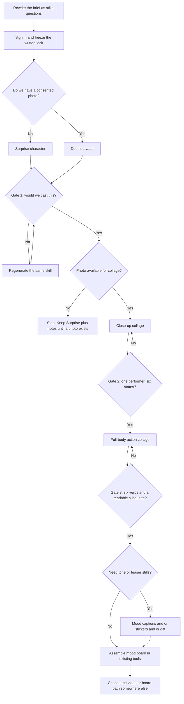
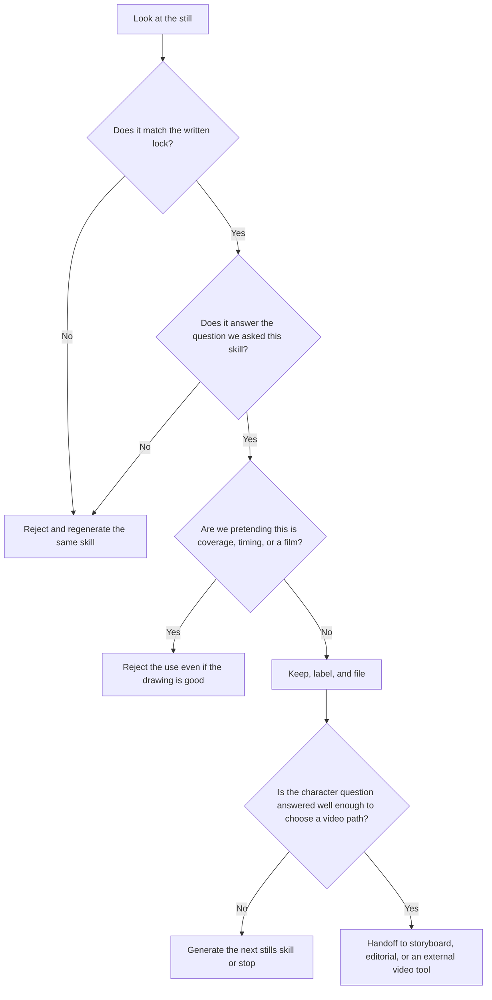

**Direct answer:** Pre-production stills let an AI filmmaker lock character, pose, and mood at doodleai.art before choosing a video path. Generate a doodle avatar or Surprise character, then a close-up collage and a full-body action sheet. A human culls every page. Video, animatics, and shot lists stay in other tools.

This is a workflow note for people who already know they will make moving pictures and who keep burning days inside a video model before anyone has agreed who is on screen. It is for an AI filmmaker, a director, or a virtual-production lead who needs character directions, pose exploration, shot ideation, and mood-board material. It is not a product landing page. It is not a Sora replacement. It will not teach you to generate a short. It will teach you what to generate as stills, what to reject, and what to hand off.

The method uses only the image skills that currently run in Doodle AI: a single doodle avatar, a six-panel close-up collage, a six-panel full-body action collage, Surprise, die-cut sticker sheets, mood-caption collages, and gift images. The production example later in this article is fictional and labelled that way. There are no invented customers, no unnamed “AI film we shipped,” and no measured speed or quality claims for Doodle AI.

## Why stills come before the video decision

Most AI-film sessions start in the wrong place. Someone pastes a scene into a video tool, watches a clip that almost works, then spends the next afternoon arguing about a face that never settled. The clip is expensive in attention even when the invoice is small. The argument is happening on motion, which is the wrong surface for a character question.

Stills are cheaper to reject. A bust, a six-panel face page, and a six-panel full-body page can answer “who is this person,” “what range can they play,” and “how do they occupy a frame.” Those answers are what a director needs before choosing live-action plates with illustrated overlays, a generated-motion tool, or a traditional board-and-animate stack. If you skip the stills, you are choosing a video approach while the lead is still a paragraph.

The pressure to skip is real, and it is not unique to independent AI film. [Wyzowl’s 2026 video marketing statistics, based on a late-2025 survey of 266 respondents, report that 91% of businesses use video as a marketing tool](https://wyzowl.com/video-marketing-statistics/). That figure is directional context, not a Doodle AI metric. It explains why a two-person unit is asked for motion before anyone has seen a character: the people who fund or share the work already treat video as a default. Pre-production stills are how you answer that demand without pretending the film is already shot.

The same Wyzowl page reports that 63% of surveyed video marketers have used AI video tools to help create or edit marketing videos, and that 89% of surveyed consumers say video quality impacts their trust in a brand. Those numbers describe an environment where generated motion is common and where a muddy first clip can damage confidence. They do not measure Doodle AI. They do not prove that any still in this workflow will be usable. They only explain why a director can insist on stills first without looking old-fashioned.

Video tools themselves are not a stable floor. That fact is external to Doodle AI, and it should stay labelled that way. [OpenAI’s deprecations page states that on 24 March 2026 it notified developers that the Videos API and Sora 2 model aliases would be removed from the API on 24 September 2026](https://developers.openai.com/api/docs/deprecations). [OpenAI’s help article on the Sora discontinuation states that the Sora web and app experiences were discontinued on 26 April 2026, and that the Sora API will be discontinued on 24 September 2026](https://help.openai.com/en/articles/20001152-what-to-know-about-the-sora-discontinuation). [OpenAI’s video-generation guide still documents how Sora 2 and the Videos API work](https://developers.openai.com/api/docs/guides/video-generation/). Those three pages are OpenAI documentation, not Doodle AI features. Doodle AI does not generate video. It does not wrap Sora. It does not offer a video adapter. The useful production lesson is narrower: lock character and blocking on stills so the later motion tool can change without restarting the film.

Provenance is a later production question, not a stills-skill question. [C2PA’s 2.2 explainer describes tamper-evident Content Credentials](https://spec.c2pa.org/specifications/specifications/2.2/explainer/Explainer.html). Doodle AI does not currently attach C2PA credentials. If a festival, platform, or client later needs Content Credentials, that requirement belongs in the handoff to tools that implement the standard. It is not something a doodle still can claim.

Taken together, those sources support one operational claim: teams already need video, generated motion is already in the mix, video APIs move, and provenance is a separate standard. None of that is a benchmark for Doodle AI. If a still is wrong, you reject it. That is the point of the rest of this article.

## What Doodle AI actually is today

Doodle AI, at [doodleai.art](https://doodleai.art), is a chat-first creative studio built with Astro and Mastra. Image generation goes through a server-owned PicX connection. You can browse the public skill catalog without an account. Sign-in is required to upload, generate, save, and do synced account work. New accounts receive 5 signup credits. Each successful generation costs 1 credit. Failed generations refund. Credits are pooled on the organization. Organization limits and rate caps exist; this article does not invent their numeric thresholds beyond the published organization caps below.

The currently runnable image skills are:

- one doodle avatar, square, from a photo
- a six-panel close-up collage, 3:2 landscape, from a photo
- a six-panel full-body action collage, 3:2 landscape, from a photo
- Surprise, a square fictional character with no photo required
- a square die-cut sticker sheet from a photo
- a 3:2 mood-caption collage from a photo
- a square gift image from a photo

That is the whole image surface this article is allowed to use. Emotional Modes and Seasonal Pack are catalog previews, not runnable skills. Do not plan a filmmaker sitting around them.

House style on the live skills is a naive hand-drawn doodle: bold outlines, simplified features, flat or restrained color, and a clean white or warm-white background. Close-up collage and full-body collage may add decorative doodle marks — sparkles, squiggles, or motion-line overlays — on the still page. Those marks are illustration, not frames of a clip. They do not turn a collage into an animatic.

Doodle AI has a Better Auth organization foundation. Every user receives a personal organization on signup. Configuration allows up to 5 organizations and 25 members. Roles in that layer are owner, producer, artist, reviewer, and client. Sessions carry an active organization. Membership and permissions are rechecked. Threads, messages, characters as shared references, moodboards, generation records, and credit accounting are organization-scoped. Credits are pooled per organization.

That is shared data behavior plus a working backend. It is not a finished team, project, or review workspace. A complete team switcher or polished B2B project UI was not verified as a user-facing product. Projects, assets, share links, batch jobs, and review states exist as schema or partial integration. Do not run this workflow as if a client portal, approval queue, or shot-list object were live. Roles exist in the organization layer. They do not currently map to a verified client-facing approval flow.

The following are not live: video generation, timeline editing, animatics, shot-list automation, C2PA, commercial licensing, Stripe checkout, subscriptions, physical fulfillment, and guaranteed character continuity. There is no saved reference-locking object that will force identical characters across generations. Organization-scoped shared references help a human keep names, notes, and images in one place. They do not guarantee that the next generation will match the last one.

The hero image on this page is a current PicX-generated die-cut sticker sheet. Read it as a sticker sheet. Do not read it as a storyboard, an animatic, a shot list, or a finished film.

*This figure is a current PicX-generated sticker-pack sample from Doodle AI’s sticker skill on doodleai.art. It is a square die-cut sticker sheet, not a storyboard, not a six-panel collage, not a full-body action page, and not a finished film. Use it only as an example of a stills sheet, never as evidence of motion, continuity, or delivery.*

## A clearly labelled hypothetical filmmaker brief

The following brief is fictional. Low Shelf Pictures is not a real company. *Quiet Inventory* is not a real film. Ellis Quinn is not a real person. No hours, festival results, or client reactions were measured. The brief exists so the rest of the article can be specific instead of speaking in “your character” forever.

**Hypothetical unit:** Low Shelf Pictures, a two-person AI-film setup. One director who also writes prompts. One virtual-production lead who will later composite, board, or supervise motion in tools that are not Doodle AI.

**Hypothetical job:** a 4-minute illustrated short called *Quiet Inventory*. After closing, a grocery night-shift stocker walks a fluorescent aisle and talks to a handheld barcode scanner as if it were a coworker. The later motion path is undecided. The unit might shoot live-action aisle plates and composite an illustrated lead. It might take locked stills into an external video tool. It might board and animate in a traditional 2D stack. This sitting is not allowed to pick that path. It is only allowed to produce stills that make the path choosable.

**Hypothetical lead:** Ellis Quinn, night-shift stocker, mid-twenties read. Costume landmarks: a faded red store vest over a thrift-store band tee, scuffed kneepads, a handheld barcode scanner on a coiled cord clipped at the hip, one fluorescent-green visor clip that never sits straight. Palette: fluorescent white, faded red, scuffed linoleum beige, a single mint visor clip. Tone: lonely competence. Not slapstick. Not a grocery-brand mascot. The scanner is a character. If it looks like a generic phone or a toy ray gun, the still fails.

**Hypothetical constraints:**

- One sitting, not a week of look-dev.
- Credit discipline. A new Doodle AI account has 5 signup credits. This hypothetical unit already has an account and budgets 10 credits: two for the first character still, two for close-ups, two for full-body action, one for a mood-caption page, one for a sticker sheet, two as redo buffer. Failed generations would refund, but the plan does not rely on failures.
- No video in this sitting. No animatic. No “just generate the short.”
- Sign-in before any upload, generation, or save.
- Human gates after each skill. Either person can stop the sitting. Either person can refuse to put a still on the mood board.

**Hypothetical success test:** a producer who has never read the script can look at the stills and say “tired stocker, scanner first, not a commercial.” If they ask for camera moves, the sitting overreached. If they ask who Ellis is, the sitting underreached. If they ask which video tool to buy, the stills did their job and the video decision happens somewhere else.

## Rewrite the brief as questions a still can fail

A shot list is not a stills brief. If you paste “open on the dairy case, track with Ellis, smash cut to the scanner, then a wide of the empty aisle” into an image skill, you will get a muddy page that pretends to be coverage. Rewrite the job as questions a single image can answer with yes or no.

For Surprise, when there is no photo: would we cast this invented face as Ellis, or is it a random cute stocker?

For the doodle avatar, when there is a photo: would we hire this illustrated face and this costume to play Ellis? Not “is it pretty.” Hire or do not hire.

For the close-up collage: can we read six distinct states in the face, and do the vest, visor clip, and scanner cord stay in the same universe? If panel four grows a different jaw, the page is research, not a lock.

For the full-body action collage: does the silhouette still read as Ellis at thumbnail size, and do the six poses cover the verbs the later board or composite will need? The hypothetical verbs are walk, crouch, reach, scan, sit, and listen. If all six poses are standing three-quarter hero shots, the page is a toy sheet.

For mood captions: does the page give a usable tone board, even though today’s skill picks a random six words from its pool rather than the exact words you typed?

For stickers: does the sheet give isolated reaction stills for a teaser or a festival postcard, without pretending the stickers are shots?

For gift: is this a sendable still for a thank-you or a crew card, and not a poster pretending to be a keyframe?

A director can do this rewrite on paper before anyone signs in. It is the cheapest part of the sitting and the part most units skip.

## Map each live skill to a filmmaking job

Use the skill that answers the question you actually have. Do not run all seven because they exist.

| Filmmaking question | Live skill | What a useful result looks like | What you still will not have |
| --- | --- | --- | --- |
| Who is Ellis if we have no photo yet? | Surprise | One square fictional doodle you might cast | Likeness, a turnaround, continuity |
| Who is Ellis if we have a reference photo? | Doodle avatar | One square illustrated bust you might hire | A model pack, legal clearance, a license |
| What range can this face play? | Close-up collage | Six candid close-ups on one 3:2 page | Lip sync, an eye chart, guaranteed panel match |
| How does this body occupy a frame? | Full-body action collage | Six head-to-toe verbs on one 3:2 page | Timing, camera, in-betweens, an animatic |
| What is the emotional temperature for a social or pitch board? | Mood captions | One 3:2 page of posed moods with hand-lettered words | Exact caption control; the tool randomizes six words from its pool |
| What isolated reaction stills could travel as a teaser object? | Sticker sheet | Four or five die-cut bust stickers on a square sheet | WhatsApp or iMessage export, a print pack in the mail |
| What still could we send as a thank-you or festival card? | Gift | One square greeting-style doodle | Custom card copy, a key art poster, physical fulfillment |

Two photo warnings from the skills themselves. Close-up collage, full-body collage, stickers, mood captions, and gift all need an uploaded photo. If the photo is a tight headshot, full-body will have to invent everything below the crop. Say that out loud before you spend the credit. Surprise is the only skill that runs with nothing attached. It will not preserve a likeness, because there is no likeness to preserve.

Mood captions and gift have their own honesty clauses. Mood captions currently draw six words at random from a living pool that includes Miss You, Enough, Healing, Overthinking, Tired, Hope, Still, and other short captions in the same set. You can steer style in the prompt. You cannot currently force a specific six-word set. Gift currently maps wording to a small occasion list — birthday, thank-you, congratulations, get well, love — and otherwise falls back to a warm “Thinking of You” default with a standard card message. It will not set arbitrary poster copy. If you need exact words on a pitch board, letter them yourself after export.

## The stills-first sitting

Run the skills in an order that matches the question, not in catalog order. Do not open Full-body because it looks like a storyboard. It is not a storyboard. It is a pose page.

### 1. Sign in and freeze a written lock

Sign in. If anyone needs to upload a reference photo, they do it after sign-in. Paste a lock you will reuse. The product does not guarantee continuity. The lock is the continuity tool you actually have.

> Lock: Ellis Quinn, grocery night-shift stocker, mid-twenties, faded red store vest over a thrift band tee, scuffed kneepads, handheld barcode scanner on a coiled cord at the hip, one fluorescent-green visor clip sitting crooked, fluorescent-white light, faded red, linoleum beige, lonely competence, not slapstick, not a mascot, no text, no watermark, no extra shoppers.

Save that text where your organization-scoped thread can see it. If you also save a named shared reference inside the organization, treat it as a human reminder, not as a lock that the model must obey. Organization-scoped shared references help the next prompt. They do not guarantee identical characters across generations.

### 2. Choose Surprise or a photo avatar, then Gate 1

If the unit has no consented photo, run Surprise. Prompt:

> Draw one fictional doodle character: Ellis Quinn, night-shift grocery stocker, mid-twenties, blunt tired eyes, faded red vest over a thrift band tee, fluorescent-green visor clip sitting crooked, handheld scanner on a coiled cord just in frame, clean warm-white background, bold ink outline, lonely competence, not cute mascot, no text, no watermark, bust-up crop.

If the unit has a consented photo of a stand-in, run the doodle avatar instead and keep the same lock. Generate once. Spend the still like a casting Polaroid.

Gate 1 is a yes or no:

- The visor clip is crooked and mint. If it vanishes, the character is already drifting.
- The vest is faded red, not a superhero cape or a brand uniform from a commercial.
- The scanner is a barcode scanner on a coil, not a phone and not a toy weapon.
- The expression is tired and competent, not adorable.

If any of those fail, regenerate the same skill. Do not “fix it in the collage.” The collage will multiply the error by six.

### 3. Close-up collage, then Gate 2

Only after Gate 1. This skill needs a photo. If you started from Surprise, you still need a photo to run collage — a consented stand-in. Keep the Surprise still in front of you as a human style reminder. Do not invent a “lock this Surprise output as the subject photo” product feature. Uploading a generated still as if it were a continuity object is not a verified workflow. If you do not have a photo, stop and stay on Surprise plus written notes until you do.

Prompt, once a photo is attached:

> Six-panel close-up collage of Ellis Quinn from the locked still: faded red vest straps, crooked fluorescent-green visor clip, scanner coil or grip in frame when a hand is visible. Panel 1: listening, eyes on the scanner. Panel 2: tired, eyes half-closed under fluorescent light. Panel 3: a small real laugh, not a commercial smile. Panel 4: startled by a fridge compressor. Panel 5: determined, jaw set, no grin. Panel 6: whispering toward the scanner. Keep face shape, hair, and visor clip consistent. Clean doodle, no captions, no extra characters.

Read the page as six performance stills, not as a sequence. Decorative overlay marks on the page, if they appear, are still-image doodles. They are not camera moves. Gate 2:

- All six heads could be the same performer.
- The six states are distinguishable at a glance.
- Wardrobe landmarks survive the crop.
- Nothing on the page is a camera move in disguise.

If two panels are usable and four are a different stocker, reject the page. One credit bought the page, not six independent wins.

### 4. Full-body action collage, then Gate 3

Prompt:

> Six-panel full-body action collage of the same locked Ellis, complete figure head to feet in every panel, same faded red vest, band tee, kneepads, scanner on coiled cord, crooked mint visor clip. Panel 1: walking an aisle, scanner down. Panel 2: crouching to a low shelf. Panel 3: reaching to a high shelf, coil stretched. Panel 4: scanning a barcode, body in a working stance. Panel 5: sitting on a pallet, scanner on the knees. Panel 6: standing still, head tilted as if listening to the scanner. Clear silhouettes, no storyboard arrows, no text.

Gate 3 is silhouette and verb, not beauty:

- Thumbnail the page. If Ellis becomes a blob, fail.
- Each panel is a different verb. Duplicate standing poses fail.
- The scanner is doing work in the pose, not floating as a prop.
- You could hand this page to a board artist or a compositor as blocking research.

Do not number the panels as shots. A 3x2 grid is a contact sheet. Motion-line doodle overlays, if the page includes them, are drawn marks that suggest action on a still. They are not in-betweens and not a clip. The sticker-pack sample at the top of this article should make that visceral: a grid of poses can look sequential and still be merchandise logic, not cinematic logic.

### 5. Optional tone and teaser stills, each with their own job

Only after Gates 1–3, and only if the sitting still has credits and a reason. These three skills also need a photo.

Mood captions are a tone board, not dialogue. Prompt for style, not for a fake shot list:

> Mood-caption collage of the locked Ellis in the same vest and crooked visor clip, fluorescent-aisle tiredness, lonely competence, no extra shoppers. Keep the character recognizable. I understand the six words will come from the skill’s own pool.

Pass the page if the moods are usable as a pitch-board temperature check. Fail it if the words fight the film — a sheet of “Congrats!” energy on a night-shift short is a reject, even if the drawing is handsome.

Stickers are isolated reaction objects. Prompt:

> Square die-cut sticker sheet of Ellis as head-and-shoulders stickers: wave, tired blink, small laugh, listening to the scanner, shy peace sign. Same vest and crooked visor clip. White die-cut borders, warm-white sheet, no text on the sheet.

Pass the sheet if the stickers could travel as a teaser object or a festival handout image. Fail it if you start treating the stickers as coverage. The sheet is a still. It is not a print order, and Doodle AI does not mail stickers.

Gift is a sendable still. Prompt only if you actually need a card:

> Gift doodle of Ellis, thank-you occasion, faded red vest, crooked mint visor clip, warm and simple, not a movie poster, not a wide aisle shot.

Pass it as a thank-you or crew card. Fail it if someone tries to use it as key art. The thank-you wording maps to the skill’s standard “Thank You” card message. It will not typeset a festival dedication.

The mood-caption sample below is a stills page from the current mood-captions skill. It is not a shot list and not a clip.

*This figure is a current PicX-generated mood-caption collage from Doodle AI’s mood-captions skill. It is a 3x2 stills page with hand-lettered words, not a shot list, not an animatic, and not a Doodle AI video export. Caption text on a live run is drawn from the skill’s word pool rather than from a custom script. Do not read it as evidence of motion, continuity, or delivery.*

### 6. Assemble the mood board outside the chat

Doodle AI currently has organization-scoped threads, shared references, moodboards, generation records, and pooled credits, so members of an active organization can share the underlying data. That is backend and API foundation plus shared data behavior. It is not a finished team, project, or review workspace. Organization-scoped moodboard records are not a verified end-to-end concept-board product. Export or save the approved stills, then build the filmmaker board in whatever the unit already uses: a slide, a Figma file, a printout, [Frame.io](https://frame.io/pricing) if that is already the review habit, or a physical wall. Frame.io is an external review tool. It is not part of Doodle AI.

Label each still with the skill that made it, the gate that passed it, and the question it answers. Put the rejected stills in an appendix so the next prompt has examples of “not this.”

That board is the deliverable of the sitting. It is not the film. It is the material you need before you choose a video approach.

The second diagram is the one a director should run instead of “I kind of like it.”

## Human review gates, written as jobs

Gates fail when they become taste. Give each person a job. In a two-person unit, one person still should not own every gate.

| Gate | Owner | Pass only if | Fail and regenerate if | Do not ask this here |
| --- | --- | --- | --- | --- |
| 1. First character still | Director | The still could be cast as Ellis | Mascot face, missing visor clip, generic gadget, wrong tone | Will this animate well? |
| 2. Close-up collage | Whoever owns performance | Six readable states, one face, wardrobe landmarks hold | Mixed identity, repeated expression, clip that changes | What is the shot list? |
| 3. Full-body action | Virtual-production lead | Six verbs, thumbnail silhouette, scanner is in the body | Hero-shot grid, unreadable mass, scanner as decoration | How long is the shot? |
| 4. Optional tone or teaser | Director | The page has a job: temperature, sticker object, or card | The page is being used as coverage or key art | Should we generate video now? |
| 5. Board assembly | Both | A stranger can describe Ellis from the wall | The wall needs a verbal tour | Which video API should we buy? |

The virtual-production lead’s actual power is to spend the redo credits or to stop. With 5 signup credits on a new account, a first-time user may only get one character still, one collage, and one full-body page, with no buffer. Plan for that. Do not perform the sitting as an open jam.

## Credit math you can defend

This table is a planning tool. It is not a price list for a subscription, because Stripe checkout and subscriptions are not live. It is not a performance promise. It only maps questions to current skills.

| Question the room needs answered | Skill | Credit cost if it succeeds | What you still will not have |
| --- | --- | --- | --- |
| Who is Ellis with no photo? | Surprise | 1 | Likeness, continuity, a turnaround |
| Who is Ellis from a photo? | Doodle avatar | 1 | A model pack, legal clearance |
| What does Ellis play in close? | Close-up collage | 1 | Lip sync, guaranteed panel-to-panel match |
| How does Ellis occupy space? | Full-body action collage | 1 | Timing, camera, an animatic |
| What is the temperature of the piece? | Mood captions | 1 | Exact words, a dialogue board |
| What isolated reactions can travel? | Sticker sheet | 1 | Chat-app export, shipped stickers |
| What still can we send? | Gift | 1 | Custom copy, a theatrical poster |
| What if Gate 1 fails once? | Same first skill again | 1 | A “variant workflow”; this is just another generation |
| What if a generation errors? | Same skill after refund | 0 if the failure refunds as specified | A reason to skip the gate |

Hypothetical budget for Low Shelf Pictures: 10 planned credits, with two unused if Gates 1–3 pass on the first or second try. A brand-new account with 5 signup credits should treat this as Surprise or avatar, close-up, full-body, and at most one redo — not as a fishing trip through stickers and gift. Those last two skills are useful. During a lock sitting they are also a leak.

Organization-pooled credits mean a second member of the active organization spends from the same balance. That is useful and dangerous. Write the budget on paper. Roles exist in the organization layer. They do not currently give you a review UI that will stop someone from spending the pool.

## Worked example, assumptions labelled hypothetical

Assume, hypothetically, that Low Shelf Pictures sits down on a Thursday night. Assume the written lock is already on paper. Assume they are signed in. Assume they have no consented stand-in photo at the start. Assume they will not open a video tool during the sitting. Assume no still is “good enough because we are tired.”

**Hypothetical pass 1, Surprise.** The first still makes Ellis look like a cheerful brand mascot. The visor clip is correct. The scanner is a rounded cartoon phone. Gate 1 fails on tone and on the scanner. They spend the second Surprise credit with the same lock plus one extra clause: “industrial handheld barcode scanner with a visible coiled cord and trigger grip, not a smartphone.” The second still is castable. Gate 1 passes. Two credits.

They still cannot run close-up collage or full-body without a photo. In this hypothetical they now use a consented photo of the director in a red vest, taken after Gate 1, as the photo input. The Surprise still stays pinned as a human style reminder. That is a workaround, not a reference-locking feature.

**Hypothetical pass 2, close-up collage.** The page is handsome and mostly wrong. Panels 1, 2, and 5 match the locked face. Panels 3, 4, and 6 lose the visor clip and grow a wider grin. Gate 2 fails because the page is not one performer. They regenerate with an added clause: “keep the crooked mint visor clip in every panel; no commercial smile.” The second page is uneven but all six heads are Ellis, and the six states read. Gate 2 passes. Two credits.

**Hypothetical pass 3, full-body action collage.** The first action page is six standing portraits with a shelf drawn behind one of them. Gate 3 fails on verbs. The second prompt names the verbs as verbs. The second page can be thumbnailed. Walk, crouch, reach, scan, sit, and listen are all present. The scanner participates. Gate 3 passes. Two credits.

**Hypothetical optional stills.** They spend one credit on mood captions. The randomized words include Tired, Enough, and Still, which they keep, and one chipper word they mark as ignore-on-the-board. They skip stickers and gift because the character question is already answered and the remaining credits are the redo buffer they did not need.

**Hypothetical board.** They place the cast Surprise still at the top as “invented lead,” the photo-based close-up page as “performance range,” the action page as “blocking research,” and a short note that the scanner must stay industrial. They do not add arrows. They do not number the close-ups as shots. They print one copy for the producer who was not in the room.

Under those hypothetical assumptions, the sitting produces a mood board. It does not produce a 4-minute film. It does not prove that another unit would get the same stills. It does not create a commercial license. It does not attach Content Credentials. It does not choose the video path. It makes the video path choosable.

## What to generate, what to reject, what to hand off

This is the whole method, restated as a cull.

**Generate** when the unanswered question is character, costume, tone, or blocking. Generate a Surprise still when you have no photo and need an invented lead. Generate an avatar when you have a consented likeness. Generate a close-up collage when you need performance range. Generate a full-body collage when you need verbs and silhouette. Generate mood captions when you need a temperature page and can live with randomized words. Generate stickers when you need isolated reaction objects. Generate a gift still when you actually need a card.

**Reject** a still that fails the written lock, even if it is charming. Reject a page that mixes identities. Reject six standing hero shots pretending to be action. Reject any grid you have started numbering as shots. Reject mood captions that fight the tone. Reject a sticker sheet you are treating as coverage. Reject a gift image you are treating as a poster. Reject the urge to keep generating after the character question is answered. Extra stills are not extra clarity.

**Hand off** as soon as a stranger can describe Ellis from the wall. Motion, timing, editorial, and delivery do not live in Doodle AI. Take the approved stills into the tools that already do those jobs: a storyboard tool, a compositing timeline, paper thumbs, or an external video model of your choice. If you later need an animatic, build it there. If you later need a shot list, write it there. If you later need Content Credentials, add them in a system that implements [C2PA](https://spec.c2pa.org/specifications/specifications/2.2/explainer/Explainer.html). If you later need a review thread with frame comments, use the review tool you already pay for.

A practical handoff packet for the hypothetical Low Shelf job would include:

- The written lock, copied verbatim.
- The Gate 1 still, labelled Surprise or avatar.
- The approved close-up collage, labelled Gate 2, with a one-line note on which panel is the rest face.
- The approved action collage, labelled Gate 3, with the six verbs written under the page.
- Optional mood, sticker, or gift stills, each labelled with the job they were allowed to do.
- The rejected stills, so later artists do not re-propose the mascot scanner.
- A sentence that motion, timing, and editorial will be done outside Doodle AI.
- A sentence that C2PA, commercial licensing, and checkout are out of scope here.
- A sentence that the video approach is now a separate decision, to be made with these stills in hand.

From there, a virtual-production lead can test a live-action plate with an illustrated overlay. A director who still wants generated motion can take the locked stills into a current video tool, with eyes open about credit pricing and about API lifetimes. [Runway’s public pricing page describes credit-based image and video plans](https://runway.com/pricing). That is how some motion products bill. It is not a recommendation to buy a particular plan, and it is not a Doodle AI feature. [OpenAI’s dated Sora shutdown](https://developers.openai.com/api/docs/deprecations) is one example of why the motion layer should remain swappable. Neither example is a reason to trap pre-production inside a video endpoint.

## Limitations, stated as product facts

The limitation list is the product list in negative.

Doodle AI does not currently generate video. It does not edit a timeline. It does not produce animatics. It does not automate a shot list. It does not attach C2PA Content Credentials. It does not grant a commercial license. It does not offer Stripe checkout or subscriptions. It does not ship physical stickers, cards, or prints. It does not guarantee character continuity across generations.

It also does not offer a finished team, project, or review workspace. Organization-scoped threads, shared references, moodboards, generation records, and pooled credits are current through the Better Auth organization foundation. Projects, assets, share links, batch jobs, and review states remain partial foundations. Roles exist. A client-facing approval flow was not verified as a live product surface.

There is no video adapter in this product. There is no saved reference-locking object that will force the next Ellis to match the last Ellis. Mentioning a shared reference in chat is a human practice. If the visor clip or jaw on the close-up page disagrees with the action page, the board is dishonest. The honest move is to regenerate or to relabel the disagreeing page as exploration.

The sticker skill makes a sticker sheet image. It does not export a transparent WhatsApp or iMessage pack. Chat-app sticker export is a different job in a different product. The gift skill makes a digital greeting image. It does not mail a card. Mood captions letter words from a pool. They do not typeset your script.

House style on these skills is a naive hand-drawn doodle: bold outlines, simplified features, flat or restrained color, clean backgrounds. If your film needs photoreal plates, 3D layout, or cinematic shading, you are in the wrong tool for finish. You may still be in the right tool for an illustrated character direction.

## Practical checklist

Print this. Tick it in the room.

- [ ] Brief rewritten as stills questions, not as a shot list.
- [ ] Fictional or real job: success test is “who is this,” not “here is the film.”
- [ ] Video path deliberately unchosen until the mood board exists.
- [ ] Everyone who will generate is signed in.
- [ ] Credit budget on paper. New accounts: 5 signup credits. Each generation costs 1 credit. Failed generations refund.
- [ ] Written lock pasted once and reused.
- [ ] Surprise if there is no photo. Avatar if there is a consented photo. Gate 1: cast or reject.
- [ ] Close-up collage only with a photo and only after Gate 1. Gate 2: one performer, six states.
- [ ] Full-body action collage only after Gate 2. Gate 3: six verbs, thumbnail silhouette.
- [ ] Optional mood captions, stickers, or gift only if they have a named job and a photo.
- [ ] Mood board assembled outside the chat. Stills labelled by skill and gate.
- [ ] Rejected stills kept as negative references.
- [ ] Organization-scoped shared references treated as human memory, not as a continuity guarantee.
- [ ] No one asks the chat for video, a timeline, an animatic, a shot list, a license, or a client portal.
- [ ] Handoff packet includes lock, approved pages, rejects, and a note that C2PA and licenses are out of scope here.
- [ ] Hero references in any write-up of the sitting, including this article’s sticker image, are labelled as what they are.

## Try Full-body, Collage, and Surprise on stills

If you want to run this yourself, start at [https://doodleai.art/skills/](https://doodleai.art/skills/). Sign in before you upload, generate, or save. Use [Surprise](https://doodleai.art/skills/surprise/) when you have no photo and need an invented lead. Use [Collage](https://doodleai.art/skills/collage/) for performance range once a photo exists. Use [Full-body](https://doodleai.art/skills/full-body/) for pose and blocking. Treat avatar, stickers, mood captions, and gift as supporting stills with their own jobs, not as a second pipeline.

You will leave with stills, not a film. That is the honest outcome. If the stills are good enough to argue about, you are ready to choose a video approach in the tools that actually move.

## Sources

- Wyzowl, Video Marketing Statistics 2026, including the claim that 91% of businesses use video as a marketing tool, plus related figures on AI video-tool use and consumer trust: [https://wyzowl.com/video-marketing-statistics/](https://wyzowl.com/video-marketing-statistics/)
- OpenAI, API deprecations, Sora 2 video generation models and Videos API shutdown date of 24 September 2026: [https://developers.openai.com/api/docs/deprecations](https://developers.openai.com/api/docs/deprecations)
- OpenAI Help Center, Sora web and app discontinued 26 April 2026; Sora API discontinued 24 September 2026: [https://help.openai.com/en/articles/20001152-what-to-know-about-the-sora-discontinuation](https://help.openai.com/en/articles/20001152-what-to-know-about-the-sora-discontinuation)
- OpenAI developers, video generation with Sora, current guide documenting Sora 2 and the Videos API as an external product: [https://developers.openai.com/api/docs/guides/video-generation/](https://developers.openai.com/api/docs/guides/video-generation/)
- C2PA 2.2 explainer, tamper-evident Content Credentials: [https://spec.c2pa.org/specifications/specifications/2.2/explainer/Explainer.html](https://spec.c2pa.org/specifications/specifications/2.2/explainer/Explainer.html)
- Runway, public credit-based image and video pricing: [https://runway.com/pricing](https://runway.com/pricing)
- Frame.io pricing, as an example of an existing review surface used after export: [https://frame.io/pricing](https://frame.io/pricing)
- Doodle AI, public studio and skill catalog: [https://doodleai.art](https://doodleai.art), [https://doodleai.art/skills/](https://doodleai.art/skills/)

These sources describe demand for video, a dated video-API shutdown, a provenance standard, credit metering in a current video product, and an adjacent review tool. They support running a stills-first sitting before you choose a video approach. They do not measure Doodle AI, do not validate any still in this article, and do not turn the hypothetical Low Shelf Pictures sitting into a case study.
