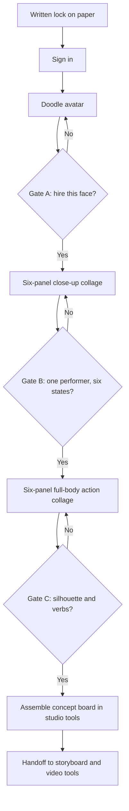
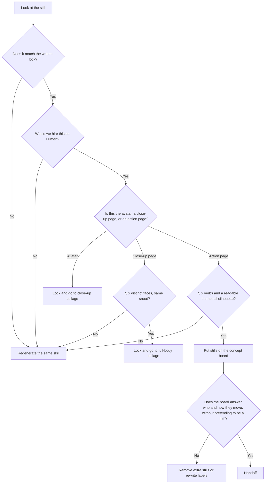

**Direct answer:** A visual sprint turns a written brief into a reviewable concept board in one sitting. Lock a doodle avatar, run a six-panel close-up collage for face and wardrobe, then a six-panel full-body action collage for silhouette and blocking. A human approves each gate. Video, storyboards, timing, and delivery still belong in dedicated tools. The hero image on this page is a PicX sticker-sheet sample, not a storyboard and not a finished film.

This is a field guide for people who already know how a short gets made and who are tired of treating generative stills as either a miracle or a toy. It is for boutique animation studios, independent AI filmmakers, producers who have to protect a schedule, and creative directors who have to protect a character. It is not a feature tour, not a ranking of video models, and not a claim that one chat studio can replace pre-production.

The method below uses only three currently runnable Doodle AI image skills: a single doodle avatar, a six-panel close-up collage, and a six-panel full-body action collage. Other skills exist in the product, including surprise character, sticker sheet, mood captions, and gift. They are useful in other conversations. They are not the spine of this sprint. The case study later in the article is hypothetical. It is labelled that way on purpose. There are no invented customers, no unnamed “studio we worked with,” and no measured speed or quality claims for Doodle AI.

## Why a stills-first sprint is a production question, not a model question

Small studios do not lose weeks because they cannot draw. They lose weeks because the first pictures arrive too late to argue about. A client says “warm, not cute.” A director says “lantern, not mascot.” A producer needs to know whether the lead reads in silhouette before anyone opens a timeline. Those are visual questions. If the first pictures only appear after a storyboard pass, the argument happens on expensive frames.

That pressure is not imaginary, and it is not unique to animation. [Wyzowl reports that 91% of businesses use video as a marketing tool](https://wyzowl.com/video-marketing-statistics/). When almost every buyer already treats video as a default communication format, a four-person studio is asked for motion work even when the real request is still “show us who this character is.” A concept board is how you answer that request without pretending you have already shot the film.

Creators have already moved generative tools into that early gap. [Adobe’s 2025 creators survey, covering more than 16,000 creators, reports that 86% use creative generative AI, 88% say it helps them work faster, and 87% say it improves quality](https://news.adobe.com/news/2025/10/adobe-max-2025-creators-survey). Those figures describe an industry habit: people use generative systems to get to a discussable picture sooner. They do not describe Doodle AI. They do not measure this sprint. They do not prove that any one generation will be usable. They only explain why a producer can put still generation in the first day of a job without looking eccentric.

The same market also explains why you should meter the work. [Runway’s pricing page and API pricing guide describe credit-based generation, including plan allowances such as 625 credits and API credits priced at $0.01 each](https://runway.com/pricing). The API detail is on [Runway’s developer pricing guide](https://docs.dev.runwayml.com/guides/pricing/). Credit systems are how current generation products make cost visible. Doodle AI also charges 1 credit per generation and refunds credits when a generation fails. That resemblance is about accounting, not about matching Runway’s models, video features, or plans. It is a reason to write prompts as if they cost something, because they do.

Two other public facts argue for stills before motion, and against coupling your pipeline to a single video API. [C2PA’s 2.2 explainer describes tamper-evident Content Credentials for provenance](https://c2pa.org/specifications/specifications/2.2/explainer/Explainer.html). Buyers, festivals, and platforms are increasingly interested in where a picture came from. Doodle AI does not currently attach C2PA credentials. If a later delivery needs Content Credentials, that requirement belongs in the handoff to tools and processes that support it. It is not something this sprint can claim.

Separately, [OpenAI’s official video-generation guide marks Sora 2 API and models as deprecated, with a shutdown date of 2026-09-24](https://developers.openai.com/api/docs/guides/video-generation/). Video endpoints move. They get renamed, repriced, and retired. A boutique studio that locks character and blocking in stills can change motion tools next month. A studio that starts the job inside one video API has to restart the job when that API changes. The Sora date is evidence of churn in the video layer. It is not evidence that Doodle AI generates video. It does not.

Taken together, those sources support a narrow operational claim: there is demand for video, creators already use generative systems to go faster, generation is metered, provenance is a separate standard, and video APIs are unstable. None of that is a performance benchmark for Doodle AI. If a still is wrong, you reject it. That is the whole point of the gates.

## What Doodle AI actually is today

Doodle AI is a chat-first creative studio built with Astro and Mastra. Image generation goes through a server-owned PicX connection. You sign in to upload, generate, and save. New accounts receive 5 signup credits. Each successful generation costs 1 credit. Failed generations refund credits.

The currently runnable image skills are:

- one doodle avatar
- a six-panel close-up collage
- a six-panel full-body action collage
- surprise character
- sticker sheet
- mood captions
- gift

That is the product surface this article is allowed to use. It is also the list of things this article will not inflate.

Doodle AI does not currently offer video, timeline editing, animatics, SSO, C2PA, commercial licenses, guaranteed character continuity, Stripe checkout, subscriptions, or physical fulfillment. The app does have a Better Auth organization layer: each user receives a personal organization, organizations can have members with owner, producer, artist, reviewer, or client roles, and the API scopes threads, messages, saved references, moodboards, generation, and pooled credits to the active organization. That is a working backend/API foundation and shared-data behavior, not a finished enterprise UI. A complete team switcher or polished B2B workspace was not verified in the audited page tree. Projects, assets, share links, batch jobs, and review states exist as schema and access-control foundations, but no dedicated end-to-end public routes were verified. A visual sprint that depends on those unverified surfaces will stall in the first hour.

Continuity in this workflow is a human practice, not a product guarantee. Signed-in members can save organization-scoped named references and mention them in chat, but that does not guarantee that a character will remain identical across generations. You lock a look by keeping the same description, the same costume landmarks, and the same rejected examples in front of the next prompt. You do not get a legal license from a successful generation. You get a still you can pin to a shared data surface and argue about; a full project/review/share workflow remains a partial foundation.

The hero image on this article, and the inline figure below, are the same file: a current PicX-generated sticker-pack sample. Read it as a sticker sheet. Do not read it as a storyboard. Do not read it as an animatic. Do not read it as a finished film. A sticker sheet is one of the skills in the product. It is not one of the three skills in this sprint. It is here so you can see what a multi-pose stills sheet looks like when the system is asked for stickers rather than for production art.

*This figure is a current PicX-generated sticker-pack sample from Doodle AI’s sticker sheet skill. It is not a storyboard, not a six-panel close-up collage, not a full-body action collage, and not a finished film. Use it only as an example of a stills sheet, never as evidence of motion, continuity, or delivery.*

## A clearly labelled hypothetical brief

The following brief is fictional. Harbor & Wick Animation is not a real studio. The Harbor lantern museum is not a real client. Lumen is not a real series. No hours, win rates, or client reactions were measured. The brief exists so the rest of the article can be specific.

**Hypothetical studio:** Harbor & Wick Animation, a four-person boutique. One creative director, one producer, one character designer who also composites, one generalist who will later board and animate in tools that are not Doodle AI.

**Hypothetical job:** a 75-second 2D character piece for a traveling exhibit about night-shift workers at a small harbor. The exhibit wants one lead character visitors can recognize from a poster, a looping screen, and a printed activity card. The motion piece will be produced later in the studio’s usual board-and-animate stack. This sprint is only meant to produce a concept board the museum stakeholders can mark up.

**Hypothetical lead:** Lumen, a raccoon lantern-keeper. Age read: late twenties. Costume landmarks: round wire glasses, patched denim overalls, a brass lantern on a worn leather strap, one yellow rain-slicker cuff that never matches the other sleeve. Palette: cream paper, soot brown, brass, a single warm amber. Tone: tired and careful, not slapstick, not “cute animal brand.” The lantern flame is a character. If the flame is generic fire, the board fails.

**Hypothetical constraints the sprint must respect:**

- One sitting, not a week of exploration.
- Credit discipline. A new Doodle AI account has 5 signup credits. This hypothetical team already has an account and budgets 8 credits: two for avatar, two for close-ups, two for full-body action, two as redo buffer. Failed generations would refund, but the plan does not rely on failures.
- No video in this sitting. No animatic. No “just generate the short.”
- Sign-in before any upload, generation, or save.
- Human gates after each skill. The producer can stop the sprint. The creative director can send a skill back. The designer can refuse to put a still on the board.

**Hypothetical success test:** after the sitting, a stranger can point at the board and say “tired raccoon, lantern first, not a mascot,” and the museum can mark three notes in the margin without asking what the film will look like. If they ask for camera moves, the sprint overreached. If they ask who Lumen is, the sprint underreached.

## How to write a brief that a collage can actually answer

Most written briefs are scene lists. A six-panel collage is not a scene list. If you paste “open on the harbor, cut to the ladder, then the ship, then the close-up of the flame” into a stills skill, you will get a muddy page that pretends to be coverage. Rewrite the brief as questions a still can fail.

For the avatar, the only question is: would we hire this face and this costume to play Lumen? Not “is it pretty.” Not “could this be a poster.” Hire / don’t hire.

For the close-up collage, the questions are: can we read six distinct states in the face, and do the glasses, overalls straps, and lantern handle stay in the same universe? If panel three grows a different snout, the collage is research, not a lock.

For the full-body action collage, the questions are: does the silhouette still read as Lumen at thumbnail size, and do the six poses cover the verbs the later board will need? The hypothetical verbs are climb, hang, run, sit, wave, and shield. If all six poses are standing three-quarter hero shots, the collage is a toy sheet.

A producer can do this rewrite on paper before anyone signs in. It is the cheapest part of the sprint and the part most teams skip.

## The three-skill workflow

Run the skills in this order. Do not skip a gate. Do not “just see what the action sheet does” before the face is hired.

### Step 1. Sign in and freeze the written lock

Sign in. If anyone needs to upload a reference, they do it after sign-in. Paste the lock into the chat as a block you will reuse, not as a vibe:

> Lock: Lumen, raccoon lantern-keeper, late-twenties read, round wire glasses, patched denim overalls, brass lantern on a worn leather strap, one yellow rain-slicker cuff, cream paper ground, soot-brown line, brass metal, single warm amber light, tired and careful, not slapstick, not mascot, no text, no watermark, no extra animals.

That block is the continuity tool. The product does not guarantee continuity. You do.

### Step 2. One doodle avatar, then Gate A

Prompt, concrete enough to paste:

> Draw one doodle avatar of Lumen the raccoon lantern-keeper, late-twenties energy, round wire glasses sitting slightly low on the snout, patched denim overalls with a visible mended patch on the left strap, brass lantern hanging from a worn leather strap across the chest, one yellow rain-slicker cuff on the right wrist only, tired eyes, small closed-mouth expression, warm amber rim light from the lantern, cream paper background, clean ink outline, no text, no watermark, bust-up crop.

Generate once. Spend the still like a casting photo. Gate A is a yes/no:

- Glasses sit on the snout, not as a human costume glued to a mascot.
- The lantern is brass and worn, not a generic magic orb.
- The unmatched yellow cuff is visible. If it vanishes, the character is already drifting.
- The expression is tired, not adorable.

If any of those fail, regenerate the avatar. Do not “fix it in the collage.” The collage will multiply the error by six.

### Step 3. Six-panel close-up collage, then Gate B

Only after Gate A passes. Prompt:

> Six-panel close-up collage of the same Lumen from the locked avatar: round wire glasses, patched denim overalls straps, brass lantern handle or glow in frame, one yellow rain-slicker cuff when a hand is visible. Panel 1: hopeful, looking up. Panel 2: tired, eyes half-closed. Panel 3: startled, lantern flare in the glasses. Panel 4: determined, jaw set, no grin. Panel 5: whispering toward the flame. Panel 6: a small real laugh, not a wide toothy mascot smile. Keep snout shape, ear notches, and glasses consistent. Cream paper, soot-brown line, brass, single amber. No text, no captions, no extra characters.

Read the page as six casting stills, not as a sequence. Gate B:

- All six heads could be the same performer.
- The six states are distinguishable at a glance.
- Wardrobe landmarks survive the crop.
- Nothing on the page is a camera move in disguise.

If two panels are usable and four are a different raccoon, reject the page. One credit bought the page, not six independent wins.

### Step 4. Six-panel full-body action collage, then Gate C

Prompt:

> Six-panel full-body action collage of the same locked Lumen, full body visible in every panel, same overalls, glasses, brass lantern on leather strap, unmatched yellow cuff. Panel 1: climbing a wooden ladder, lantern hanging. Panel 2: hanging a lantern on a hook above a dock. Panel 3: running along wet planks, protecting the flame. Panel 4: sitting on a crate, lantern on the knees. Panel 5: waving toward a ship, lantern down by the hip. Panel 6: turning away from wind, body curved around the flame. Clear silhouettes, no text, no motion lines that look like storyboard arrows, cream paper, soot-brown line, brass, single amber.

Gate C is silhouette and verb, not beauty:

- Thumbnail the page. If Lumen becomes a blob, fail.
- Each panel is a different verb. Duplicate standing poses fail.
- The lantern is doing work in the pose, not floating as a prop.
- You could hand this page to a board artist as blocking research.

### Step 5. Assemble a concept board outside the chat

Doodle AI now has organization-scoped threads, saved references, moodboards, and pooled credits, so members of an active organization can share the underlying data behavior. It is not yet a polished project workspace or client portal. Export or save the approved stills, then build the board in whatever the studio already uses: a slide, a printout, a Figma file, or a physical wall. Label each still with the skill that made it, the gate that passed it, and the question it answers. Put the rejected stills in an appendix so the next prompt has examples of “not this.”

That board is the deliverable of the sprint. It is not the film.

## Human review gates, written as jobs

Gates fail when they become taste. Give each person a job.

| Gate | Owner | Pass only if | Fail and regenerate if | Do not ask this here |
| --- | --- | --- | --- | --- |
| A. Avatar | Creative director | The still could be hired as Lumen | Mascot face, missing cuff, generic lantern, wrong tone | Will this animate well? |
| B. Close-up collage | Character designer | Six readable states, one snout, wardrobe landmarks hold | Mixed species, repeated expression, glasses that change | What is the shot list? |
| C. Full-body action | Producer plus CD | Six verbs, thumbnail silhouette, lantern is in the body | Hero-shot grid, unreadable mass, flame as decoration | How long is the shot? |
| D. Board assembly | Producer | A stranger can describe Lumen from the wall | The wall needs a verbal tour | Should we generate video? |

The producer’s actual power is to spend the redo credits or to stop. With 5 signup credits on a new account, a first-time user may only get one full pass and no buffer. Plan for that. Do not perform the sprint as an open jam.

The decision diagram is stricter than the flowchart. It is what the creative director should run in the room instead of “I kind of like it.”

## Credit math you can defend

This table is a planning tool. It is not a price list for a subscription, because Doodle AI does not currently present Stripe checkout or a subscription in this article’s facts. It is also not a performance promise. It only maps questions to the three skills in the sprint.

| Question the room needs answered | Skill to run | What you should get | Credit cost if it succeeds | What you still will not have |
| --- | --- | --- | --- | --- |
| Who is Lumen? | One doodle avatar | A hireable bust | 1 | A turnaround, a model pack, legal clearance |
| What does Lumen feel and wear in close? | Six-panel close-up collage | Six expression and wardrobe stills on one page | 1 | Lip sync, eye charts, guaranteed panel-to-panel match |
| How does Lumen occupy space? | Six-panel full-body action collage | Six blocking stills on one page | 1 | Timing, camera, in-betweens, an animatic |
| What if Gate A fails once? | Avatar again | A second casting still | 1 | A “variant workflow”; this is just another generation |
| What if a generation errors? | Same skill after refund | Another attempt | 0 if the failure refunds as specified | A reason to skip the gate |

Hypothetical budget for Harbor & Wick: 2 + 2 + 2 + 2 = 8 planned credits, with the last two unused if Gates A–C pass on the second try or better. A brand-new account with 5 signup credits should treat this as a single pass plus one redo, not as a fishing trip. Surprise character, sticker sheet, mood captions, and gift each also cost 1 credit if someone gets bored and runs them. In this sprint, that is a leak. The sticker-pack sample illustrating this article is exactly that kind of adjacent stills sheet: useful as a product example, expensive as a distraction from locking Lumen.

## Worked example, assumptions labelled hypothetical

Assume, hypothetically, that Harbor & Wick sits down on a Tuesday afternoon. Assume the written lock is already on paper. Assume they are signed in. Assume they will not run video tools during the sitting. Assume no still is “good enough because we are tired.”

**Hypothetical pass 1, avatar.** The first still makes Lumen look like a children’s-menu raccoon. The glasses are correct. The lantern is a round cartoon bulb. Gate A fails on tone and on the lantern. They spend the second avatar credit with the same lock plus one extra clause: “brass lantern with a visible bail and glass chimney, not a glowing orb.” The second still is hireable. Gate A passes. Two credits.

**Hypothetical pass 2, close-up collage.** The page is handsome and mostly wrong. Panels 1, 2, and 5 match the locked snout. Panels 3, 4, and 6 grow a narrower muzzle and lose the unmatched cuff. Gate B fails because the page is not one performer. They regenerate with an added clause: “keep the same wide snout and the same ear notches in every panel; if a hand is in frame the yellow cuff must be on the right wrist.” The second page is uneven but all six heads are Lumen, and the six states read. Gate B passes. Two credits.

**Hypothetical pass 3, full-body action collage.** The first action page is six standing portraits with a ladder drawn behind one of them. Gate C fails on verbs. The second prompt names the verbs as verbs, not as scenery. The second page can be thumbnailed. Climb, hang, run, sit, wave, and shield are all present. The lantern participates. Gate C passes. Two credits.

**Hypothetical board.** They place the hired avatar at the top, the close-up page as “face and wardrobe,” the action page as “blocking research,” and a short note that the flame must stay amber and small. They do not add arrows. They do not number the close-ups as shots. They print one copy for the museum and keep the rejected pages internal.

Under those hypothetical assumptions, the sitting produces a concept board. It does not produce a 75-second film. It does not prove that another studio would get the same stills. It does not create a commercial license. It does not attach Content Credentials. If the museum later needs provenance, Harbor & Wick would handle that in a tool chain that supports [C2PA Content Credentials](https://c2pa.org/specifications/specifications/2.2/explainer/Explainer.html), which Doodle AI does not currently provide.

## What this sprint is for, and what it is not for

Use it when the argument is character, costume, tone, or blocking. Use it when a stakeholder is about to approve a written treatment they cannot see. Use it when a board artist should not have to invent the lead from adjectives.

Do not use it when you need a shot list. A six-panel collage is a sheet, not coverage. The sticker-pack sample on this page should make that visceral: a grid of poses can look sequential and still be merchandise logic, not cinematic logic.

Do not use it when you need timing. Nothing in the current skills is a clock.

Do not use it when you need legal comfort. There is no commercial-license claim here. If a client needs usage terms, that is a separate conversation with a lawyer and with whatever license actually governs the files you export. This article will not invent one.

Do not use it when you need a finished studio workspace with a complete team switcher, project board, client portal, or review queue. The organization/API foundation and shared data behavior exist, but those user-facing production surfaces were not verified end to end. If three people review, use the shared organization data where available and keep the formal board and client review in the studio’s existing files.

Do not use it as a substitute for continuity tools. If the close-up snout and the action-page snout disagree, the board is dishonest. The honest move is to regenerate or to relabel the disagreeing page as exploration.

## Limitations, then a real handoff

The limitation list is the product list in negative. No video. No timeline. No animatics. No finished batch or variants workflow. No polished project/review/share workspace. No SSO. No C2PA. No guaranteed character continuity. No checkout flow, subscription, or physical stickers in the mail. The sticker skill makes a sticker sheet image. It does not ship a pack. The organization layer, shared references, moodboards, threads, and pooled credits are real backend/API capabilities; projects, assets, share links, batch jobs, and review states remain partial foundations rather than verified end-to-end product surfaces.

Handoff is therefore mandatory, not a nice extra. After Gate D, the studio should move the approved stills into the tools that actually finish animation.

A practical handoff packet for the hypothetical Harbor & Wick job would include:

- The written lock, copied verbatim.
- The hired avatar, labelled Gate A.
- The approved close-up collage, labelled Gate B, with a one-line note on which panel is the “rest face.”
- The approved action collage, labelled Gate C, with the six verbs written under the page.
- The rejected stills, so later artists do not re-propose the mascot lantern.
- A sentence that motion, timing, and editorial will be done in the studio’s storyboard and animation tools, not in Doodle AI.
- A sentence that if the client later asks for provenance, Content Credentials would be added in a system that implements C2PA, because this sprint did not.

From there, a board artist can work in Storyboard Pro, a TVPaint or Toon Boom pass, or even a paper thumb pass. An AI filmmaker who still wants generated motion can take the locked stills into a current video tool of their choice, with eyes open about credit pricing and about API lifetimes. [Runway’s public credit pricing](https://runway.com/pricing) is one example of how motion generation bills. [OpenAI’s Sora 2 deprecation and 2026-09-24 shutdown](https://developers.openai.com/api/docs/guides/video-generation/) is one example of why that motion layer should remain swappable. Neither example is a recommendation to buy a particular video plan. Both are reasons not to trap pre-production inside a video endpoint.

If the later pipeline needs batch stills, variant trees, or an animatic, use software that has those jobs. Do not wait for Doodle AI to grow them. The sprint is useful because it is small.

## Practical checklist

Print this. Tick it in the room.

- [ ] Brief rewritten as stills questions, not as a shot list.
- [ ] Fictional or real job: success test is “who is this,” not “here is the film.”
- [ ] Everyone who will generate is signed in.
- [ ] Credit budget on paper. New accounts: 5 signup credits. Do not spend them on surprise character, stickers, mood captions, or gift during this sprint.
- [ ] Written lock pasted once and reused.
- [ ] Avatar generated. Gate A hired or rejected.
- [ ] Close-up collage generated only after Gate A. Gate B: one performer, six states.
- [ ] Full-body action collage generated only after Gate B. Gate C: six verbs, thumbnail silhouette.
- [ ] Concept board assembled outside the chat. Stills labelled by skill and gate.
- [ ] Rejected stills kept as negative references.
- [ ] No one asks the chat for video, a timeline, an animatic, or a client link.
- [ ] Handoff packet includes lock, three approved pages, rejects, and a note that C2PA and licenses are out of scope here.
- [ ] Hero references in any write-up of the sprint, including this article’s image, are labelled as what they are. The PicX URL used here is a sticker-pack sample, not the Harbor & Wick board.

## Try the skills, or ask for a facilitated pilot

If you want to run this yourself, start at [https://doodleai.art/skills/](https://doodleai.art/skills/). Sign in before you upload, generate, or save. Use the doodle avatar, the six-panel close-up collage, and the six-panel full-body action collage in that order. Treat every other skill as optional and, during a sprint, probably off-limits.

If you want a producer in the room and a timed sitting with review gates, request a paid concept-sprint pilot. That is a services conversation. It is not a self-serve checkout. It is not a team workspace. It is not a subscription. It will not include video output from Doodle AI, and it will not invent a license. Bring a real brief. Leave with a board you are willing to hang on a wall.

The point is not to generate more pictures. The point is to make the first pictures early enough that the expensive work, the boarding and the animation and the motion tools that will change again next year, starts from a character you have already hired.

## Sources

- Wyzowl, video marketing statistics, including the claim that 91% of businesses use video as a marketing tool: [https://wyzowl.com/video-marketing-statistics/](https://wyzowl.com/video-marketing-statistics/)
- Adobe News, Adobe MAX 2025 creators survey, more than 16,000 creators; 86% use creative generative AI, 88% say it helps them work faster, 87% say it improves quality: [https://news.adobe.com/news/2025/10/adobe-max-2025-creators-survey](https://news.adobe.com/news/2025/10/adobe-max-2025-creators-survey)
- Runway pricing, credit-based plans including 625 credits: [https://runway.com/pricing](https://runway.com/pricing)
- Runway developer docs, API credits at $0.01 each: [https://docs.dev.runwayml.com/guides/pricing/](https://docs.dev.runwayml.com/guides/pricing/)
- C2PA 2.2 explainer, tamper-evident Content Credentials: [https://c2pa.org/specifications/specifications/2.2/explainer/Explainer.html](https://c2pa.org/specifications/specifications/2.2/explainer/Explainer.html)
- OpenAI developers, video-generation guide, Sora 2 API/models deprecated with shutdown date 2026-09-24: [https://developers.openai.com/api/docs/guides/video-generation/](https://developers.openai.com/api/docs/guides/video-generation/)

These sources describe demand for video, creator use of generative tools, credit metering in a current video product, a provenance standard, and a dated video-API shutdown. They support running a stills-first concept sprint. They do not measure Doodle AI, do not validate any still in this article, and do not turn the hypothetical Harbor & Wick sitting into a case study.
