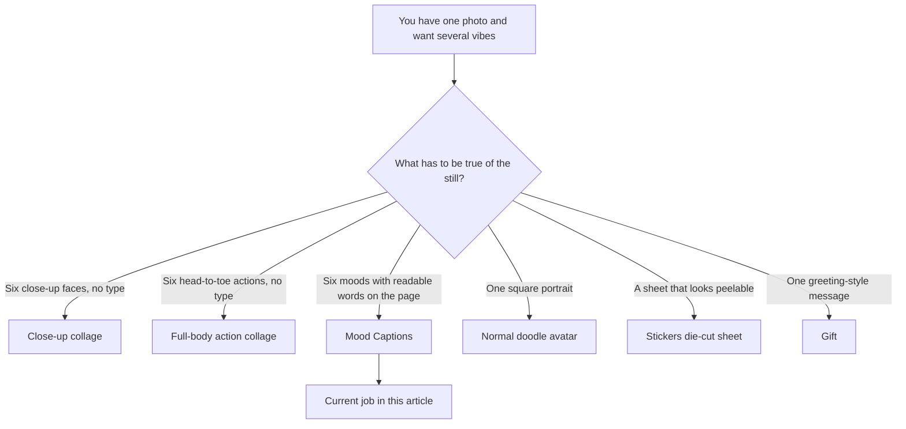
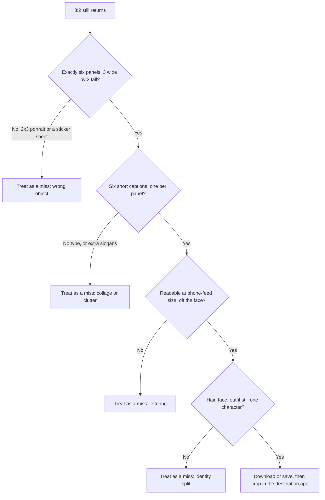

**Direct answer:** To make a mood-caption collage at [doodleai.art](https://doodleai.art), sign in, attach one photo you are allowed to use, and run the [Mood Captions](https://doodleai.art/skills/mood-captions/) skill. You get one 3:2 landscape still: six doodle panels of the same illustrated person, each with a short hand-lettered mood word. The six words are drawn at random from a short pool. Each generation reserves 1 credit and refunds on failure; new accounts start with 5.

People already share one-photo, several-vibe grids as posts, Stories, and chat images. That is a different job from a square profile picture, a die-cut sticker sheet, or a greeting card. Mood Captions is the live Doodle AI skill built for that shareable page: one uploaded likeness, six illustrated moods, six short words drawn into the picture itself.

This article is a use-case explainer for that sitting. It is not a caption-typesetting tutorial. It is not a batch-variant generator. It is not an Instagram, Discord, or WhatsApp export preset. Product facts below are current as of 2026-08-25. If a later screen disagrees with this page, trust the live product and the [privacy](https://doodleai.art/privacy-policy/) and [terms](https://doodleai.art/terms-of-service/) pages.

The three people named later — Mira, Jonah, and Sable — are **hypothetical**. They are not customers, not measured sessions, and not proof of output quality. They are labelled teaching cases so a post, a Story crop, and a group-chat send stay distinct.

*Current PicX-generated sample from the Mood Captions skill on doodleai.art. This is one 3:2 still with six hand-lettered panels, not six files, not a Story template, and not a custom typeset caption. Source image used as the public skill thumbnail; it is not a consented customer likeness.*

## Visual plan: a consented owned collage is not attached yet

The figure above is the public skill sample. Until a consented source photo and a matching Mood Captions result exist as owned files on this site, do not treat that thumbnail as a before/after of a named person.

**Planned owned figure (not yet attached)**

- Intended public path once generated: `/mood-caption-collage/doodleai-art-mood-caption-collage.png`
- Full uncropped 3:2 still from Mood Captions, showing all six panels and all six words.
- Proposed alt text: “Uncropped 3:2 Doodle AI mood-caption collage of a consented portrait, six hand-drawn panels with readable mood words generated from the live word pool.”
- Proposed caption: “Owned Mood Captions result on doodleai.art. Source photo used with permission. One landscape still, not six downloads, not a platform export, and not a custom lettering job.”

**Optional publishing overlay (not a product preset)**

- A second diagram that marks a 9:16 Story-safe window over the same uncropped 3:2 page, clearly labelled “crop suggestion you apply in the destination app.”
- Proposed alt text: “Diagram overlaying a Story-safe vertical crop on a 3:2 mood-caption collage, labelled as a publishing suggestion rather than a Doodle AI export.”

Do not read a close-up collage, a full-body action sheet, or a sticker sheet as a substitute for this object. Those skills share a house style. They do not letter six mood words.

## What a mood-caption collage actually is

**Available now.** Doodle AI is an Astro and Mastra chat-first still-image studio at **doodleai.art**. You can browse without an account. Sign-in is required to upload, generate, save, and sync account work. Generation uses a server-owned PicX connection. You do not paste a PicX key into Settings.

The public page is [doodleai.art/skills/mood-captions/](https://doodleai.art/skills/mood-captions/). Catalog copy currently reads: shareable doodle moods with hand-lettered captions. The longer description states a wide six-panel doodle collage for sharing as a reaction image or status update, with each panel pairing a mood-matched pose and a short hand-lettered caption such as Miss You, Healing, Hope, or Enough. The skill requires a photo. The output aspect ratio is **3:2**.

That is **one** landscape image. It is not six separately downloadable files. It is not a carousel builder. It is not a chat sticker pack. The generation instruction asks PicX for a strict grid: exactly three columns and two rows, six panels, wider than it is tall. Each panel shows the same illustrated subject — hairstyle, face shape, and outfit translated from the photo into doodle art — in a different candid mood. Each panel also carries one short caption, drawn as bold, slightly uneven marker-style letters that match the illustration’s linework. The instruction tells the model to keep those letters large enough to read at a glance and positioned so they never overlap the character’s face. That is a generation request, not a typesetting contract.

House style is the same naive marker-and-ink doodle used elsewhere on the site: bold outlines, simplified features, flat cheerful color, slightly exaggerated proportions, clean or airy backgrounds. Other skills are told to avoid text. Mood Captions is the exception. The only text that is supposed to appear is the one short caption per panel. No watermarks, no logos, no extra slogans.

The PicX request currently uses a 1K size setting and a 3:2 aspect ratio. That is a provider size parameter. It is not a verified print-ready dimension, not 300 DPI, and not a named Instagram, X, or Discord export. Do not treat “1K” as a commercial print spec.

[llms.txt](https://doodleai.art/llms.txt) states the same public boundary in one line: Mood Captions is a 3x2 collage with short hand-lettered captions.

## Three 3:2 collages, three different jobs

Doodle AI currently ships three landscape six-panel skills. They look related in a thumbnail. They are not interchangeable.

| Skill | Public page | What each panel shows | Text in the image | Use this when |
| --- | --- | --- | --- | --- |
| Close-up collage | [/skills/collage/](https://doodleai.art/skills/collage/) | Candid face and shoulders, varied angle and expression | None on purpose | You want six close-up moments, not words |
| Full-body action collage | [/skills/full-body/](https://doodleai.art/skills/full-body/) | Head-to-toe figure in a different action | None on purpose | You want dancing, jumping, walking, or outfit-visible poses |
| Mood Captions | [/skills/mood-captions/](https://doodleai.art/skills/mood-captions/) | Mood-matched pose plus one hand-lettered word | Six short captions from a pool | You want a shareable reaction or status grid |

Close-up collage varies expression, camera angle, crop, and gesture, then ties the page with overlay doodles — motion lines, sparkles, squiggles. Full-body collage uses the same 3-wide by 2-tall canvas, but every panel must show the complete figure from head to feet. Mood Captions reuses the six-panel page and then does the one thing the other two are instructed not to do: it letters a word in every frame.

If you want six faces with no type, Collage is the skill. If you want six full-body actions, Full-body is the skill. If the words are the reason you would send the picture, Mood Captions is the skill. Asking Collage to “add captions” will not convert it into this job. Asking Mood Captions for karate kicks will not convert it into Full-body.

Read that diagram as a routing rule. A captioned grid is a social object. A contact sheet of faces is a likeness object. An action sheet is a body-and-outfit object. Mixing those jobs in one prompt usually wastes the credit.

## The mood-word pool, stated honestly

The generation tool does not wait for you to type six captions. Every Mood Captions run selects **six entries at random** from a short pool (`VIRAL_MOOD_WORDS` in the product’s generation config). The pool is a living list. Treat the table below as the current set as of 2026-08-25, not as a forever catalog.

| Word | Pose the panel is asked to match |
| --- | --- |
| Miss You | Hugging a small hand-drawn heart, soft wistful smile |
| Enough | Palm raised outward, calm and steady |
| Healing | Eyes closed, hand over the heart, peaceful |
| Overthinking | Hand at the temple, a small spiral above the head |
| Lonely | Knees hugged to the chest, a little distance in the eyes |
| Lost | Looking off to one side, shoulders slightly slumped |
| Tired | Half-closed eyes, holding a small doodle coffee cup |
| Hope | Looking slightly upward, a small sparkle near the eyes |
| Peace | Soft closed-eye smile, relaxed shoulders |
| Sorry | Hands clasped together, gentle apologetic half-smile |
| Goodbye | One hand raised in a small wave, bittersweet expression |
| Wait | Palm raised, glancing at a small doodle wristwatch |
| Maybe | Head tilted, eyebrow raised, small shrug |
| Almost | Thumb and finger pinched close together |
| Still | Standing calm, hands folded, steady gaze |
| Again | Sleeves rolled up, determined half-smile |
| Never | Arms crossed, firm expression |
| Why? | Palms open and raised, puzzled, small question marks nearby |

Six is always six. The picker shuffles the pool and takes the first six unique entries. You do not currently get seven. You do not currently get two copies of Tired. You do not currently lock “Miss You” into panel three.

**You cannot hand-pick the six words for a given run today.** If you ask the chat to “make one say Miss You,” be upfront with yourself: today’s path randomizes a set. A second run spends a second credit and draws a fresh random six. It is not an editor. It is not a find-and-replace pass over the first still.

**Your message can still do useful work.** It tells the Mastra agent to load Mood Captions instead of Collage. It confirms a photo is attached. It can name landmarks you care about — box braids, a septum ring, a mustard jacket — so the agent has something human to preserve in conversation. The generation tool itself currently builds the PicX instruction from the skill recipe and the random six. Extra description is unused by this skill’s generation path. Named words in your prompt are a wish, not a typesetting contract.

That is a sharper limit than Gift, which scans your description for a small occasion keyword list and then letters one standard line such as Happy Birthday or Thank You. Mood Captions does not scan for custom verse. It does not letter “Happy 29th, Mira.” It does not letter a brand slogan.

## Caption and text limitations you should inspect, not assume

Hand-lettered type inside a generated illustration is the fragile part of this skill. The prompt asks for thick, slightly uneven marker letters, not a clean digital font, and it asks those letters not to cover the face. Models still miss. Before you post the page, look at the words as words.

**Readable at a glance.** Pinch the still down to phone-feed size. If you cannot name all six captions without zooming, the page failed its job even if the doodles are charming.

**One caption per panel, and only those captions.** Extra slogans, hashtags, signatures, or a seventh word in the gutter are drift. The instruction says the only text anywhere in the image is the one short caption per panel.

**Letters stay off the face.** A “Hope” that sits on the eyes is not hopeful. It is a blocked likeness. The same is true of glasses, a septum ring, or a distinctive hairline. If type covers the landmark you uploaded the photo to keep, treat the still as a miss.

**Spelling and glyph quality.** Pool words are short, but generated lettering can still collapse. “Why?” may drop the question mark. “Miss You” may fuse into one blob. “Overthinking” is the longest word in the current pool; it is the first to crush in a tight panel. You are not proofing a print shop file. You are deciding whether a friend could read the word in a chat bubble.

**Hand-lettering, not a font overlay.** If the result looks like a stock sans-serif slapped on a photo, the doodle translation failed. Mood Captions is supposed to draw the word in the same marker language as the character.

**No user-authored typesetting.** There is no live control for font, tracking, color, or exact panel order. There is no “lock these six words for my brand kit.” Asking for Grind / Ship / Founder / Series A / Unicorn / Exit will not create a founder-pack lettering mode. The pool is the pool.

**No continuity of words across runs.** Saved references and saved characters help a signed-in person organize work. They do not lock the next six captions. They also do not guarantee identical characters. Guaranteed character continuity is **not live**.

If the first page is almost right except for one crushed word, the honest next move is another full generation, not an in-product text editor. That second generation is a second credit and a new random set. Plan for that before you spend the last two signup credits on a Story that has to go up tonight.

## Choose a photo that can survive six panels and six words

Most disappointing caption grids start as photos the model cannot read, or as photos that leave no room for type. Mood Captions has to invent six poses **and** park a word in each frame. Tight, dark, or crowded sources make both jobs harder.

**Prefer**

- One person filling most of the frame, face toward the camera.
- Even indoor light. A window to the side beats a ceiling bulb directly overhead.
- Eyes visible. Glasses on, not dropped to the chin, and not replaced by sunglasses unless those sunglasses are the landmark.
- A hair silhouette that still reads after simplification: bun, braid, curls, fade, bangs, a color streak.
- Clothing color you actually want repeated six times. A mustard jacket is a better landmark than a busy patterned shirt.
- A recent photo. An old portrait with a different haircut will be illustrated as that old haircut, six times.

**Skip or recrop**

- Group huddles. The skill is instructed to keep one illustrated subject. Extra faces compete with the captions.
- Motion blur, nightclub darkness, or a face lit only by a phone screen.
- Screenshots of screenshots, memes that already have captions, or photos with stickers on them. The model is being asked to letter six new words; old type in the source is clutter.
- Extreme crops that already cut off the hairline or chin. Mood panels still need a place to put letters.
- Someone else’s photo that you do not have permission to process.

**Hypothetical photo check.** Mira has a Thursday-afternoon kitchen selfie, front camera, window light, box braids, septum ring, mustard jacket. That is a usable Mood Captions input: landmarks the doodle can keep, and enough shoulder room that a word can sit in the panel without covering the ring. Jonah has a dim concert pit shot from twenty feet, one raised arm, face the size of a coin. That is a weak input. Recrop will not invent detail that is not there; pick a tighter portrait. Sable has a screenshot of a group chat photo with an existing “miss u” sticker on the cheek. That is the wrong source. The new collage will try to letter its own words on top of a picture that already has type.

Pet photos are not a dedicated path here. Mood words in the current pool are human status language — Enough, Overthinking, Sorry, Goodbye. A pet can still be attached, but the poses (coffee cup, wristwatch, rolled sleeves, palms raised) are human-gesture flavored. If the job is a pet keepsake, use [Normal](https://doodleai.art/skills/normal/), [Gift](https://doodleai.art/skills/gift/), or [Stickers](https://doodleai.art/skills/stickers/) instead, and read the pet guide linked at the end only if you actually want that sitting.

Consent is two decisions, not one. You need permission to upload the likeness, and you need a separate judgment about posting a six-mood cartoon of that person. A playful grid of Lonely / Lost / Goodbye can read as a joke in a close chat and as a public statement on a feed. Doodle AI does not make that call for you.

## How the live sitting actually runs

The public hub is [/skills/](https://doodleai.art/skills/), not the homepage. The homepage is intentionally omitted from the sitemap. Start on the [Mood Captions](https://doodleai.art/skills/mood-captions/) page, or open chat and ask for a mood-caption collage.

1. **Sign in.** Browse is open. Upload, generation, saving, and synced account work require an account.
2. **Attach one photo you are allowed to use.** Mood Captions will not invent a likeness from a text description. If no photo is attached, the agent is instructed to ask for one.
3. **Name the job in plain language.** “Mood-caption collage from this photo, 3x2, same person in every panel, keep the box braids and mustard jacket. I know the six words come from the pool.” You do not need to paste the internal generation prompt.
4. **Generate.** The Mastra agent selects the Mood Captions skill and calls the generation tool. The tool reserves **1 credit**, calls server-owned PicX, and refunds that credit if generation fails.
5. **Inspect the still as a captioned page.** Use the checklist later in this article. Download or save it only if the six words are readable and the person still reads as one illustrated character.

New accounts receive **5 signup credits** into their personal organization. Credits are pooled on the organization. Every runnable skill currently costs 1 credit. Emotional Modes and Seasonal Pack appear in the catalog as coming soon. They are **not runnable**. Do not plan a seasonal mood pack around them.

The Better Auth organization layer exists as a backend and API foundation: a personal organization on signup, up to 5 organizations, up to 25 members, owner/producer/artist/reviewer/client roles, an active organization on the session, membership and permission rechecks, and organization-scoped threads, saved references, moodboards, generation records, and pooled credits. That is shared data behavior. A polished team switcher, a finished B2B workspace UI, and verified end-to-end public workflows for projects, assets, share links, batch jobs, and review states were not confirmed as complete product surfaces. Do not treat this sitting as a studio production pipeline or a client review portal.

**Not in the current product for this sitting:** user-authored caption sets, exact typesetting, batch variants, social-platform export presets, transparent PNG packs, WhatsApp or iMessage export, physical fulfillment, Stripe checkout, subscriptions, video, timeline or animatic tools, shot-list automation, C2PA credentials, a commercial license, guaranteed character continuity, user-authored “fork as skill,” server-side conversation memory, or voice input.

## Credit accounting for a grid you might rerun

Mood Captions costs the same as every other runnable skill: **1 credit per generation**. Failed generations refund. Successful generations that you simply dislike do not.

A realistic first sitting for this use case is often two credits, not one, because the words are random and the lettering is the failure mode.

| What happens | Credit effect |
| --- | --- |
| New account signup | **5** credits granted to the personal organization |
| Mood Captions run starts | **1** credit reserved |
| PicX returns a still | Reservation settles; you have a page to inspect |
| Generation fails | That **1** credit is refunded |
| You ask for another set | Another **1** credit; new random six, not an edit of the first |
| You switch to Collage or Normal instead | Another **1** credit on that other skill |

There is no live control that returns several candidate grids from one click. Schema for batch jobs exists as foundation. It is not a verified public “give me four caption sets” button. If you want a second mood page, run the skill again on purpose.

Credits are pooled on the active organization. If you later join someone else’s organization, generations spend from that pool, subject to organization limits and rate caps. Rate limits exist so a fast loop cannot empty a pool in one burst. They are not a promise of a studio queue.

Stripe checkout, paid credit packs, and subscriptions are **not live**. Do not write a budget that assumes a pack you can buy in-app today. Spend the signup grant as if it is the budget you have.

**Hypothetical ledger.** Mira has 5 credits. Run 1 returns a readable page with Tired, Hope, Maybe, Still, Why?, and Enough. She keeps it. Four credits remain. Jonah’s run 1 letters Overthinking as an unreadable scribble across the glasses. He spends run 2. The second page is a new random six. That is the actual cost of chasing a favorite word.

## Human review before you publish

A mood-caption collage can look finished at chat size and still be the wrong object. Review it as a **page of words plus a likeness**, not as a vibe.

Walk that path in order.

1. **Object check.** Landscape 3:2, six boxed panels. If you got four die-cut busts on a warm-white sheet, that is Stickers. If you got six faces and no words, that is Collage. If you got a square greeting still, that is Gift.
2. **Word check.** Name the six captions out loud. They should be pool words, not a paragraph, not a URL, not a username.
3. **Legibility check.** Zoom out. Then look at each panel at actual phone width. “Overthinking” and “Miss You” are the usual casualties.
4. **Face check.** Glasses, eyes, hairline, and any piercing you care about should be uncovered.
5. **Likeness check.** Six panels should still read as one person. Saved references do not fix a split identity after the fact.
6. **Tone check.** The random set may include Goodbye, Lonely, or Sorry. If you would not send those words to the people who will see this post, do not post this page. Run again, or pick a different skill.

If you save the keeper, you can save it to a moodboard and keep going in the same thread. Signed-in chats, characters, and moodboards can sync across devices. That save is account-scoped. [About](https://doodleai.art/about/) states there is no public gallery feed. Voice input is not live.

If you want a friend to see it before you post, download the file and send it through the channel you already use. That is a human share. It is not a Doodle AI messaging integration. Share-link schema exists; a verified public review route was not confirmed.

## Publishing the still yourself: post, Story, or chat

Mood Captions gives you one landscape still. Where it goes next is your crop, in the app you already use. Doodle AI does not currently ship Instagram, X, Discord, iMessage, or WhatsApp export presets. The sizes below are **publishing recommendations from third-party guides**, not product outputs.

[Buffer’s 2026 Instagram size guide](https://buffer.com/resources/instagram-image-size/) lists square feed posts at 1080 × 1080 (1:1), portrait feed posts at 1080 × 1350 (4:5) or 1080 × 1440 (3:4), landscape feed posts at 1080 × 566 (about 1.91:1), and Stories at 1080 × 1920 (9:16). Buffer’s help article on [ideal image sizes](https://support.buffer.com/article/617-ideal-image-sizes-and-formats-for-your-posts) notes that Instagram’s accepted feed aspect-ratio range is roughly 3:4 through 1.91:1, including square. A 3:2 collage (1.5:1) sits inside that wide-to-square band more comfortably than it sits inside a 9:16 Story.

| Destination | What usually happens to a 3:2 grid | What you do by hand | Not a Doodle AI feature |
| --- | --- | --- | --- |
| Feed post, uncropped | The whole six-panel page can show, often smaller than a tall portrait post | Post the still as one image if you want every caption visible | No “Instagram landscape” export |
| Feed post, tall crop | Top and bottom of the page may be fine; left and right panels can vanish | Do not use a 4:5 crop if the left and right captions matter | No 4:5 preset |
| Story or Reels canvas | 9:16 will slice the sides unless you letterbox | Add your own top/bottom padding in the Story editor, or accept that side panels crop | No Story template |
| Group chat | The image sends as a still; the other person pinches to zoom | Send the downloaded file in the chat you already have | No WhatsApp or iMessage pack |
| Profile picture | A circle destroys the grid and the words | Use [Normal](https://doodleai.art/skills/normal/) instead | Mood Captions is a poor PFP |

**If the job is a feed post where all six words must survive,** keep the landscape page intact. A tall 4:5 crop is a better fit for a single portrait, not for a 3-wide grid. Letterboxing — placing the 3:2 still on a taller canvas with plain bars — is something you do in the destination editor or any image app you already have. It is not a Doodle AI layout mode.

**If the job is a Story,** decide whether the Story is “here is the whole grid” or “here is one panel.” The whole grid on 9:16 almost always needs padding. One panel, cropped by you, can fill the phone. Cropping one panel is your edit. It does not split the generation into six files.

**If the job is a chat image,** send the still. Do not expect a sticker tray object. Transparent chat-app sticker export is **not live**. [ChatGPT Images announced native iMessage and WhatsApp stickers](https://x.com/ChatGPT/status/2091996384954069032) on 2026-08-24. That is a different product and a different file. Doodle AI’s sticker skill makes a square die-cut *sheet image*. Mood Captions is not that sheet, and it is not a messaging sticker.

**If the job is a profile picture,** stop. Circular masks ruin lettering. Use Normal.

Adobe’s 2025 creator survey, summarized in [Adobe’s public write-up](https://news.adobe.com/news/2025/10/adobe-max-2025-creators-survey), reported that 86% of more than 16,000 surveyed creators use creative generative AI. That is market context for why shareable stills are a common job. It is not a Doodle AI adoption metric, and it is not evidence that this collage will perform on any network.

Live sharing behavior on X already includes one-photo-to-many-vibe grids. That is a format people copy. It is not an official doodleai.art account, and it is not a ranking claim. There is no official doodleai.art X account yet. Do not treat `@doodleais` as owned.

## Three clearly labelled hypothetical sittings

These are teaching cases. They are not results from named customers.

**Hypothetical 1 — Mira wants a feed post, all six words visible.**

Mira signs in at doodleai.art, attaches the kitchen selfie, and asks for a mood-caption collage that keeps the box braids, septum ring, and mustard jacket. The first still is a 3:2 page. The six words happen to be Tired, Hope, Maybe, Still, Why?, and Enough. She pinches the image down. Every word reads. The ring is visible in five panels and slightly cropped in the sixth, which she accepts. She downloads the still and posts the uncropped landscape on her feed. She does not ask Doodle AI for an Instagram size. She does not generate a matching Story crop as a second product export. If she wants a Story later, she will pad or crop in Instagram.

**Hypothetical 2 — Jonah wants a Story and is tempted to force the words.**

Jonah types “put Miss You in the first panel, Healing in the second, and make the rest up.” The tool still randomizes six pool words. The returned page has Overthinking lettered across his glasses. He treats that as a miss, spends the second credit, and gets a new random six. The second page is readable. For the Story, he letterboxes the landscape still on a 9:16 canvas in his phone’s editor so the side panels survive. He does not get a Doodle AI Story preset. He also does not get Miss You on demand.

**Hypothetical 3 — Sable wants a group-chat reaction image.**

Sable’s group already sends reaction pictures. Sable generates one Mood Captions page, checks that Lonely and Goodbye are words she is willing to send to that thread, and texts the downloaded file. Nobody in the chat receives a sticker pack. If a friend asks “can you make mine say Enough,” Sable can tell the truth: a new run might include Enough, and it will cost another credit. She does not promise a matching set.

## When Mood Captions is the wrong skill

Stay on this skill when the still has to carry short mood words. Leave when the job is something else.

| If you actually want | Use | Why Mood Captions is the wrong click |
| --- | --- | --- |
| One illustrated bust of the person in the photo | [Normal / Doodle Avatar](https://doodleai.art/skills/normal/) | A square PFP; type is a liability in a circle |
| Six close-up expressions, no words | [Collage](https://doodleai.art/skills/collage/) | Captions are the point of Mood Captions |
| Head-to-toe action | [Full-body](https://doodleai.art/skills/full-body/) | Full-body panels leave even less room for type, and this skill is not the action library |
| A fictional character, no photo | [Surprise](https://doodleai.art/skills/surprise/) | Mood Captions requires a photo and a likeness |
| A die-cut sticker *sheet* | [Stickers](https://doodleai.art/skills/stickers/) | Stickers forbid sheet text; Mood Captions requires it |
| One greeting-style message | [Gift](https://doodleai.art/skills/gift/) | Gift letters one standard occasion line, not six pool words |
| Exact custom copy, a brand slogan, or a name | None of the live skills | User-authored typesetting is not live |
| Six files, a carousel, or a batch of variants | None as a verified public workflow | One still per generation |

Emotional Modes and Seasonal Pack are catalog previews. They are **not runnable**.

Nearby products are easy to mix up and should stay separate:

- **doodleai.art** is this studio. It is not doodleai.fun, InstaDoodle, or cartoonize.ai.
- **[LazyAvatar](https://lazyavatar.com)** is a seed-based hand-drawn avatar API. It is not a photo-likeness studio and it is not a captioned collage tool.
- [Canva](https://www.canva.com/features/photo-to-cartoon/), [Fotor](https://www.fotor.com/features/photo-to-cartoon/), [ImageToCartoon](https://imagetocartoon.com/), and [Adobe Firefly’s cartoon generator](https://www.adobe.com/products/firefly/features/ai-cartoon-generator.html) sit on the broader cartoonize surface. This article does not rank them. None of them is Doodle AI’s Mood Captions skill.

## What this article will not pretend you received

State these as product facts, not as fine print.

- **Not live:** video, timeline, animatic, or a captioned clip. The output is a still.
- **Not live:** C2PA Content Credentials. Provenance is a standard described by the [C2PA explainer](https://c2pa.org/specifications/specifications/2.2/explainer/Explainer.html); Doodle AI does not currently attach it.
- **Not live:** a commercial license, print fulfillment, or guaranteed usage rights. Read the [terms](https://doodleai.art/terms-of-service/).
- **Not live:** Stripe checkout or subscriptions.
- **Not live:** guaranteed character continuity, even if you save a reference or @-mention a character.
- **Not live:** user-authored skills, server-side conversation memory, or voice input.
- **Partial foundation, not a walkthrough:** projects, assets, share links, batch jobs, and review states. Do not plan a client approval round inside this sitting.

Your photo is uploaded through the server-owned PicX connection and used to generate the still. Read the [privacy policy](https://doodleai.art/privacy-policy/). Do not upload a likeness you do not have permission to process. Sign-in currently uses Google; Google’s own [privacy policy](https://policies.google.com/privacy) applies to that identity provider.

## Questions people actually ask about mood-caption grids

### Can I choose the six words?

Not in the current generation path. The tool picks six at random from the pool. Ask for the skill, not for a locked caption list. A second run is a new random six and another credit.

### Can I type my own caption, like a meme generator?

No. Mood Captions letters short pool words as hand-drawn type. It is not a meme layout tool and not a font overlay. Gift letters one standard occasion line. Neither skill typesets arbitrary copy.

### Is this the same as the close-up collage?

No. Both are 3:2 six-panel pages. Close-up collage has no captions. Mood Captions is built around the captions. Full-body collage is a third 3:2 skill, with head-to-toe action and no type.

### Will the next grid look like the same character?

Not as a guarantee. The instruction asks for the same illustrated subject across the six panels of one still. Later generations, saved references, and @-mentions do not lock identity. Guaranteed continuity is not live.

### Can I post this on Instagram or send it in chat?

You can download the still and upload or send it yourself. That is ordinary file use. There is no live Instagram, Story, Discord, WhatsApp, or iMessage export preset. Crop and padding happen in the destination app.

### Does this make WhatsApp stickers?

No. Transparent messaging stickers are a different job. Doodle AI does not export them. The Stickers skill makes a square die-cut sheet image, which is also not a chat pack.

### How many credits does a mood grid cost?

1 credit per generation. New accounts receive 5. Failed generations refund. A second try for a different random set costs a second credit.

### Do I need a PicX key?

No. Generation uses Doodle AI’s server-owned PicX connection.

### Can I make several variants at once?

Not as a verified public workflow. One generation returns one still. Batch job schema exists as foundation. Do not expect a four-pack of caption grids from one click.

## Related reading

- [How to Turn a Photo into a Cartoon with Doodle AI](/photo-to-cartoon/) — the single-portrait process on Normal, when you want one likeness still instead of a captioned page
- [How to Make a Cartoon Profile Picture from a Photo](/cartoon-profile-picture/) — why a circular PFP is a different object, and why lettering dies in that mask

## Sources

- [Doodle AI](https://doodleai.art)
- [Mood Captions skill](https://doodleai.art/skills/mood-captions/)
- [Close-up collage skill](https://doodleai.art/skills/collage/)
- [Full-body action collage skill](https://doodleai.art/skills/full-body/)
- [Skills catalog](https://doodleai.art/skills/)
- [About doodleai.art](https://doodleai.art/about/)
- [Doodle AI llms.txt](https://doodleai.art/llms.txt)
- [Privacy policy](https://doodleai.art/privacy-policy/)
- [Terms of service](https://doodleai.art/terms-of-service/)
- [Buffer — Instagram Post Size Guide](https://buffer.com/resources/instagram-image-size/) — third-party feed and Story size recommendations; not Doodle AI export presets
- [Buffer Help — ideal image sizes](https://support.buffer.com/article/617-ideal-image-sizes-and-formats-for-your-posts) — Instagram accepted aspect-ratio range as documented by Buffer
- [Adobe 2025 creator survey](https://news.adobe.com/news/2025/10/adobe-max-2025-creators-survey) — market context only; not Doodle AI metrics
- [Canva photo to cartoon](https://www.canva.com/features/photo-to-cartoon/)
- [Fotor photo to cartoon](https://www.fotor.com/features/photo-to-cartoon/)
- [ImageToCartoon](https://imagetocartoon.com/)
- [Adobe Firefly AI cartoon generator](https://www.adobe.com/products/firefly/features/ai-cartoon-generator.html)
- [LazyAvatar](https://lazyavatar.com)
- [ChatGPT sticker announcement on X](https://x.com/ChatGPT/status/2091996384954069032) — chat-app stickers are a different job
- [C2PA 2.2 explainer](https://c2pa.org/specifications/specifications/2.2/explainer/Explainer.html) — provenance standard; not a current Doodle AI feature
- [Google privacy policy](https://policies.google.com/privacy) — Google sign-in

## Make one captioned page, then crop it where you actually post

If you have a photo you are allowed to use and you want a several-vibe grid with words on it, open the [Mood Captions skill](https://doodleai.art/skills/mood-captions/) at **doodleai.art**, sign in, attach the picture, and ask for that collage. Spend the credit on a still you can actually read at phone size. If the random six are wrong for the people who will see them, run the skill once more — that is a second credit and a new set, not a batch of variants. Download the keeper and post, pad, or send it yourself. Browse the rest of the [skills](https://doodleai.art/skills/) only after this page is a keeper. Read [about](https://doodleai.art/about/) if you want the product in one page. Do not expect custom lettering, platform export presets, a matching character lock, checkout, or a shipped print. You are asking for one playful 3:2 mood grid from a real photo. That is the current job.
