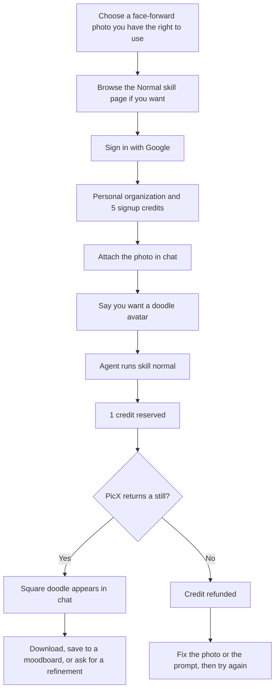
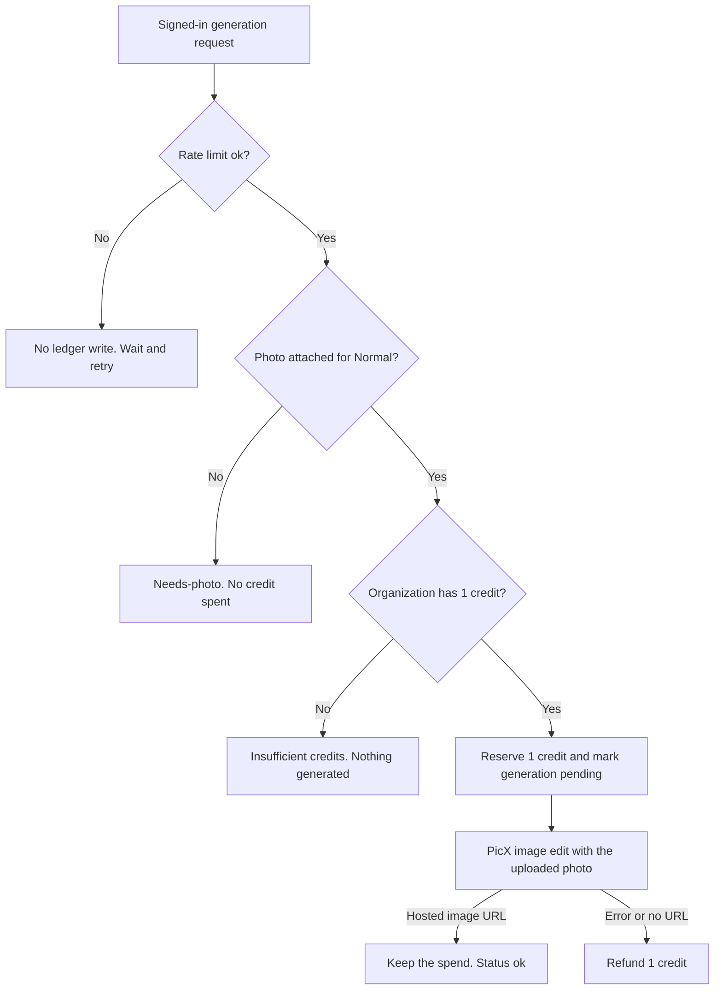
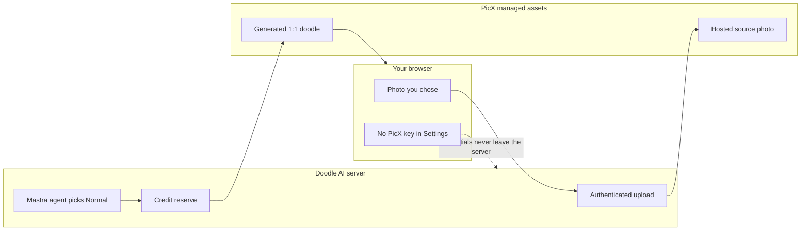

**Direct answer:** To turn a photo into a cartoon at [doodleai.art](https://doodleai.art), sign in, attach a clear face-forward photo, and run the [Normal doodle avatar](https://doodleai.art/skills/normal/) skill. You get one square hand-drawn still, not a headshot, print, or video. Each generation reserves 1 credit and refunds on failure; new accounts start with 5.

People type “turn photo into cartoon” and “photo to cartoon” when they already have a selfie, a portrait, or a group shot and want a playful illustrated version of that picture. This guide is for that job. It is not a professional-headshot tutorial. It is not a print-shop walkthrough. It is not a video pipeline. It is a still-image process for one person who wants a hand-drawn doodle that still reads as them.

Doodle AI is a chat-first studio built with Astro and Mastra. You talk to an agent, attach a photo, and the agent runs a skill. For a single cartoon portrait, that skill is **Doodle Avatar**, also called Normal. The public page is [doodleai.art/skills/normal/](https://doodleai.art/skills/normal/). The catalog of other live skills lives at [doodleai.art/skills/](https://doodleai.art/skills/). Product facts in this article are current as of 2026-08-25. If a later screen disagrees with this page, trust the live product and the [privacy](https://doodleai.art/privacy-policy/) and [terms](https://doodleai.art/terms-of-service/) pages.

A historical US Google Ads volume snapshot from 2026-08-24, collected through [DataForSEO’s search-volume endpoint](https://docs.dataforseo.com/v3/keywords_data/google_ads/search_volume/live/), recorded `photo to cartoon` at 4,400 monthly searches and `turn photo into cartoon` at 2,900. Those numbers describe search language. They are not Doodle AI traffic, conversion, or quality evidence. They are not a live ranking claim.

The examples named Jordan, Priya, and Mateo later in this article are **hypothetical**. They are not customers, not measured sessions, and not proof of output quality.

## Visual plan for the missing before/after

This article does not attach an unrelated sticker sheet, collage, gift card, or third-party cartoon as if it were a Normal-skill result. Until a consented source photo and a matching Doodle AI avatar exist as owned files, treat the visual as a production plan rather than a fake proof.

**Planned owned figure (not yet attached)**

- Intended public path once generated: `/photo-to-cartoon/doodleai-art-selfie-before-after.png`
- Left panel: a consented, face-forward indoor portrait with even light, visible eyes, and a readable hair silhouette.
- Right panel: the 1:1 Normal doodle avatar generated from that same photo on doodleai.art.
- Proposed alt text: “Side-by-side of a consented portrait photograph and the matching hand-drawn Doodle AI avatar from the Normal skill on doodleai.art.”
- Proposed caption: “Owned before/after from the Normal doodle avatar skill on doodleai.art. Source photo used with permission. Square doodle still, not a professional headshot, print, or video frame.”

Do not read any other sample on this site as a substitute for that pair. A die-cut sticker sheet is a different skill. A six-panel collage is a different skill. A fictional Surprise character is not a likeness of your photo.

## What a photo-to-cartoon pass actually produces

Normal redraws **one uploaded photo** into **one square illustrated avatar**. The skill page states the output is 1:1 and that a photo is required. House style is a naive marker-and-ink doodle: bold outlines, simplified features, flat cheerful color, slightly exaggerated proportions, and a clean white or warm-white background. The generation instruction tells the model to keep hairstyle, face shape, expression, skin tone, clothing, and accessories recognizable, then translate them into illustration. It is not a photographic filter. It is not a 3D bust. It is not a pencil-sketch app.

That distinction matters because the broader “cartoonize photo” category is crowded with other jobs. [Canva’s photo-to-cartoon feature](https://www.canva.com/features/photo-to-cartoon/), [Fotor’s photo-to-cartoon tool](https://www.fotor.com/features/photo-to-cartoon/), [ImageToCartoon](https://imagetocartoon.com/), and [Adobe Firefly’s cartoon generator](https://www.adobe.com/products/firefly/features/ai-cartoon-generator.html) all sit on the same search surface. They are not Doodle AI, and this article does not rank them. Doodle AI’s current signature is a conversational hand-drawn doodle at doodleai.art, not a style catalog of anime, clay, comic, or photoreal sketch looks.

Two nearby products are easy to mix up and should stay separate:

- **doodleai.art** is this studio. It is not doodleai.fun, InstaDoodle, or cartoonize.ai.
- **[LazyAvatar](https://lazyavatar.com)** is a seed-based hand-drawn avatar API. It is not a photo-likeness studio. Uploading a selfie to Doodle AI is a different job from generating a seed character with no portrait.

| You asked for | Current Doodle AI result | Not in this pass |
| --- | --- | --- |
| A cartoon of me from a selfie | One 1:1 doodle avatar | A professional headshot, LinkedIn portrait, or photoreal retouch |
| A playful illustrated PFP | A square still you can crop yourself | Platform-specific export presets |
| A cartoon of a group | One illustrated frame from one photo; faces may compete | A guaranteed matching set of separate avatars |
| A print or poster | A digital still | Print-ready dimensions, shipped prints, or fulfillment |
| A video or “cartoon trend” clip | A still image | Video, timeline, lip-sync, or animatic |
| Chat stickers | A different skill: a square die-cut *sheet* | WhatsApp or iMessage sticker export |
| Many variants at once | One result per generation | Batch variants, A/B grids, or checkout packs |

The generation request currently uses PicX with a 1:1 aspect ratio and a 1K size setting. That is a provider size parameter, not a promise of a specific pixel count you can print. Do not treat “1K” as a commercial print spec.

## Prepare the photo before you sign in

Most disappointing cartoons start as disappointing source photos. The model can only keep what it can see. Normal is instructed to preserve hairstyle silhouette and color, face shape, expression, skin tone, glasses, and distinctive accessories. If those landmarks are hidden, crushed by shadow, or split across several people, the doodle has to guess.

Use this as a kitchen-table check, not as a studio lighting guide.

**Prefer**

- One person filling most of the frame, face toward the camera.
- Even indoor light. A window to the side is better than a ceiling bulb directly overhead.
- Eyes visible. Glasses on, not dropped to the chin, and not replaced by sunglasses.
- Hair that reads as a silhouette: bun, braid, curls, fade, bangs.
- Clothing color that you actually want in the doodle. A navy hoodie stays navy more reliably than a busy patterned shirt.
- A recent photo. An old portrait with a different haircut will be illustrated as that old haircut.

**Skip or recrop**

- Group huddles where three faces share one small frame. Normal is a single-portrait skill.
- Motion blur, nightclub darkness, or a face lit only by a phone screen.
- Heavy beauty filters that already flattened the face.
- Screenshots of screenshots, memes with captions, or photos that already have stickers on them.
- Extreme crops that cut off the hairline or chin.
- Someone else’s photo that you do not have permission to process.

**Hypothetical photo check.** Jordan has a Saturday kitchen selfie, front camera, 10 a.m. window light, glasses on, hair in a clip, oatmeal hoodie. That is a usable Normal input. Priya has a dim restaurant booth photo of four friends, one face half in shadow, a candle in the foreground. That is a weak Normal input. Recrop to one consented face, or pick a different picture. Mateo has a full-body concert shot from twenty feet away. Normal can still run, but the face is small; a tighter portrait will carry likeness better. Full-body action collage is a separate skill and a separate article.

File limits that are implemented today: uploads must be image files, and they must be 20 MB or smaller. Empty files and non-image files are rejected. There is no verified public list of “best camera apps,” and this guide does not invent one.

If you do not want to upload a likeness at all, do not use Normal. Use [Surprise](https://doodleai.art/skills/surprise/), which invents a fictional doodle character and does not preserve your face. That is an honest fork, not a hidden likeness mode.

## Sign in, then attach the photo

You can browse the skill catalog without an account. You cannot upload, generate, save, or sync account work until you sign in. Creation currently uses Google sign-in. [About](https://doodleai.art/about/) states that sign-in unlocks creation, syncing, and starter credits. [Terms](https://doodleai.art/terms-of-service/) repeat that browsing is open and Google sign-in is required to upload, generate, save, and synchronize supported chats, moodboards, characters, and generation history.

On signup, Doodle AI creates a **personal organization** for you. Credits live on that organization, not as a private wallet that follows you independently of it. Configuration allows up to 5 organizations and up to 25 members, with owner, producer, artist, reviewer, and client roles in the Better Auth organization layer. Sessions carry an active organization. Membership and permissions are rechecked. That is a working backend and API foundation plus shared data behavior. It is not a polished team switcher or a finished studio workspace. Do not wait for a “team review portal” before making a personal cartoon. For this how-to, you are one person in your personal organization.

| Action | Signed out | Signed in |
| --- | --- | --- |
| Read `/skills/normal/` and this guide | Yes | Yes |
| Upload a photo | No | Yes, through the server-owned PicX connection |
| Generate a doodle | No | Yes, 1 credit reserved per attempt |
| Save a result to a moodboard | No | Yes, organization-scoped |
| Save a named character reference | No | Yes; this helps you reuse notes, it does not lock identical faces |
| Sync chats across devices | Local-only experience | Server-backed account path |
| Paste a PicX API key | Never | Never. Credentials stay on the server |

You do not paste a PicX key into Settings. Live copy that tells you to supply a provider credential is outdated. Generation uses Doodle AI’s server-owned PicX connection. Chat is routed through OpenRouter. Hosting is on Cloudflare. Those processors are named on the [privacy policy](https://doodleai.art/privacy-policy/).

After you sign in, start from the Normal skill’s **Use this skill** path or from a chat and say you want a doodle from the attached photo. Attach the image in the composer. The upload goes to PicX managed assets using the platform account. The agent should not call the generation tool until a photo is attached. If you forget the photo, the Normal skill is specified to ask for one rather than invent a face.

That is the whole current path. There is no separate `/photo-to-cartoon/` product page to wait for. There is no checkout screen. There is no “make 20 variants” button.

## Run Normal as a conversation, not as a filter picker

Doodle AI is not a row of style thumbnails you tap. You attach a photo and talk. For a first cartoon, keep the request small enough that the photo can still do the work.

**A first prompt you can paste**

> Turn this photo into a doodle avatar. Keep my glasses, hair clip, and oatmeal hoodie. Closed-mouth smile. Clean warm-white background. No text, no watermark.

That prompt does three useful things. It names the skill outcome (one avatar). It names landmarks the skill is already trying to keep. It forbids text, which the house style already avoids. It does not ask for a cinematic camera move, a new biography, or six outfits.

**A mood prompt, still one person**

> Same photo, doodle avatar, slightly more chibi, thicker outline, warmer paper. Keep the glasses. No extra props, no caption.

“Thicker outline,” “warmer paper,” “cuter / more chibi,” “cleaner,” and “more colorful” are the refinement words the house style actually maps. Use those after you have a first still, not as a replacement for the photo.

**A prompt that fights the photo**

> Make me an anime protagonist in a neon alley at night, wind in my hair, holding a glowing sword, cinematic depth of field, eight-head proportions, photoreal skin, signature in the corner, then turn it into a 12-frame fight scene.

Normal will still try to draw one square doodle. It will not become a video. It will not become photoreal. It will not typeset a signature. The extra lore competes with the likeness landmarks. If you want a fictional character with no photo, that is Surprise. If you want six close-up expressions, that is [Collage](https://doodleai.art/skills/collage/). If you want head-to-toe action, that is [Full-body](https://doodleai.art/skills/full-body/). Stay on Normal until one face is good enough to keep.

The generation path can apply a visual theme such as pastel, neon, sunset, or mono. Those are style hints, not separate products and not extra skills. You do not need a theme name to run Normal. If you mention one, still describe the photo landmarks in the chat. A theme is not a substitute for “keep the glasses.”

| Prompt move | Why it helps on Normal | When it backfires |
| --- | --- | --- |
| Name two or three landmarks: glasses, bun, hoodie color | Gives the doodle something to keep | A ten-item costume list can crowd the bust |
| Name the expression you already have | The photo already contains it | Asking for “every emotion” belongs on Collage |
| Ask for warm-white background, no text | Matches house style | Asking for a busy bedroom scene hides the face |
| After a first still: thicker outline, warmer paper | Mapped refinement language | “Make it more professional” sounds like a headshot, which this is not |
| Mention a saved character with @ | Human reminder in an organization-scoped thread | Does not guarantee the next face matches the last one |

Saved characters are organization-scoped shared references. Signed-in users can save them and mention them in chat. That helps you reuse a name and a note. **Guaranteed character continuity is not live.** If the second generation drifts, say so in the next prompt and point at the landmarks again. Do not assume the saved reference is a lock.

**Hypothetical follow-up after a first still.** Jordan’s first doodle kept the glasses and lost the hair clip. Next message:

> Same person from the photo. Put the hair clip back on the left side. Keep the oatmeal hoodie. Thicker outline. No extra jewelry.

That is one more credit if it runs. It is not a free undo. It is also not a batch of candidates. You will see one new still.

## Credit accounting for a first cartoon sitting

New accounts receive **5 signup credits** into the personal organization. Every runnable skill costs **1 credit**. The ledger **reserves** that credit before PicX is called. If generation fails, the credit is **refunded**. If you are rate-limited, the request is a no-op against the ledger: nothing is reserved. If the organization balance is too low, generation does not start. Credits are pooled on the organization. Organization limits and rate caps exist; this article does not invent extra numeric thresholds beyond the published organization caps of 5 organizations and 25 members.

Stripe checkout, paid credit packs, and subscriptions are **not live**. Do not plan this sitting as if you can buy more credits in the product today. Five attempts is the current starter grant. Spend them as if they are sitting tickets, because they are.

A failed generation is not a “maybe later” charge. The product logic refunds when the PicX call does not return a usable URL. A generation you dislike but that did return an image is a successful generation. Taste is not a refund reason. If the still is wrong, spend another credit on a refinement or stop.

**Hypothetical 5-credit plan for one person**

| Credit | Job | Stop rule |
| --- | --- | --- |
| 1 | First Normal avatar from the prepared photo | Keep if the glasses, hair, and expression survive |
| 2 | One landmark repair, or thicker outline | Stop if the face got worse |
| 3 | One mood change you would actually use as a PFP | Do not spend this on a different skill yet |
| 4 | Buffer for a second photo if the first was a bad crop | Optional |
| 5 | Leave unspent unless the sitting already produced a keeper | Do not “just try stickers” with the last credit |

Collage, full-body, stickers, mood captions, gift, and surprise each also cost 1 credit. They are live. They are not free extras bundled into Normal. A sticker sheet is a square die-cut *sheet image*, not a messaging pack. Gift is a greeting-style still, not a shipped present. Mood captions currently draw six words from a pool; they are not a custom-lettering tool. Emotional Modes and Seasonal Pack are catalog previews. They are **not runnable**.

## What the cartoon is not

Say this out loud before you upload, because search language will try to talk you into a different product.

It is **not a professional headshot**. Doodle AI’s anti-ICP for this job includes photoreal corporate portraits. If you need a LinkedIn photo, use a photographer or a tool that actually sells that look. Normal is instructed to avoid photorealism, 3D, and heavy realistic shading.

It is **not a print**. There is no physical fulfillment. There is no verified print-ready dimension set. You may download a digital still and print it yourself later. That printing step is yours. Doodle AI does not ship stickers, mugs, or posters.

It is **not video**. There is no timeline, animatic, shot list, or image-to-video adapter. A “ChatGPT cartoon trend” clip is a different category. Doodle AI returns a still.

It is **not a WhatsApp or iMessage sticker pack**. The live sticker skill makes a square die-cut sticker *sheet*. Transparent chat-app export is not live.

It is **not a commercial license**. [Terms](https://doodleai.art/terms-of-service/) say you keep whatever rights you already have in the photo you upload, Doodle AI does not claim ownership of your content, and you are responsible for reviewing results before publishing or using them commercially. AI-generated results may be inaccurate, unexpected, or similar to other results. There is no C2PA Content Credential on current outputs. [C2PA’s explainer](https://c2pa.org/specifications/specifications/2.2/explainer/Explainer.html) describes a provenance standard Doodle AI does not currently attach.

It is **not guaranteed identity**. Two generations from the same photo can drift. Saved references do not freeze a face. If likeness is the whole point, judge each still on its own and stop when it fails.

It is **not a public gallery post**. [About](https://doodleai.art/about/) states there is no feed or public gallery. Account-scoped chats, moodboards, saved characters, and generated results are visible to you through the app, not published as a community board.

Projects, assets, share links, batch jobs, and review states exist as schema or partial access-control foundations. They are **not** verified complete public workflows. Do not wait for a share-link review or a batch queue to finish a personal cartoon. Download the still you have, or save it to an organization-scoped moodboard.

## Save, download, and share without over-claiming

After a successful Normal generation, the image is hosted by PicX and shown in the chat. You can download it from the app. You can save it to a moodboard. You can keep going in the same thread. Signed-in chats, characters, and moodboards can sync across devices.

What you should not expect:

- A branded public share page as a finished product surface. Share-link schema exists; a verified public review route was not confirmed.
- A “post to Instagram” exporter with official sizes. Crop the square yourself. Common social crops are publishing suggestions, not Doodle AI presets.
- A transparent PNG pack. Normal returns a doodle on a clean white or warm-white field.
- A matching set for every platform from one click. Each extra still is another credit.
- Server-side conversation memory that remembers your face next week without the photo. The current path is the thread, the saved reference, and the photo you attach again.

If you want to show the result to a friend, download the file and send it through the channel you already use. That is a human share. It is not a Doodle AI messaging integration. Voice input is not live. User-authored “fork as skill” is not live.

**Hypothetical PFP crop.** Jordan likes the second still, downloads it, and crops it to Discord’s circle themselves. The hair clip sits high enough that a circular crop still shows it. That crop is Jordan’s. Doodle AI did not emit a Discord preset.

## Common failures, with recoveries that cost another credit

These are process failures, not measured error rates. Doodle AI does not publish a success percentage here, and this article will not invent one.

**No photo attached.** Normal cannot run. Attach a picture, or switch to Surprise if you refuse to upload a likeness.

**The face is too small.** Recrop the original so the head fills the frame. Do not ask Normal to “zoom in” as if it were a RAW editor.

**Glasses vanished, or became a second pair.** Name the glasses in the next prompt. If the source photo had glare that erased the lenses, pick a photo where the frames are readable.

**Group photo mashed into one chimera.** Recrop to one consented person. Do not treat Normal as a team portrait product. A later couple-avatar guide should wait until a two-person workflow is documented honestly. This article will not invent multi-image upload.

**The doodle looks like a filtered photograph.** Ask for a cleaner doodle: bolder outline, less interior detail, flat color, no photoreal skin. If you actually wanted a photoreal headshot, you are in the wrong product.

**The doodle looks generic-cute and lost the hair silhouette.** Repeat the hair in words: “short curly crop, dark brown, tight to the head,” or whatever is true. The skill is specified to keep that silhouette. Help it.

**Text appeared in the image.** House style says no text, captions, watermarks, or signatures. Ask for a regeneration with “no text.” Gift and mood-captions are the skills that letter words on purpose. Normal should not.

**You hit a rate limit.** Wait and retry. Nothing was reserved.

**You ran out of credits.** Stop. Paid packs are not live. Do not create extra accounts to dodge limits; the terms forbid evading restrictions.

**You wanted six expressions.** That is Collage, 3:2, six close-ups, 1 credit, still needs a photo. Run it only after one Normal still is good enough that multiplying it by six would help.

**You wanted a whole-body jumping shot from a tight selfie.** Full-body will have to invent everything below the crop. The skill itself says so. Stay on Normal, or shoot a standing photo first.

**You wanted a memorial, a brand mascot, or a child’s portrait.** Slow down. Terms require permission for the likeness. The privacy policy says Doodle AI is not directed at children. Memorial uses are sensitive and have no special product mode. Do not upload a photo you would not want sent to PicX and a language-model provider.

## Privacy-conscious handling of a face

A cartoon from a photo is a likeness job. Treat the upload as processing, not as a private diary that never leaves your phone.

What the current privacy policy states, in short:

- Browsing is open. Sign-in is required to create, save, and sync.
- Google sign-in provides the basic profile Google shares for authentication.
- Signed-in content stored for sync includes chat metadata and messages, generated-image references, moodboard items, saved characters, and generation metadata such as skill, prompt, status, and credit usage.
- Provider credentials stay on the server and are not sent to your browser.
- When you attach a photo, that photo, references, prompt, and generation settings are sent to PicX through Doodle AI’s server-owned connection. PicX hosts the resulting media.
- Chat messages go to the language-model service via OpenRouter.
- Cloudflare hosts the site, API, D1 database, and session storage.
- DataFast provides analytics. The policy says Doodle AI does not run advertising pixels, does not sell data, and does not build an advertising profile.
- Signed-out browser data can be cleared by clearing site data for doodleai.art.
- Signed-in users can remove individual chats, moodboard items, and characters in the app.
- To request deletion of an account and associated server-side content, email yash@typethink.ai from the account email address.
- Data held by PicX, Google, OpenRouter, Cloudflare, or DataFast is subject to those providers’ own practices.
- This article does **not** invent a numbered retention window. If the policy does not state one, neither does this guide.

Practical habits that match those facts:

1. Upload only photos you have the right to use. Terms require this.
2. Do not upload passports, school IDs, medical images, or other documents “just to see.”
3. Do not upload a friend’s face as a joke. Ask.
4. Prefer a photo that contains only the person who consented.
5. Remember that a downloaded doodle can still be recognized as you. Sharing is a separate decision from generating.
6. If you want to try the style with no likeness, use Surprise instead of someone else’s portrait.

That diagram is the current generation path described in [llms.txt](https://doodleai.art/llms.txt): the signed-in browser sends a chat turn, photos upload through the server-owned connection, the agent selects a skill, the tool reserves credits, PicX runs, failures refund, and the browser renders the result.

## When to stay on Normal, and when to leave

This article’s job is one cartoon from one photo. Other live skills are adjacent, not bundled.

| If you actually want | Use | Notes |
| --- | --- | --- |
| One illustrated bust of the person in the photo | [Normal / Doodle Avatar](https://doodleai.art/skills/normal/) | 1:1, photo required, 1 credit |
| Six close-up expressions | [Collage](https://doodleai.art/skills/collage/) | 3:2, photo required, 1 credit, one page not six independent wins |
| Head-to-toe action | [Full-body](https://doodleai.art/skills/full-body/) | 3:2; a tight headshot will force invented legs |
| No photo | [Surprise](https://doodleai.art/skills/surprise/) | Fictional character, no likeness |
| A die-cut sticker *sheet* | [Stickers](https://doodleai.art/skills/stickers/) | Square sheet image, not chat-app export |
| Mood words on a grid | [Mood captions](https://doodleai.art/skills/mood-captions/) | Captions come from a pool |
| A greeting-style still | [Gift](https://doodleai.art/skills/gift/) | Digital card, not fulfillment |

Do not start on stickers because the search box said “cartoon.” Stickers are a different intent. Do not start on gift because you might later text the image to someone. Normal is the likeness still. Get that still first.

## A clearly labelled hypothetical first sitting

The following sitting is fictional. Jordan is not a real user. No time, quality score, or share rate was measured.

**Hypothetical person:** Jordan, 24, wants a Discord picture that is not a raw selfie and not a plastic AI headshot.

**Hypothetical photo:** front-camera kitchen selfie, window light, glasses, hair clip, oatmeal hoodie. Jordan took it. Jordan consents to processing it.

**Hypothetical budget:** 5 signup credits. Stripe is not available, so there is no “buy three more.”

**Hypothetical steps**

1. Jordan reads [doodleai.art/skills/normal/](https://doodleai.art/skills/normal/), sees that a photo is required and the output is 1:1, then signs in.
2. Personal organization appears with 5 credits. Jordan does not invite anyone. This is not a studio sprint.
3. Jordan attaches the selfie and pastes: “Turn this photo into a doodle avatar. Keep my glasses, hair clip, and oatmeal hoodie. Closed-mouth smile. Warm-white background. No text.”
4. One credit is reserved. A square doodle returns. Glasses survived. Hair clip did not.
5. Jordan spends credit 2 on the hair-clip repair prompt above. The clip returns. Outline is a bit thin for a small avatar crop.
6. Jordan spends credit 3: “Same person, thicker outline, warmer paper, keep the clip and glasses.” That still is the keeper.
7. Credits 4 and 5 stay unused. Jordan downloads the file, crops a circle in the phone’s editor, and sets it as a profile picture. Doodle AI did not set the Discord image. Doodle AI produced the still.

If step 4 had failed with an API error, credit 1 would have refunded and Jordan would still have 5. If step 4 had succeeded but looked unlike Jordan, that would still have cost 1 credit. Those two outcomes are different, and the ledger treats them differently.

## Questions people actually ask

These questions show up around photo-to-cartoon searches. The answers below are about doodleai.art, not about every app in the results.

**How do I convert my photo to a cartoon here?** Sign in, attach one clear photo, and ask for a doodle avatar. The Normal skill is the default for “doodle me” and “turn this into a cartoon.” Generate, look at the still, then refine or stop.

**Can AI turn my photo into a cartoon?** On Doodle AI, yes, as a playful hand-drawn still from a photo. That is not the same as a script-to-animation product or a text-to-video product.

**Can I cartoonize a photo on my phone?** The current product is a browser app. You can sign in from a phone browser, attach a photo from the camera roll, and generate. This article does not claim a native iOS or Android app.

**Is this free?** Browsing is open. The site does not charge you to read skill pages. Generation uses credits. New accounts receive 5 signup credits. Each generation costs 1 credit. Failed generations refund. Paid checkout is not live, so “free unlimited cartoons” is not the offer.

**How do I create an AI cartoon of myself?** Use a photo of yourself that you have the right to process. Do not describe a stranger and hope the model invents you. Surprise invents a fictional person. Normal needs your picture.

**Will it look exactly like me?** It is instructed to keep recognizable landmarks. It does not guarantee identical characters across generations. Judge the still. If it fails, recrop, rename the landmarks, or stop.

**Can I use it as a profile picture?** You can download a square still and crop it for a profile. That is a common use people already have in mind. It is not a dedicated export preset, and it is not a professional headshot product.

**What happens to my photo?** It is uploaded through Doodle AI’s server-owned PicX connection, used to generate the still, and hosted according to that processing path. Read the [privacy policy](https://doodleai.art/privacy-policy/). Do not upload anything you do not want sent to those processors.

## Sources

- [Doodle AI](https://doodleai.art)
- [Doodle Avatar / Normal skill](https://doodleai.art/skills/normal/)
- [Skills catalog](https://doodleai.art/skills/)
- [About doodleai.art](https://doodleai.art/about/)
- [Doodle AI llms.txt](https://doodleai.art/llms.txt)
- [Privacy policy](https://doodleai.art/privacy-policy/)
- [Terms of service](https://doodleai.art/terms-of-service/)
- [DataForSEO Google Ads search volume live](https://docs.dataforseo.com/v3/keywords_data/google_ads/search_volume/live/) — 2026-08-24 US snapshot cited only as historical search language, not as Doodle AI performance
- [Canva photo to cartoon](https://www.canva.com/features/photo-to-cartoon/)
- [Fotor photo to cartoon](https://www.fotor.com/features/photo-to-cartoon/)
- [ImageToCartoon](https://imagetocartoon.com/)
- [Adobe Firefly AI cartoon generator](https://www.adobe.com/products/firefly/features/ai-cartoon-generator.html)
- [LazyAvatar](https://lazyavatar.com)
- [C2PA 2.2 explainer](https://c2pa.org/specifications/specifications/2.2/explainer/Explainer.html) — provenance standard; not a current Doodle AI feature
- [Google privacy policy](https://policies.google.com/privacy) — Google sign-in
- [DataFast privacy policy](https://datafa.st/privacy-policy)

## Try one photo on Normal

If you have a photo you are allowed to use, open the [Normal doodle avatar skill](https://doodleai.art/skills/normal/), sign in, attach the picture, and generate one square doodle. Browse the rest of the [skills](https://doodleai.art/skills/) if you later want a collage, a sticker sheet, or a gift still. Read [about](https://doodleai.art/about/) if you want the product in one page. Do not expect video, checkout, prints, chat-app sticker export, or a commercial license from this sitting. You are asking for one playful cartoon of a real photo. That is the current job.
