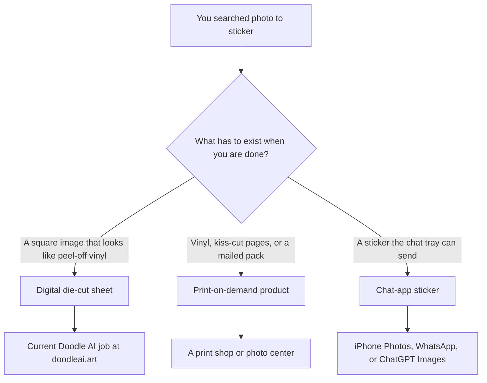
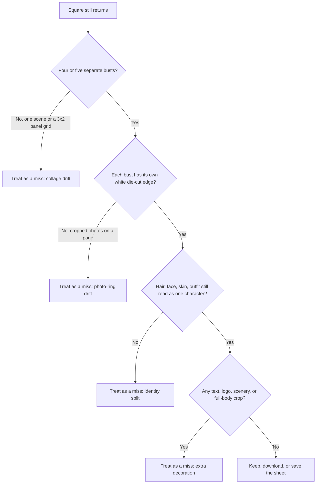

**Direct answer:** Searching photo to sticker can mean three jobs: a digital die-cut sticker sheet, a print-on-demand vinyl order, or a transparent iMessage or WhatsApp sticker. Doodle AI at doodleai.art currently makes only the first — a square illustrated sheet from the Stickers skill. It does not print vinyl, export chat-app packs, or ship stickers.

People type `photo to sticker` when they already have a selfie, a pet photo, or a group shot and want that picture to become “a sticker.” That sentence is doing too much work. A sticker can be a square image that *looks* like peel-off vinyl. It can be actual vinyl that arrives in an envelope. It can be a transparent cutout that sits in iMessage or WhatsApp. Those three objects share a word and almost none of the production path.

This article is an intent-clarifier for that mixed search. It is not a print-shop order form. It is not an iPhone tutorial. It is not a ChatGPT Images walkthrough. It is a map of the three jobs, then a precise account of the one job [Doodle AI](https://doodleai.art) currently runs: a square die-cut sticker *sheet* from the [Stickers skill](https://doodleai.art/skills/stickers/). Product facts below are current as of 2026-08-25. If a later screen disagrees with this page, trust the live product and the [privacy](https://doodleai.art/privacy-policy/) and [terms](https://doodleai.art/terms-of-service/) pages.

A historical US Google Ads volume snapshot from 2026-08-24, collected through [DataForSEO’s search-volume endpoint](https://docs.dataforseo.com/v3/keywords_data/google_ads/search_volume/live/), recorded `photo to sticker` and `sticker from photo` at 4,400 monthly searches each, with a paid-competition index of 100. The same snapshot recorded `create sticker from photo` at 2,400, `personalized stickers` at 5,400, `whatsapp sticker maker` at 720, and `ai sticker maker` at 720. Those numbers describe search language in the United States. They are not Doodle AI traffic, conversion, quality, or ranking evidence.

The same pull listed India volume for `photo to sticker` at 18,100. That is research context, not a promise of an India-localized page or a regional fulfillment path. This article is written in US English for the first editorial wave.

A US mobile SERP snapshot of `photo to sticker` from the same week, collected through [DataForSEO’s Google Organic SERP Live Advanced endpoint](https://docs.dataforseo.com/v3/serp/google/organic/live/advanced/), did not return a captured AI Overview. It did return organic results, People Also Ask, a knowledge graph, images, and Perspectives. Leading organic domains in that snapshot included Jukebox Print, Walmart Photos, PhotoRoom, StickerYou, and Apple Support. That mix is the point of this page: printers, a photo-center catalog, a cutout tool, and a phone-native sticker utility were already answering the query before Doodle AI published this guide.

The four people named later — Keisha, Omar, Lila, and Dev — are **hypothetical**. They are not customers. They are labelled teaching cases so the three jobs stay human. They are not proof of output quality.

*Current PicX-generated sample from the Stickers skill on doodleai.art. This is a square die-cut sticker sheet image — several illustrated busts with white borders and paper grain on one still — not a WhatsApp pack, not an iMessage sticker, and not vinyl in the mail. Source image used as the public skill thumbnail; it is not a consented customer likeness and not a print proof.*

## The phrase “photo to sticker” currently names three jobs

A useful first question is not “which tool is best.” It is “which object do you need in your hand, or on your screen, when you are done.”

| Job | What you walk away with | Typical next step | Current Doodle AI fit |
| --- | --- | --- | --- |
| Digital die-cut *sheet* | One square still that *looks* like several peel-off stickers on a warm-white page | Download, save to a moodboard, post the sheet as an image | **Available now** on [/skills/stickers/](https://doodleai.art/skills/stickers/) |
| Print-on-demand vinyl | Physical stickers or a printed sheet, with a cut path, stock, and a shipping address | Upload a file to a printer, approve a proof, wait for mail or pickup | **Not live.** Doodle AI does not fulfill or print |
| Chat-app sticker | A transparent cutout, or a pack of them, that the Messages or WhatsApp sticker tray can send | Use an iPhone cutout, WhatsApp’s own maker, or a tool that exports to those apps | **Not live.** Doodle AI does not export iMessage or WhatsApp packs |

Those rows are incompatible on purpose. A square JPEG of a sticker *sheet* cannot be dropped into WhatsApp as a pack. A 300 DPI CMYK file with a named die line is a print artifact, not a chat asset. A transparent PNG of a lifted subject is a cutout, not a doodle sheet.

Read that diagram as a routing rule, not as a ranking. If the output has to peel off a backing sheet, you need a printer. If it has to sit in a sticker drawer next to Memoji, you need a messaging exporter. If it has to look like a playful illustrated pack on one still, you are in Doodle AI’s current job.

## What a Doodle AI sticker sheet actually is

**Available now.** Doodle AI is an Astro and Mastra chat-first still-image studio at **doodleai.art**. You can browse without an account. Sign-in is required to upload, generate, save, and sync account work. Generation uses a server-owned PicX connection. You do not paste a PicX key into Settings.

The public page for this skill is [doodleai.art/skills/stickers/](https://doodleai.art/skills/stickers/). The catalog copy currently reads: it turns a photo into a sheet of separate die-cut doodle stickers with paper grain and soft shadows. The longer description states a square sticker sheet from a photo, several distinct illustrated poses of the same character, an even white die-cut border, subtle paper grain, and soft contact shadows. The skill requires a photo. The output aspect ratio is 1:1.

That is one still. It is not four separately downloadable files. It is not a ZIP of transparent PNGs. It is not a WhatsApp `.wastickers` pack. The generation instruction asks PicX for a single square image containing four or five head-and-shoulders doodles of the same illustrated subject. Each doodle is specified as a standalone object: a white die-cut outline hugging the silhouette, a faint paper-grain surface, a short drop shadow, and a plain warm-white sheet behind them. Layouts in the current prompt pool include a loose 2×2 with generous gaps, a relaxed cluster with slight corner overlap, or a single row at playful tilt angles.

The pose library is human-gesture flavored. Current sets include combinations such as a wave, a wink, a laugh, and a peace sign; a closed-mouth smile, a gasp, hands framing the face, and a thumbs up; a blown kiss, crossed arms, a sleepy yawn, and a cheer. The instruction tells the model to keep hairstyle, face shape, skin tone, and outfit matching across stickers, then vary only expression and small gesture. That is a generation instruction, not a continuity guarantee. Saved references help a signed-in person organize work. They do not lock a character across later generations.

House style is the same naive marker-and-ink doodle used elsewhere on the site: bold outlines, simplified features, flat cheerful color, slightly exaggerated proportions. The prompt tells the model not to keep the result photographic. A sticker sheet that still looks like cropped photos with white rings around them has drifted. A sheet that reads as one bordered collage grid has drifted into a different skill. Close-up collage is a 3×2 *panel* page. Stickers are supposed to look peelable.

The PicX request currently uses a 1K size setting and a 1:1 aspect ratio. That is a provider size parameter. It is not a verified print-ready dimension, not 300 DPI, and not a CMYK file. Do not treat “1K” as a commercial print spec.

[llms.txt](https://doodleai.art/llms.txt) states the same public boundary in one line: Sticker Pack is a square die-cut sticker *sheet* image, not a WhatsApp or iMessage sticker pack.

## How the live Stickers sitting actually runs

The public hub is [/skills/](https://doodleai.art/skills/), not the homepage. The homepage is intentionally omitted from the sitemap. Start on the Stickers page, or open chat and ask for a sticker sheet.

1. **Sign in.** Browse is open. Upload, generation, saving, and synced account work require an account.
2. **Attach one photo you are allowed to use.** Stickers will not invent a likeness from a text description. If no photo is attached, the agent is instructed to ask for one.
3. **Name the job in plain language.** “Die-cut sticker sheet of this person, head-and-shoulders, keep the glasses and the yellow hoodie” is enough. You do not need to paste the internal generation prompt.
4. **Generate.** The Mastra agent selects the Stickers skill and calls the generation tool. The tool reserves **1 credit**, calls server-owned PicX, and refunds that credit if generation fails.
5. **Inspect the still.** Use the checklist later in this article. Download or save it only if the sheet still reads as separate die-cuts of one illustrated character.

New accounts receive **5 signup credits** into their personal organization. Credits are pooled on the organization. Every runnable skill currently costs 1 credit. Emotional Modes and Seasonal Pack appear in the catalog as coming soon. They are **not runnable**.

The Better Auth organization layer exists as a backend and API foundation: a personal organization on signup, up to 5 organizations, up to 25 members, owner/producer/artist/reviewer/client roles, an active organization on the session, membership and permission rechecks, and organization-scoped threads, saved references, moodboards, generation records, and pooled credits. That is shared data behavior. A polished team switcher, a finished B2B workspace UI, and verified end-to-end public workflows for projects, assets, share links, batch jobs, and review states were not confirmed as complete product surfaces. Do not treat this sitting as a studio production pipeline.

**Not in the current product for this sitting:** transparent PNG packs, WhatsApp or iMessage export, physical fulfillment, Stripe checkout, subscriptions, video, timeline or animatic tools, C2PA credentials, a commercial license, guaranteed character continuity, user-authored “fork as skill,” server-side conversation memory, or voice input.

## Prompt examples that stay inside the sheet job

These prompts are for the [Stickers skill](https://doodleai.art/skills/stickers/) only. They assume one consented photo is already attached. They do not request chat-app export, a print die line, or a commercial license, because those are not live. They do not claim the next generation will match this one.

**Prompt A — one person, readable landmarks**

> Square die-cut sticker sheet of the person in this photo. Keep the round glasses, the side shave, and the rust-orange cardigan. Four or five head-and-shoulders busts, each with its own white die-cut border, paper grain, and a short drop shadow on a warm-white sheet. No text on the sheet.

**Prompt B — a pet, translated carefully**

> Die-cut sticker sheet of this cat. Keep the white blaze on the nose and the torn left ear. Head-and-shoulders busts only, doodle marker style, not a photograph with a white ring. If a pose would need human hands, use ear and whisker gestures instead.

**Prompt C — a reaction sheet, still one still**

> Sticker sheet of this face as playful reactions: a small wave, a wink, a laugh, a shy peace sign. Same hair and hoodie on every sticker. Loose 2x2 with space between the cutouts. No captions, no logo, no scenery.

**Prompt D — what not to ask the skill**

> Make a WhatsApp pack with transparent backgrounds and add it to iMessage.

That last line is a different product. Saying it in Doodle AI chat will not create an exporter that does not exist. If you need that object, use the adjacent tools named later.

A second generation is a second credit. There is no live batch-variants control that returns several candidate sheets from one click. If the first sheet is almost right, say what to change: “same person, fewer overlapping borders, no full-body crop.” If the first sheet invented a second face, stop and recrop the source photo rather than stacking retries.

## How to inspect a result before you keep it

A sticker sheet can look charming at chat size and still be the wrong object. Inspect it as a *sheet*, not as a vibe.

Use this as a kitchen-table pass, not as a print-preflight.

**Pass signals**

- You can point at each sticker and imagine peeling it. The white border hugs the hair and shoulders, not a rectangle around a photo.
- The sheet background is plain. Nothing behind the stickers is competing for attention.
- The same glasses, haircut, or collar survive across the set, even if the smile changes.
- There is no lettering on the page. Stickers currently specify no text, no captions, no logos.
- Crops stay at the bust. A full-body action page is a different skill.

**Fail signals**

- The output is a six-panel grid with gutters. That is collage language.
- Two stickers share one outline, or the die-cut borders collide hard enough that they read as one blob.
- A third person appeared because the source photo was a group huddle.
- The “stickers” still have photographic skin texture. The instruction asked for doodle marker, not a beauty-filter cutout.
- You started planning a WhatsApp install, a Cricut cut, or a mailed pack from this file. Those plans need other tools.

If generation fails, the reserved credit is refunded. A completed still that you simply dislike is not a failure in that ledger sense. Decide whether a second credit is worth another try, or whether the source photo is the problem.

## Why the sheet is not a transparent chat sticker

Transparent export is **not live**. That is a product fact, not a temporary copy omission.

A chat sticker is a small, background-less image the messaging tray can composite onto a thread. [Photoroom’s sticker tutorial](https://docs.photoroom.com/tutorials/how-to-create-sticker-images) describes that object directly: stickers as small background-less images for reactions or profile decoration, produced by removing a background and cropping to the subject. [Photoroom’s transparent-background tool](https://www.photoroom.com/tools/transparent-background) is a cutout product. Doodle AI’s Stickers skill is the opposite composition: it *adds* a warm-white sheet, a paper-grain fill, and a drop shadow so the doodles read as objects sitting on a page. Flattening those shadows into a chat tray would not give you a pack. It would give you a picture of a pack.

[WhatsApp’s help article on custom stickers and sticker packs](https://faq.whatsapp.com/1056840314992666) describes creating stickers inside WhatsApp and lists static-sticker requirements, including a maximum sticker size of 100 KB and a pack limit of up to 30 static stickers. [WhatsApp’s help article on AI stickers](https://faq.whatsapp.com/959603618629670) describes a separate in-app path: Create sticker, then Use AI, with up to four stickers generated from a text description through a Meta service. Those are WhatsApp jobs. Doodle AI does not install a pack into that tray.

ChatGPT Images is another adjacent job, announced on 2026-08-24. The [ChatGPT account post](https://x.com/ChatGPT/status/2091996384954069032) describes turning a photo, idea, or inside joke into a custom sticker pack with transparent backgrounds, made in ChatGPT and shared on iMessage or WhatsApp. [9to5Mac’s same-day write-up](https://9to5mac.com/2026/08/24/chatgpt-now-lets-users-create-custom-imessage-and-whatsapp-stickers/) reports an “Add to chat apps” control with iMessage, WhatsApp, and Save to photos, and notes that WhatsApp export requires three or more stickers because of a Meta pack minimum. That is ChatGPT’s product. It is not a Doodle AI export. This article does not copy that interface. It cites the announcement so the jobs stay separate.

If you needed a sticker that peels into a thread tonight, doodleai.art is the wrong studio for that last mile. You can still generate a doodle *sheet* for fun, then use a cutout tool or a chat-native maker on a single bust if you accept that you are leaving Doodle AI. That handoff is yours. It is not a documented in-product pipeline.

## Why the sheet is not a print-ready or shipped sticker

Physical fulfillment is **not live**. There is no Doodle AI checkout for vinyl. Stripe checkout and subscriptions are not implemented. There is no verified print-ready dimension set, no named die-line layer, and no CMYK export.

Printers are explicit about those artifacts because they cut physical material. [Jukebox Print’s die-cut upload guide](https://www.jukeboxprint.com/blog/How-to-Create-and-Upload-Files-for-Die-Cut-Stickers), updated 2026-02-07, tells designers to use 300 DPI, CMYK, and a vector cut line on its own layer named “Through Cut” or “Die Line.” Beginners can use Jukebox’s Sticker Maker, which the same article says builds a cut line after an upload. [Jukebox’s Sticker Maker page](https://www.jukeboxprint.com/sticker-maker) describes background removal, a die-cut shape, and a downloadable print-ready file with cut lines. Those are print-shop promises. They are not Doodle AI features.

[Walmart Photo’s sticker category](https://photos3.walmart.com/category/2276-stickers) is a photo-center catalog: full-photo and upload-your-design stickers in rectangle, round, and square sizes, sold in sets, with pickup or delivery as a retail photo product. Listed examples on that page at the time of writing included 3×2 inch rectangle and 3×3 inch round or square sets. Those prices and sizes belong to Walmart Photo. They are not Doodle AI SKUs.

[StickerYou’s photo-sticker product page](https://www.stickeryou.com/products/photo-stickers/542) describes turning photos into vinyl stickers, including singles and custom photo sticker pages, with finishes such as glossy, matte, and clear removable vinyl. [StickerYou’s die-cut sticker pages](https://www.stickeryou.com/products/die-cut-sticker-pages/750) are physical die-cut pages. A Doodle AI sheet can *look* like that object. Looking like a page is not the same as being a page that arrives in the mail.

You may download a digital still and print it yourself later on a home printer, a sticker paper pack from a craft store, or a third-party shop. That printing step is yours. Doodle AI does not review a proof, does not guarantee edge bleed, and does not refund a bad home print as a failed generation. A failed generation is a PicX or tool error. A muddy inkjet page is a different disappointment.

## How do I convert a photo to a sticker on iPhone?

If the search that brought you here was really “on my iPhone, in Messages,” Apple already documents that job.

[Apple Support’s iPhone guide, “Make stickers from your photos on iPhone”](https://support.apple.com/guide/iphone/make-stickers-from-your-photos-iph9b4106303/ios), says you can make stickers from subjects in your photos and animated stickers from Live Photos, then use them to decorate messages, photos, notes, and more. The steps currently published there: open Photos, open a photo full screen, touch and hold the subject, tap Add Sticker, optionally tap Add Effect for looks such as Outline, Comic, or Puffy. [Apple Support’s article on photo cutouts](https://support.apple.com/en-us/102460) describes the same lift-the-subject gesture in iOS 16 and later, with Copy, Add Sticker, and Share.

That path keeps the photographic subject. It is a cutout, not a doodle. Comic or Puffy is an Apple effect, not Doodle AI house style. Stickers you make that way live in the iPhone sticker menu and can sync with iCloud across devices signed into the same Apple Account, according to that guide. None of that is a Doodle AI setting.

**Hypothetical — Omar, Saturday group chat.** Omar has a photo of his dog mid-yawn. He wants to spam the family iMessage thread tonight. The honest tool for that job is Photos on his iPhone: lift the dog, Add Sticker, send. If he instead opens doodleai.art, signs in, and runs Stickers, he will get a square illustrated *sheet*. He can screenshot one bust and try to lift *that* doodle in Photos, but that is a manual remix, not an export. This paragraph is a labelled fiction. Omar is not a customer.

## How do I turn a photo into a sticker if I wanted vinyl?

If the object has to exist on a laptop lid or a water bottle, you are in print-on-demand.

Use the printer’s own file rules. Jukebox’s designer path wants 300 DPI, CMYK, and a named cut layer. Walmart Photo sells photo stickers as a retail set with a listed size. StickerYou sells photo sticker pages and die-cut pages as vinyl products. Pick one shop, upload *their* accepted formats, and approve *their* proof. Do not send a Doodle AI sheet to a printer and assume the white doodle borders will become the cut path. A drawn white ring is a picture of a border. A die line is a vector instruction to a cutter.

**Hypothetical — Keisha, classroom thank-you.** Keisha wants twenty physical stickers of her third-grade class pet for the last day of school. She needs quantity, a mailing address, and a material that survives a backpack. That is StickerYou, Jukebox, Walmart Photo, or another printer. If she generates a doodle sheet on doodleai.art first, she still has to rebuild that art as a print file. Doodle AI will not take the classroom address. This paragraph is a labelled fiction. Keisha is not a customer.

## Adjacent cutout tools are a fourth, smaller job

Some people who type `photo to sticker` want neither a doodle sheet, nor vinyl, nor a chat pack. They want the subject isolated on transparency so they can drop it into Canva, a thumbnail, or a slide.

PhotoRoom’s public tools and API docs describe that isolation job. They are useful when the photograph should remain a photograph. Doodle AI’s current signature is the opposite: a hand-drawn doodle. Do not paste a PhotoRoom result into this article as if it were a Doodle AI sticker. Do not paste a Doodle AI sheet into a background remover and call the leftover shadow a “sticker pack.”

This page does not rank PhotoRoom, Jukebox, Walmart Photo, StickerYou, Apple, WhatsApp, or ChatGPT. It uses what those sites say about their own inputs and outputs so you can leave when the job is not ours.

Two nearby names should stay separate for entity reasons:

- **doodleai.art** is this studio. It is not doodleai.fun, InstaDoodle, or cartoonize.ai.
- **[LazyAvatar](https://lazyavatar.com)** is a seed-based hand-drawn avatar API. It is not a photo-likeness sticker studio.

## Hypothetical sittings that keep the jobs honest

These four cases are teaching fiction. They are not sessions, not testimonials, and not quality claims.

**Hypothetical 1 — Lila wanted WhatsApp, opened the wrong tab.** Lila searches `photo to sticker`, sees a doodle sheet in an image result, and assumes the download will land in WhatsApp. She signs in at doodleai.art, attaches a consented selfie, spends 1 of 5 signup credits, and receives a square sheet of four illustrated busts. The sheet is usable as a social image. It is not a pack. The next honest step is either to post the sheet as a photo, or to leave for WhatsApp’s own [custom sticker help](https://faq.whatsapp.com/1056840314992666) or ChatGPT Images. Spending the remaining four credits “until it becomes a pack” will not create an exporter.

**Hypothetical 2 — Dev wanted a community object, not merch.** Dev mods a small Discord. He wants a recognizable doodle of the server’s frog mascot as a *sheet he can post in #welcome*. He has one clear photo of a plush frog. Stickers is the right skill: one credit, one square still, several poses, no claim that Discord will ingest it as a sticker pack. Discord sticker upload is Discord’s product. Dev’s job on doodleai.art ends at a downloadable still.

**Hypothetical 3 — Omar, already described, needed iMessage tonight.** The iPhone lift-subject gesture is faster than signing in anywhere. A doodle sheet is a different Saturday project.

**Hypothetical 4 — Keisha, already described, needed twenty pieces of vinyl.** A printer’s proof is the artifact that matters. A Doodle AI still can be a concept. It is not the shipped pack.

If your real sitting looks like Dev, stay. If it looks like Lila, Omar, or Keisha, this page has done its job by sending you out.

## Photo, credit, and privacy notes that belong on this page

Use a photo you have permission to process. A sticker sheet that still reads as someone is still a likeness. Publishing it, printing it, or sending it in a group chat does not become harmless because the lines are cartoony.

Prefer one subject filling the frame, eyes visible, even light, hair or ears that read as a silhouette, and clothing you actually want repeated. Skip group huddles, motion blur, heavy beauty filters, screenshots of screenshots, and photos that already have stickers composited on them. Pets can be attached; the pose library is still human-gesture flavored, so a peace sign may land on a paw. That is a real limit.

Credits, again, because sticker searches often collide with “free sticker maker” language. Browsing doodleai.art is open. Generation is metered. New accounts receive 5 signup credits. This skill costs 1 credit. The credit is reserved before PicX runs and refunded when generation fails. There is no live paid pack on this page. Stripe checkout is not implemented. Do not write “unlimited free stickers” into a prompt and expect the ledger to agree.

Provider credentials stay on the server. You do not paste a PicX key. Do not invent a deletion window or a commercial-use grant from this article. Read [privacy](https://doodleai.art/privacy-policy/) and [terms](https://doodleai.art/terms-of-service/) for the current policy text.

## Related live skills, if the sheet was the wrong still

Stickers is one runnable skill. The others are separate sittings and separate credits.

| If you actually wanted | Live skill | Public page | Why it is not Stickers |
| --- | --- | --- | --- |
| One square doodle portrait | Doodle Avatar (Normal) | [/skills/normal/](https://doodleai.art/skills/normal/) | One face, not a peel-off sheet |
| Six close-up expressions in a grid | Close-up collage | [/skills/collage/](https://doodleai.art/skills/collage/) | Panels share gutters; they are not die-cuts |
| Six full-body poses | Full-body action collage | [/skills/full-body/](https://doodleai.art/skills/full-body/) | Stickers are bust-only |
| A greeting-style still | Gift | [/skills/gift/](https://doodleai.art/skills/gift/) | A card image, not vinyl, not a pack |
| A 3×2 page with lettered moods | Mood captions | [/skills/mood-captions/](https://doodleai.art/skills/mood-captions/) | Captions are the point; Stickers forbid sheet text |
| A fictional character and no photo | Surprise | [/skills/surprise/](https://doodleai.art/skills/surprise/) | No likeness to preserve |

A longer process for a single cartoon portrait lives in [How to turn a photo into a cartoon with Doodle AI](/photo-to-cartoon/). A pet sitting that may use Stickers as one of three digital options lives in [How to make a cartoon pet portrait](/cartoon-pet-portrait/). Neither article is this one. Do not start on Normal because this URL said sticker. Do not start on Stickers because another URL said cartoon.

## Visual plan for a comparison figure that is not attached yet

The hero on this page is a real Stickers-skill sample, captioned as a sheet. A three-column “sheet versus vinyl versus chat cutout” graphic would help scanners, but only if the other two columns are owned or honestly labelled. This article does not screenshot Jukebox, Walmart Photo, PhotoRoom, Apple Photos, WhatsApp, or ChatGPT as proof.

**Planned owned figure (not yet attached)**

- Intended public path once produced: `/photo-to-sticker/doodleai-art-sheet-vs-print-vs-chat.png`
- Left: the current doodle sheet sample, labelled “digital die-cut sheet image.”
- Center: a simple diagram of a mailed envelope and a backing page, labelled “print-on-demand vinyl — not a Doodle AI product,” drawn as a diagram rather than a competitor photo.
- Right: a simple diagram of a chat bubble with a transparent cutout, labelled “iMessage / WhatsApp sticker — not a Doodle AI export.”
- Proposed alt text: “Three labelled columns comparing a Doodle AI die-cut sticker sheet image, a print-on-demand vinyl job, and a transparent chat-app sticker, with the last two marked as not Doodle AI products.”
- Proposed caption: “Planned comparison diagram for doodleai.art. Only the left column is a Doodle AI still. The center and right columns are job labels, not product screenshots and not fulfillment proofs.”

Until that file exists, use the table and the two Mermaid diagrams on this page. Do not read the hero as evidence of vinyl or of a chat pack.

## People Also Ask, answered in the same language as the live product

### How do I turn a photo into a sticker?

First pick the object. For a doodle *sheet* at **doodleai.art**, sign in, attach one photo, and run [Stickers](https://doodleai.art/skills/stickers/). For vinyl, use a printer’s upload and proof flow. For iPhone Messages, use Apple’s lift-subject gesture. For WhatsApp, use WhatsApp’s own sticker help. For a transparent ChatGPT pack, use ChatGPT Images as announced on 2026-08-24.

### How can I convert a picture into a sticker?

Same split. “Convert” does not name a file type. If you needed a transparent PNG of the real photo, a cutout tool is closer than a doodle sheet. If you needed an illustrated pack-on-a-page, Stickers is the current Doodle AI answer.

### How do I convert a photo to a sticker on iPhone?

Follow [Apple Support](https://support.apple.com/guide/iphone/make-stickers-from-your-photos-iph9b4106303/ios): Photos app, touch and hold the subject, Add Sticker. That is not doodleai.art.

### Is there a free sticker maker app?

Apple’s Photos sticker gesture is a built-in iPhone feature documented by Apple, not a Doodle AI claim about Apple’s pricing. WhatsApp documents in-app sticker creation. Doodle AI lets you browse without an account and grants 5 signup credits; each Stickers run then costs 1 credit. This page does not call Doodle AI a free unlimited sticker app.

### Does the result have a transparent background?

The current Stickers result does not. It is specified with a warm-white or soft-neutral sheet, paper grain, and a drop shadow. Transparent chat-app export is **not live**.

### Is the output digital or print-ready?

Digital. Square still, provider size parameter 1K, aspect 1:1. Not a verified print-ready file, not 300 DPI, not CMYK, not a named die line, not a shipped product.

## What this article is willing to leave unsaid

There is no Doodle AI performance benchmark here. There is no conversion rate. There is no claim that a doodle sheet photographs well on kraft paper, survives a dishwasher, or matches a mascot across a 30-sticker WhatsApp pack. Saved characters and @-mentions help a signed-in person reuse a reference in chat. They do not guarantee identical characters. Projects, assets, share links, batch jobs, and review states exist as schema or access-control foundations. They are not the workflow this page teaches.

If a later Doodle AI release adds transparent export or a print partner, that change belongs in an `updatedDate` revision and in [llms.txt](https://doodleai.art/llms.txt), not in a quiet rewrite of this paragraph. Until then, the honest sentence is the one at the top.

## Sources

- [Doodle AI](https://doodleai.art)
- [Doodle AI skills](https://doodleai.art/skills/)
- [Sticker Pack skill](https://doodleai.art/skills/stickers/)
- [Doodle AI llms.txt](https://doodleai.art/llms.txt)
- [About doodleai.art](https://doodleai.art/about/)
- [Privacy policy](https://doodleai.art/privacy-policy/)
- [Terms of service](https://doodleai.art/terms-of-service/)
- [DataForSEO Google Ads Search Volume Live](https://docs.dataforseo.com/v3/keywords_data/google_ads/search_volume/live/) — US and India volume snapshot dated 2026-08-24
- [DataForSEO Google Organic SERP Live Advanced](https://docs.dataforseo.com/v3/serp/google/organic/live/advanced/) — US mobile `photo to sticker` snapshot dated 2026-08-24
- [ChatGPT sticker announcement on X](https://x.com/ChatGPT/status/2091996384954069032) — 2026-08-24
- [9to5Mac, “ChatGPT now lets users create custom iMessage and WhatsApp stickers”](https://9to5mac.com/2026/08/24/chatgpt-now-lets-users-create-custom-imessage-and-whatsapp-stickers/) — 2026-08-24
- [Apple Support, Make stickers from your photos on iPhone](https://support.apple.com/guide/iphone/make-stickers-from-your-photos-iph9b4106303/ios)
- [Apple Support, Create and share photo cutouts on your iPhone](https://support.apple.com/en-us/102460)
- [WhatsApp Help, How to create and share custom stickers and sticker packs](https://faq.whatsapp.com/1056840314992666)
- [WhatsApp Help, How to create and share AI stickers](https://faq.whatsapp.com/959603618629670)
- [Jukebox Print, How to Create and Upload Files for Die-Cut Stickers](https://www.jukeboxprint.com/blog/How-to-Create-and-Upload-Files-for-Die-Cut-Stickers)
- [Jukebox Print Sticker Maker](https://www.jukeboxprint.com/sticker-maker)
- [Walmart Photo, Custom Stickers](https://photos3.walmart.com/category/2276-stickers)
- [StickerYou, Photo Stickers](https://www.stickeryou.com/products/photo-stickers/542)
- [StickerYou, Die-Cut Sticker Pages](https://www.stickeryou.com/products/die-cut-sticker-pages/750)
- [Photoroom, How to create sticker images](https://docs.photoroom.com/tutorials/how-to-create-sticker-images)
- [Photoroom, Transparent background maker](https://www.photoroom.com/tools/transparent-background)
- [LazyAvatar](https://lazyavatar.com) — named only to keep a seed-based avatar API from being confused with doodleai.art

If you want a square die-cut sticker *sheet* from a photo you are allowed to use, open the [Stickers skill](https://doodleai.art/skills/stickers/) at **doodleai.art**, sign in, attach the picture, and generate one still. Browse the rest of the [skills](https://doodleai.art/skills/) only after that sheet passes the inspection above. Read [about](https://doodleai.art/about/) if you want the product in one page. Do not expect vinyl in the mail, an iMessage or WhatsApp pack, a transparent PNG set, a commercial license, or checkout from this sitting. You are asking for a playful illustrated sheet of die-cut doodles. That is the current job.
